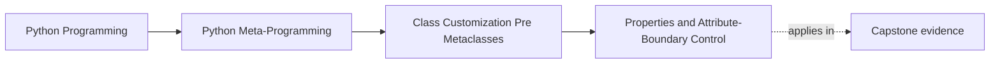

# Properties and Attribute-Boundary Control


<!-- page-maps:start -->
## Page Maps




<!-- page-maps:end -->

Properties are the friendliest place in the course to say something very important:

> attribute access is still runtime machinery, even when the syntax looks like a plain
> field.

That is why this page matters in Module 06. It keeps one attribute boundary visible
without yet escalating into broader descriptor systems.

## The sentence to keep

When you see `@property`, ask:

> what invariant or computation is being owned at this one attribute boundary?

That question keeps properties from being mistaken for ordinary stored values.

## A property is still a descriptor

The course has already hinted at this earlier. Here it becomes concrete:

- `instance.attr` triggers property getter behavior
- `instance.attr = value` triggers property setter behavior when present
- `del instance.attr` triggers property deleter behavior when present

So a property is not a special beginner feature separate from descriptor machinery. It is
the most approachable descriptor form most Python developers meet.

## Properties are data descriptors

This detail matters a lot:

> a property is a data descriptor, even when you did not define a custom setter.

That means a property wins over instance dictionary state during lookup and cannot be
shadowed the way a non-data descriptor can.

That is one of the most useful lookup corrections Module 06 can make before the descriptor
modules arrive.

## One picture of the lookup boundary

```text
obj.x
  -> data descriptor on the class?
  -> instance storage?
  -> non-data descriptor or plain class attribute?
```

For properties, the first step wins.

That is why a read-only property still beats `obj.__dict__["x"]` during normal lookup.

## A standard validation example

```python
class Circle:
    def __init__(self, radius):
        self._radius = radius

    @property
    def radius(self):
        return self._radius

    @radius.setter
    def radius(self, value):
        if value < 0:
            raise ValueError("Radius must be non-negative")
        self._radius = value
```

This is a good Module 06 example because:

- the invariant belongs to one attribute
- the storage remains explicit
- the class does not need a wider descriptor framework yet

That is exactly the sort of lower-power ownership decision the module is trying to teach.

## Read-only does not mean shadowable

```python
class ReadOnly:
    @property
    def x(self):
        return 123
```

Even without a custom setter, this property still wins over instance state during lookup.

That is a crucial correction because many people assume "no setter" means the property is
like a method-like computed attribute that can be shadowed. It is not.

## Properties can also be extended in subclasses

Another useful pattern is reusing a property from a base class:

```python
class Base:
    @property
    def value(self):
        return 42


class Sub(Base):
    @Base.value.getter
    def value(self):
        return getattr(self, "_value", super().value)

    @Base.value.setter
    def value(self, value):
        self._value = value
```

This is a good reminder that properties are first-class objects on the class, not only
syntax decorations on methods.

## Properties are strongest when the boundary is truly one attribute

A property is a great fit when:

- one field needs validation
- one computed value needs a read boundary
- one deletion or mutation rule belongs to one name

A property is a weaker fit when:

- many fields need the same behavior
- the design wants reusable field machinery
- the invariant is no longer about one attribute boundary

Those are clues that later descriptor tools may be the more honest owner.

## Review rules for properties

When reviewing `@property` usage, keep these questions close:

- what one attribute boundary is this property owning?
- is the storage behind it still explicit and understandable?
- does the review understand that the property is a data descriptor?
- is this still a one-attribute rule, or is the code starting to want reusable field machinery?
- would a plain method be clearer if no true attribute-boundary semantics are needed?

## What to practice from this page

Try these before moving on:

1. Implement a property with validation and explain why the rule belongs at one attribute boundary.
2. Show that a read-only property still beats a same-named entry in `__dict__`.
3. Write down one case where a property is the right fit and one where a reusable descriptor system would be more honest.

If those feel ordinary, the next step is to use type hints as declarative aids for shallow
validation through descriptors.

## Continue through Module 06

- Previous: [Dataclass Generation Boundaries](dataclass-generation-boundaries.md)
- Next: [Type Hints and Descriptor-Backed Validation](type-hints-and-descriptor-backed-validation.md)
- Return: [Overview](index.md)
- Terms: [Glossary](glossary.md)
