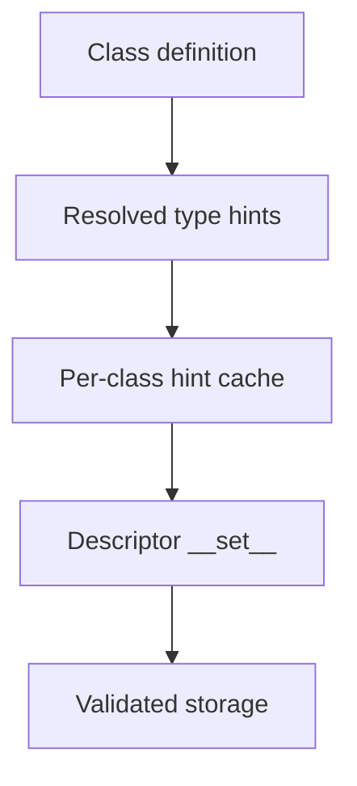

# Type Hints and Descriptor-Backed Validation


<!-- page-maps:start -->
## Page Maps


<!-- page-maps:end -->

Module 06 now has enough machinery in place to use type hints in a more disciplined class
context:

> annotations can act as declarative input for shallow runtime validation, but they still
> do nothing on their own.

That is the boundary this page keeps explicit.

## The sentence to keep

When a class uses type hints for runtime validation, ask:

> where is the actual enforcement happening, and how shallow is the contract?

That question stops annotations from being mistaken for behavior.

## Hints are declarations, not enforcement

At the class level, `get_type_hints(MyClass)` can resolve field annotations into runtime
objects.

That is useful because it gives you a declarative description of expected field types.
It is not useful enough by itself to validate anything.

To enforce behavior, the class still needs a runtime owner, such as:

- a property
- a descriptor
- a validating constructor path

This page focuses on the descriptor route because it scales beyond one property while
still staying below metaclass power.

## One picture of the typing bridge



Caption: type hints provide declarative input, but the descriptor still owns the runtime enforcement.

## A minimal `_is_instance` helper stays honest

Like Module 05, this module benefits from a deliberately limited runtime checker:

```python
from typing import Any, Union, get_args, get_origin


def _is_instance(value, hint) -> bool:
    if hint is Any:
        return True

    origin = get_origin(hint)

    if origin is Union:
        return any(_is_instance(value, option) for option in get_args(hint))

    if origin is not None:
        raise NotImplementedError(f"Generic validation not supported: {hint!r}")

    try:
        return isinstance(value, hint)
    except TypeError as exc:
        raise NotImplementedError(f"Unsupported hint: {hint!r}") from exc
```

That helper is intentionally small because the module focuses on a shallow validation
bridge, not a full runtime typing system.

## A typed descriptor gives the enforcement a real owner

```python
import sys
from typing import get_type_hints


class TypedDescriptor:
    def __set_name__(self, owner, name):
        self.public_name = name
        self.storage_name = f"_{name}"

        if not hasattr(owner, "_field_hints_cache"):
            owner._field_hints_cache = get_type_hints(
                owner,
                globalns=vars(sys.modules[owner.__module__]),
                localns=dict(owner.__dict__),
            )

    def __get__(self, obj, objtype=None):
        if obj is None:
            return self
        return getattr(obj, self.storage_name)

    def __set__(self, obj, value):
        hints = obj.__class__._field_hints_cache
        expected = hints.get(self.public_name)

        if expected is not None and not _is_instance(value, expected):
            raise TypeError(f"{self.public_name}={value!r} expected {expected!r}")

        setattr(obj, self.storage_name, value)
```

This is a good Module 06 pattern because it makes ownership explicit:

- hints describe the expected shape
- the descriptor performs enforcement
- storage remains visible and local

## Per-class caching matters

One subtle but important quality point is:

- resolve type hints once per class
- do not recompute them on every assignment

That is both cleaner and more honest. The class owns a stable declaration surface, so the
validation helper should cache that declaration rather than repeatedly rediscover it.

## This is still shallow runtime validation

The strongest honest claim here is:

> the descriptor enforces a limited runtime contract for supported hint shapes.

It does not mean:

- full generic validation
- full typing-system enforcement
- zero-cost runtime checking

That narrow claim is exactly what keeps the pattern useful instead of misleading.

## Review rules for hint-backed validation

When reviewing hint-backed class validation, keep these questions close:

- where does enforcement actually happen?
- what hint subset is supported, and what is refused explicitly?
- are hints being cached per class instead of recomputed per assignment?
- is the attribute-boundary owner clear: property, descriptor, or constructor?
- has the design grown large enough that a dedicated validation layer would be clearer?

## What to practice from this page

Try these before moving on:

1. Implement a descriptor that validates plain classes plus `Union` or `Optional`.
2. Cache resolved hints on the class and explain why that is better than repeated `get_type_hints` calls.
3. Write down one reason this remains a shallow contract rather than a full runtime type system.

If those feel ordinary, the next step is the bigger boundary question: when are these
class-level tools still enough, and when is the design drifting upward?

## Continue through Module 06

- Previous: [Properties and Attribute-Boundary Control](properties-and-attribute-boundary-control.md)
- Next: [Class Customization Boundaries](class-customization-boundaries.md)
- Return: [Overview](index.md)
- Terms: [Glossary](glossary.md)
