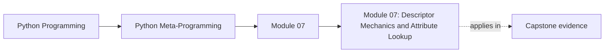

<a id="top"></a>
# Module 07: Descriptor Mechanics and Attribute Lookup


<!-- page-maps:start -->
## Page Maps




<!-- page-maps:end -->

<a id="toc"></a>
## Table of Contents

1. [Introduction](#introduction)
2. [Core 31: Full Protocol: `__get__`, `__set__`, `__delete__`, `__set_name__`](#core31)
3. [Core 32: Data vs Non-Data Descriptors – The Precedence Rule That Makes Everything Work](#core32)
4. [Core 33: How Functions Become Bound Methods (The Hidden Descriptor)](#core33)
5. [Core 34: First Reusable Descriptors: String(), Positive(), Email(), etc.](#core34)
6. [Synthesis: Descriptors as the Real Attribute Engine](#synthesis)
7. [Capstone: Quantity – Didactic Unit-Aware Length Descriptor](#capstone)
8. [Glossary (Module 7)](#glossary)

<span style="font-size: 1em;">[Back to top](#top)</span>

---

<a id="introduction"></a>
## Introduction

Building on Module 1’s attribute lookup rules and Module 6’s `@property` / class decorator bridge, this module exposes the mechanism that actually powers `obj.attr`: the descriptor protocol. If the details of attribute lookup have faded, briefly revisit Module 1, Core 2, then return here.

A descriptor is any object that defines at least one of `__get__`, `__set__`, or `__delete__` and is stored on a class. When Python resolves `obj.attr`, it walks the MRO (Module 1), finds the attribute on the first class that defines it, and—if that attribute is a descriptor—delegates to the descriptor’s methods instead of returning the raw object. Properties, bound methods, many slots, and most “field” abstractions in ORMs and validators are all built on this mechanism.

This module stays in the single-interpreter, sync, CPython-centric world of Volume I and focuses on per-instance state descriptors:

- **Core 31**: the full four-method protocol (`__get__`, `__set__`, `__delete__`, `__set_name__`), with emphasis on how often each is actually used.
- **Core 32**: data vs non-data descriptors, and the precedence rules that decide who wins between descriptors and instance dictionaries.
- **Core 33**: how ordinary functions become bound methods via a hidden non-data descriptor.
- **Core 34**: the first reusable field descriptors (`String`, `Positive`, `Email`) and a slotted variant.
- **Capstone**: a didactic, unit-aware `Quantity` descriptor that normalises values to a base unit and returns an object that supports simple arithmetic, previewing the framework-grade patterns of Module 8.

The risk profile is clear:

- **Spec-level**: the attribute lookup order and the rules for data/non-data descriptors.
- **CPython-leaning**: exact behaviour of functions and properties as descriptors.
- **Diagnostic / didactic only**: the `Quantity` capstone and slotted storage tricks—use them to understand the mechanism, not as drop-in framework code.

## Why this module matters in the course

This is where attribute access stops being intuitive and starts becoming mechanical. Many
frameworks feel magical only because descriptor precedence and storage rules stay implicit.
Once those rules are explicit, a large class of "why did Python do that?" bugs becomes explainable.

This module matters because it reveals the attribute engine that powers properties, bound
methods, many validators, and a large share of framework field abstractions.

## Questions this module should answer

By the end of the module, you should be able to answer:

- What exactly makes an object a descriptor, and when does Python invoke it?
- Why do data descriptors beat instance dictionaries while non-data descriptors can be shadowed?
- Where should descriptor state live so instances stay independent?
- When is a descriptor the right abstraction instead of a property, plain method, or manual validation?

If those answers remain fuzzy, metaclasses will look more necessary than they really are.

## What to inspect in the capstone

Keep the capstone open while reading this module and inspect:

- `Field` descriptors under `capstone/src/incident_plugins/`
- tests that assert coercion, validation, and per-instance storage behavior
- places where descriptor behavior shapes what the runtime manifest can report

The capstone should make one point concrete here: descriptors are the real attribute engine, not an exotic edge feature.

<span style="font-size: 1em;">[Back to top](#top)</span>

---

<a id="core31"></a>
## Core 31: Full Protocol: `__get__`, `__set__`, `__delete__`, `__set_name__`

### Canonical Definition

The descriptor protocol defines four optional methods on a class `D`:

- `__get__(self, obj, owner=None)` → value  
  Called on read (`obj.attr` or `cls.attr`); `obj` is the instance or `None` on class access.

- `__set__(self, obj, value)` → None  
  Called on write (`obj.attr = value`).

- `__delete__(self, obj)` → None  
  Called on deletion (`del obj.attr`).

- `__set_name__(self, owner, name)` → None (Python 3.6+)  
  Called once when the owning class is created; gives the descriptor its attribute name and owning class.

A descriptor is any object defining at least one of `__get__`, `__set__`, or `__delete__` and stored as a class attribute. `__set_name__` is an additional helper hook that many descriptors implement, but it does not by itself make an object a descriptor.

In terms of the full lookup pipeline, all instance attribute access still goes through `obj.__getattribute__(name)` first. What you see in this module is the behaviour of the *default* `object.__getattribute__`, which itself applies the descriptor / `__dict__` / MRO rules. Advanced code that overrides `__getattribute__` can intercept everything, but that is rare and belongs in the “outer darkness” of Module 10.

### Practical Frequency and Priorities

In real code these four methods are not equal:

- `__get__` – used in almost every useful descriptor.
- `__set__` – common for validators and fields that must see every write.
- `__set_name__` – increasingly standard; essential for self-configuring descriptors.
- `__delete__` – niche. You will see it occasionally, but many production codebases never implement it at all.

### Examples

Full descriptor:

```python
class FullDesc:
    def __set_name__(self, owner, name):
        self.public_name = name
        self.private_name = f"_{name}"

    def __get__(self, obj, owner=None):
        if obj is None:
            return self
        return obj.__dict__.get(self.private_name, 0)

    def __set__(self, obj, value):
        if not isinstance(value, int):
            raise TypeError(f"{self.public_name} must be int")
        obj.__dict__[self.private_name] = value

    def __delete__(self, obj):
        obj.__dict__.pop(self.private_name, None)

class C:
    count: int = FullDesc()

c = C()
c.count = 42
print(c.count)  # 42
del c.count
print(c.count)  # 0
```

Read-only (data descriptor):

```python
class ReadOnly:
    def __init__(self, default=0):
        self.default = default

    def __set_name__(self, owner, name):
        self.public_name = name
        self.private_name = f"_{name}"

    def __get__(self, obj, owner=None):
        if obj is None: return self
        return obj.__dict__.get(self.private_name, self.default)

    def __set__(self, obj, value):
        raise AttributeError(f"{self.public_name} is read-only")
```

### Advanced Notes and Pitfalls

- `__set_name__` is called for every attribute that defines it, exactly once per class creation.
- `__delete__` exists mostly for symmetry and rare cases (revoking tokens, dropping external resources). If you never write a custom `__delete__`, you are not missing part of the “normal” descriptor toolkit.
- `__get__` returning `self` on class access (`obj is None`) is the strong convention.

**Use / Avoid**

- Use `__get__` + `__set__` + `__set_name__` for reusable, declarative fields.
- Use `__get__`-only descriptors when you want overridable defaults or computed attributes.
- Avoid implementing `__delete__` unless you have a concrete deletion protocol.
- Avoid storing per-instance state on the descriptor itself; use `obj.__dict__` or external storage (Module 8).

### Exercise

Implement `TrackedDesc` that logs every `__get__`, `__set__`, and `__delete__` with the instance id and value. Use `__set_name__` for the field name in messages.

<span style="font-size: 1em;">[Back to top](#top)</span>

---

<a id="core32"></a>
## Core 32: Data vs Non-Data Descriptors – The Precedence Rule That Makes Everything Work

### Canonical Definition

Descriptors are classified by which methods they define:

- **Data descriptor** – defines `__set__` or `__delete__` (or both).
- **Non-data descriptor** – defines only `__get__`.

Precedence during attribute lookup (after the default `object.__getattribute__` has found the class attribute in the MRO):

1. If the attribute is a data descriptor → use it.
2. Else if the name exists in `obj.__dict__` → return that.
3. Else if the attribute is a non-data descriptor → call its `__get__`.
4. Else return the raw attribute (or continue lookup).

These rules refine the attribute lookup order from Module 1: they decide what happens after the default `object.__getattribute__` has found the class attribute in the MRO. Properties from Module 6 are just a packaged version of these ideas: a `property` instance is *always* a data descriptor (it defines `__set__`, even if that method simply raises `AttributeError` when no setter is configured). As a result, any `@property` – with or without a setter – cannot be shadowed by `obj.__dict__`; assigning `obj.__dict__["prop"] = ...` will not bypass the property.
  
#### Visual: Attribute Lookup with Descriptors

```mermaid
graph TD
  access["`obj.attr`"]
  getattribute["`obj.__getattribute__(\"attr\")`"]
  lookup["1. Look up `attr` on `type(obj)` and its MRO"]
  dataDesc["2. Data descriptor?<br/>return `A.__get__(obj, type(obj))`"]
  dict["3. In `obj.__dict__`?<br/>return stored value"]
  nonData["4. Non-data descriptor?<br/>return `A.__get__(obj, type(obj))`"]
  plain["5. Plain class attribute?<br/>return `A`"]
  missing["6. Not found?<br/>call `obj.__getattr__(\"attr\")` or raise `AttributeError`"]
  access --> getattribute --> lookup
  lookup --> dataDesc
  lookup --> dict
  lookup --> nonData
  lookup --> plain
  lookup --> missing
```

This diagram assumes the default `object.__getattribute__`. Overriding `__getattribute__` lets you short-circuit or post-process this pipeline, which is powerful but rarely needed.

### Examples

Data descriptor (unshadowable):

```python
class DataDesc:
    def __set_name__(self, owner, name): self.private = f"_{name}"
    def __get__(self, obj, owner=None):
        if obj is None: return self
        return obj.__dict__.get(self.private, 0)
    def __set__(self, obj, val):
        obj.__dict__[self.private] = val

class C:
    val = DataDesc()

c = C()
c.val = 10
c.__dict__['val'] = 999   # Ignored – data descriptor wins
print(c.val)  # 10
```

Non-data descriptor (shadowable):

```python
class NonDataDesc:
    def __get__(self, obj, owner=None):
        return "computed"

class C:
    val = NonDataDesc()

c = C()
print(c.val)      # "computed"
c.val = "shadow"  # Stored in __dict__
print(c.val)      # "shadow"
```

### Advanced Notes and Pitfalls

- Functions are non-data descriptors (`function.__get__` binds `self`).
- `property` instances are data descriptors regardless of whether a setter is defined. A “read-only” property (`@property` with no `@prop.setter`) still wins over `obj.__dict__`.
- The precedence is strict and spec-level; it is the reason `@property` with a setter cannot be bypassed via `obj.__dict__['prop'] = ...`.

**Use / Avoid**

- Use **data descriptors** when you want hard invariants that cannot be bypassed by direct `__dict__` manipulation.
- Use **non-data descriptors** when you want overridable defaults or behaviour that instances can shadow.
- Avoid relying on subtle precedence interactions for API design. If users have to remember precedence rules to understand your code, it’s too clever.
- Avoid writing tooling that assumes data descriptors “win forever” – `__getattribute__` can still override everything; treat descriptor precedence as a guideline for user-level code, not an absolute for metaprogramming tricks.

### Exercise

Implement a `LoggedProperty` that behaves like `@property` but logs every access (read/write/delete). Make it a data descriptor when a setter is present, non-data otherwise. Test shadowing behaviour.

<span style="font-size: 1em;">[Back to top](#top)</span>

---

<a id="core33"></a>
## Core 33: How Functions Become Bound Methods (The Hidden Descriptor)

### Canonical Definition

Functions defined on classes are non-data descriptors. Accessing one via an instance triggers `function.__get__(obj, cls)`, which returns a `types.MethodType` (bound method) containing:

- `__func__` → the original function
- `__self__` → the instance

Calling the bound method invokes `__func__.__call__(__self__, *args, **kwargs)`.

Recall from Module 1 that functions are callable objects with `__call__`; here we see they are also non-data descriptors.

### Deep Dive Explanation

In ordinary application code you rarely construct `types.MethodType` or call `__get__` on functions directly. The value of this core is conceptual: once you see that “bound methods” are just a thin wrapper around a function and an instance, a lot of stack traces and introspection output stop looking magical.

### Examples

```python
def meth(self, x):
    return f"{self.name}: {x}"

class C:
    name = "C"
    meth = meth

c = C()
bound = c.meth
print(type(bound))          # <class 'method'>
print(bound.__func__ is meth)  # True
print(bound.__self__ is c)     # True
print(bound(42))            # C: 42
```

### Advanced Notes and Pitfalls

- `classmethod` and `staticmethod` replace the default function descriptor with their own.
- Decorators that wrap methods must preserve the descriptor nature (use `@functools.wraps` or manually return a new function).

**Use / Avoid**

- Use this mental model to interpret `__func__`/`__self__` in debugging and introspection tools.
- Use explicit `func.__get__(obj, cls)` only in rare metaprogramming code that needs to bind functions manually.
- Avoid building APIs that require users to touch `MethodType` or `__get__` directly; surface higher-level concepts instead.
- Avoid wrapping bound methods in decorators that discard `__func__` / `__self__`; always preserve identity with `functools.wraps`.

### Exercise

Write a `@classbound` decorator that turns an instance method into a class method that receives the instance as the first argument after `cls`. Compare it to `@classmethod` + manual `self` handling.

<span style="font-size: 1em;">[Back to top](#top)</span>

---

<a id="core34"></a>
## Core 34: First Reusable Descriptors: String(), Positive(), Email(), etc.

### Canonical Definition

Reusable field descriptors are small classes that:

- accept configuration in `__init__`,
- learn their attribute name via `__set_name__`,
- validate/coerce in `__set__`,
- return stored values in `__get__`.

They are almost always data descriptors (they have `__set__`).

### Examples

String validator (with maxlen):

```python
class String:
    def __init__(self, maxlen=None):
        self.maxlen = maxlen

    def __set_name__(self, owner, name):
        self.public_name = name
        self.private_name = f"_{name}"

    def __get__(self, obj, owner=None):
        if obj is None: return self
        return obj.__dict__.get(self.private_name, "")

    def __set__(self, obj, value):
        val = str(value)
        if self.maxlen is not None and len(val) > self.maxlen:
            raise ValueError(f"{self.public_name} too long (max {self.maxlen})")
        obj.__dict__[self.private_name] = val
```

Positive integer:

```python
class Positive:
    def __set_name__(self, owner, name):
        self.public_name = name
        self.private_name = f"_{name}"

    def __get__(self, obj, owner=None):
        if obj is None: return self
        return obj.__dict__.get(self.private_name, 0)

    def __set__(self, obj, value):
        val = int(value)
        if val < 0:
            raise ValueError(f"{self.public_name} must be ≥ 0")
        obj.__dict__[self.private_name] = val
```

Email (toy pattern – deliberately simplified):

```python
import re

class Email:
    # This is a deliberately simplified pattern for demonstration purposes.
    # It is NOT RFC-compliant and should not be used to validate real-world email addresses.
    PATTERN = re.compile(r"^[a-zA-Z0-9._%+-]+@[a-zA-Z0-9.-]+\.[a-zA-Z]{2,}$")

    def __set_name__(self, owner, name):
        self.public_name = name
        self.private_name = f"_{name}"

    def __get__(self, obj, owner=None):
        if obj is None: return self
        return obj.__dict__.get(self.private_name, "")

    def __set__(self, obj, value):
        val = str(value).strip().lower()
        if not self.PATTERN.match(val):
            raise ValueError(f"Invalid email for {self.public_name}")
        obj.__dict__[self.private_name] = val
```

Slotted-compatible version (external storage, no memory leak):

```python
from weakref import WeakKeyDictionary

class SlottedPositive:
    _storage: dict[type, WeakKeyDictionary] = {}

    def __set_name__(self, owner, name):
        self.public_name = name
        self._storage.setdefault(owner, WeakKeyDictionary())

    def __get__(self, obj, owner=None):
        if obj is None:
            return self
        fields = self._storage.get(type(obj))
        if fields is None:
            return 0
        return fields.get(obj, {}).get(self.public_name, 0)

    def __set__(self, obj, value):
        if not isinstance(value, int) or value < 0:
            raise ValueError(f"{self.public_name} must be non-negative int")
        cls = type(obj)
        fields = self._storage.setdefault(cls, WeakKeyDictionary())
        per_obj = fields.setdefault(obj, {})
        per_obj[self.public_name] = value
```

The following pattern previews the “framework-grade” external-storage descriptors of Module 8: it keeps per-instance state out of `__dict__` and uses `WeakKeyDictionary` to avoid leaks.

### Advanced Notes and Pitfalls

- The email regex is deliberately simplified for teaching purposes. It is **not** RFC-compliant and must never be used for real validation.
- For slotted classes, always use `WeakKeyDictionary` (or similar) to avoid memory leaks; never key off `id(obj)`.

**Use / Avoid**

- Use small, single-purpose descriptors as building blocks for domain models and internal invariants.
- Use `__set_name__` systematically to avoid hard-coding attribute names and to improve error messages.
- Avoid shipping home-grown email validators; either call a well-tested library or keep the pattern as a teaching tool only.
- Avoid storing per-instance state on the descriptor object itself; use instance dictionaries or `WeakKeyDictionary`-backed external storage instead.

### Exercise

Implement `NonEmptyString` (rejects empty/blank after strip) and `Choices(options=...)`. Test both with normal and slotted classes.

<span style="font-size: 1em;">[Back to top](#top)</span>

---

<a id="synthesis"></a>
## Synthesis: Descriptors as the Real Attribute Engine

Cores 31–34 move us from “descriptors exist” (Module 1, Module 6) to a usable, mental model–level mastery of the protocol:

- **Core 31 (full protocol)** makes the mechanics explicit and ranks the methods by real-world frequency.
- **Core 32 (data vs non-data)** ties the protocol back into attribute lookup: data descriptors win over instance dictionaries; non-data descriptors can be shadowed. This explains why properties with setters behave differently from plain `@property`, and why methods are still override-friendly.
- **Core 33 (bound methods)** reveals what happens when you write `obj.method(...)`: a hidden non-data descriptor call (`function.__get__`) produces a bound method object.
- **Core 34 (reusable descriptors)** shows how to turn the protocol into reusable building blocks: `String`, `Positive`, `Email`, and a slotted variant that demonstrates external storage patterns.

Three boundaries matter going into Module 8:

1. **Descriptors vs properties** – Properties are just one particular descriptor implementation. When you need reusable field behaviour across many classes, a dedicated descriptor class is the more scalable tool.

2. **Data vs non-data semantics** – If you want invariants that cannot be bypassed via `obj.__dict__`, you need data descriptors. If you want overridable defaults or behaviour that instances can shadow, non-data descriptors are appropriate.

3. **Descriptors vs `__setattr__`** – Descriptors keep validation and coercion local to each field and compose cleanly. `__setattr__` centralises logic, is hard to test, and tends to grow into a tangle.

Typing aside: most static type checkers do not understand the invariants enforced by descriptors on their own; to expose those guarantees to tools like mypy or pyright you typically need Protocols, ABCs, or custom plugins. Volume II returns to this from the static-analysis side.

The `Quantity` capstone sits at this intersection: it is a data descriptor that normalises values on write, returns a small helper object on read, and uses `__set_name__` to self-parameterise. Module 8 will extend these ideas to cached fields, external storage, and framework-style declarative models.

<span style="font-size: 1em;">[Back to top](#top)</span>

---

<a id="capstone"></a>
## Capstone: Quantity – Didactic Unit-Aware Length Descriptor

> **Didactic only – not production-ready**  
> This is a minimal teaching example to show descriptor mechanics in action.  
> For real unit handling, use a dedicated library such as **pint**.

```python
import re

# Length units → factor to metres (educational only)
_CONVERSIONS = {
    "mm": 0.001,
    "cm": 0.01,
    "m":  1.0,
    "km": 1000.0,
}

_UNIT_RE = re.compile(r"^\s*(\d*\.?\d*)\s*([a-zA-Z]+)\s*$")

class QuantityValue:
    """Returned on read – supports scalar arithmetic and conversion."""
    __slots__ = ("_metres", "_display_unit")

    def __init__(self, metres: float, display_unit: str):
        self._metres = metres
        self._display_unit = display_unit

    def to(self, unit: str) -> float:
        """Return scalar value in the requested unit."""
        try:
            factor = _CONVERSIONS[unit]
        except KeyError:
            raise ValueError(f"Unknown unit {unit!r}") from None
        return self._metres / factor

    # Scalar multiplication / division only
    def __mul__(self, scalar: float):
        return QuantityValue(self._metres * scalar, self._display_unit)
    __rmul__ = __mul__

    def __truediv__(self, scalar: float):
        return QuantityValue(self._metres / scalar, self._display_unit)

    def __repr__(self):
        return f"{self.to(self._display_unit):.3f} {self._display_unit}".strip()

class Quantity:
    """
    Data descriptor for length-like fields.
    Normalises everything to metres internally.
    Accepts numbers (metres), strings like "3 km", or QuantityValue.
    """

    def __init__(self, display_unit: str = "m"):
        if display_unit not in _CONVERSIONS:
            raise ValueError(f"Unsupported display unit {display_unit!r}")
        self._display_unit = display_unit

    def __set_name__(self, owner, name):
        self.public_name = name
        self._storage_name = f"_{name}_metres"

    def __get__(self, obj, owner=None):
        if obj is None:
            return self
        metres = obj.__dict__.get(self._storage_name, 0.0)
        return QuantityValue(metres, self._display_unit)

    def __set__(self, obj, value):
        if isinstance(value, QuantityValue):
            metres = value._metres
        elif isinstance(value, (int, float)):
            metres = float(value)
        elif isinstance(value, str):
            match = _UNIT_RE.match(value)
            if not match:
                raise ValueError(f"Cannot parse unit string {value!r}")
            scalar_str, unit = match.groups()
            scalar = float(scalar_str) if scalar_str else 1.0
            try:
                factor = _CONVERSIONS[unit]
            except KeyError:
                raise ValueError(f"Unknown unit {unit!r}") from None
            metres = scalar * factor
        else:
            raise TypeError(f"Unsupported value type for {self.public_name}")
        # Always store the normalised value in metres on the instance.
        obj.__dict__[self._storage_name] = metres

# Usage example
class Distance:
    length = Quantity("m")

d = Distance()
d.length = 3
print(d.length)           # 3.000 m  (3 metres)

d.length = "2 km"
print(d.length)           # 2000.000 m  (stored in metres; display_unit is 'm')
print(d.length.to("cm"))  # 200000.0

scaled = 5 * d.length
print(scaled)             # 10000.000 m
```

Bare numbers are interpreted as metres, regardless of the display_unit. The display_unit only controls how values are shown in `__repr__` and how `QuantityValue.to(...)` interprets the returned scalar. The original textual unit from string inputs is not preserved.

### Advanced Notes and Pitfalls

- Deliberately length-only and scalar-only arithmetic; adding proper dimensional analysis is left as an exercise (or use pint).
- Storage uses normal `__dict__`; a `__slots__`-compatible version appears in Module 8.

### Exercise

Add support for `Quantity("km")` as the display unit and a `.in_metres` property on `QuantityValue`. Then implement a second descriptor `Speed = Quantity("m/s")` and demonstrate why simple `*` between `Distance` and `Speed` would be incorrect without proper dimension tracking.

You have completed Module 7.

<span style="font-size: 1em;">[Back to top](#top)</span>

---

<a id="glossary"></a>
## Glossary (Module 7)

| Term                                          | Definition                                                                                                                                                                                                                                           |
| --------------------------------------------- | ---------------------------------------------------------------------------------------------------------------------------------------------------------------------------------------------------------------------------------------------------- |
| **Descriptor protocol**                       | Mechanism where class attributes that define `__get__`, `__set__`, or `__delete__` participate in attribute access (`obj.attr` / `obj.attr = v` / `del obj.attr`) instead of returning the raw class attribute.                                      |
| **Descriptor**                                | Any object stored on a class that defines at least one of `__get__`, `__set__`, or `__delete__`. (`__set_name__` alone is not enough.)                                                                                                               |
| **`__get__(self, obj, owner=None)`**          | Called on read. `obj` is the instance; `obj is None` on class access (`C.attr`). Conventionally returns `self` when `obj is None`.                                                                                                                   |
| **`__set__(self, obj, value)`**               | Called on write (`obj.attr = value`). Typically used for validation/coercion and storage.                                                                                                                                                            |
| **`__delete__(self, obj)`**                   | Called on deletion (`del obj.attr`). Rare in practice; used when deletion has semantics beyond “remove stored value.”                                                                                                                                |
| **`__set_name__(self, owner, name)`**         | Hook invoked once at class creation time for each descriptor attribute; supplies owning class and attribute name so the descriptor can self-configure (e.g., compute storage key).                                                                   |
| **Default attribute access pipeline**         | `obj.__getattribute__(name)` runs first; the behavior described by descriptor precedence is what `object.__getattribute__` implements (custom `__getattribute__` can override everything).                                                           |
| **Data descriptor**                           | Descriptor that defines `__set__` or `__delete__` (or both). During lookup it has priority over `obj.__dict__` for the same name.                                                                                                                    |
| **Non-data descriptor**                       | Descriptor that defines only `__get__`. It can be shadowed by an instance attribute stored in `obj.__dict__` under the same name.                                                                                                                    |
| **Descriptor precedence rule**                | Lookup order (after finding the class attribute via MRO): (1) data descriptor wins → `__get__`; (2) else instance `__dict__` wins; (3) else non-data descriptor `__get__`; (4) else raw class attribute; (5) else `__getattr__` or `AttributeError`. |
| **Why `property` is unshadowable**            | `property` is a data descriptor even without a user-defined setter (it still defines `__set__` that raises), so `obj.__dict__['prop']=...` doesn’t bypass it.                                                                                        |
| **Method descriptor behavior**                | Plain functions defined on classes are non-data descriptors; accessing them on an instance triggers binding via `function.__get__`.                                                                                                                  |
| **Bound method**                              | Object produced by function binding that carries `__func__` (original function) and `__self__` (instance); calling it invokes `__func__(__self__, *args, **kwargs)`.                                                                                 |
| **`types.MethodType`**                        | Concrete type typically representing bound methods (implementation detail you see in debugging/introspection).                                                                                                                                       |
| **`classmethod`**                             | Descriptor wrapper that changes binding: accessing via instance/class passes the class as the first argument (`cls`).                                                                                                                                |
| **`staticmethod`**                            | Descriptor wrapper that disables binding: accessing returns the underlying function unchanged (no implicit `self`/`cls`).                                                                                                                            |
| **Per-instance state storage (safe pattern)** | Store values on the instance (commonly `obj.__dict__[private_name]`) rather than on the descriptor object, to avoid shared-state bugs across instances.                                                                                              |
| **Field descriptor**                          | Reusable descriptor that models a “field” with validation/coercion on `__set__` and retrieval on `__get__`, configured via `__init__` + `__set_name__` (e.g., `String`, `Positive`, `Email`).                                                        |
| **Shadowable default**                        | Using a non-data descriptor to provide computed/default behavior that instances may override by setting an instance attribute of the same name.                                                                                                      |
| **External-storage descriptor**               | Descriptor storing per-instance data outside `obj.__dict__` (e.g., `WeakKeyDictionary` keyed by instances) to support slotted instances or to avoid polluting instance namespaces.                                                                   |
| **`WeakKeyDictionary` storage**               | External storage keyed by objects with weak references so instances can be garbage-collected without leaking descriptor-held state.                                                                                                                  |
| **Slotted compatibility**                     | Requirement that descriptors work for classes without `__dict__` (`__slots__`); often requires external storage or explicit slot-based access.                                                                                                       |
| **Invariants vs bypass**                      | Data descriptors enforce invariants robustly against `__dict__` shadowing; non-data descriptors trade enforceability for overridability.                                                                                                             |
| **Capstone `Quantity` descriptor**            | Didactic data descriptor that normalizes assigned values to a base unit (e.g., meters) on write and returns a helper value object on read to support conversion/arithmetic; teaching tool, not production unit system.                               |
| **Unit normalization**                        | Storing values internally in a single canonical unit while allowing user-facing input/output in multiple units.                                                                                                                                      |
| **Helper value object (`QuantityValue`)**     | Object returned by the descriptor read that encapsulates canonical value + display semantics and supports limited arithmetic/conversions.                                                                                                            |
| **Spec-level vs CPython-leaning**             | Spec-level: precedence rules and descriptor semantics; CPython-leaning: concrete types/representation of method objects and slot descriptor internals.                                                                                               |

Proceed to Module 8: The Descriptor Protocol – The True Engine (Part 2 – Framework Grade).

<span style="font-size: 1em;">[Back to top](#top)</span>
