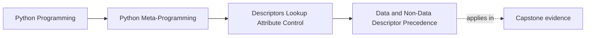
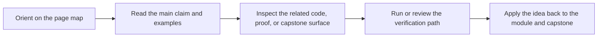

# Data and Non-Data Descriptor Precedence


<!-- page-maps:start -->
## Page Maps




<!-- page-maps:end -->

This page answers the question that makes descriptors stop feeling mysterious:

why does one descriptor beat instance state while another can be shadowed?

The answer is precedence.

## The sentence to keep

Data descriptors win over the instance dictionary, while non-data descriptors yield to the
instance dictionary when the same attribute name exists there.

That one rule explains a large share of descriptor behavior.

## The two categories

The distinction is mechanical:

- a data descriptor defines `__set__`, `__delete__`, or both
- a non-data descriptor defines only `__get__`

This is why a descriptor's category is not about intention. It is about which methods are
present.

## The default lookup order

For ordinary instance lookup under `object.__getattribute__`, the useful review model
is:

1. look for the attribute on the class and its MRO
2. if that class attribute is a data descriptor, use it
3. otherwise, if the name exists in `obj.__dict__`, return that value
4. otherwise, if the class attribute is a non-data descriptor, call `__get__`
5. otherwise, return the plain class attribute or continue lookup

This is the lookup rule that turns many "Python did something weird" moments into a
reviewable explanation.

## A compact data-descriptor example

```python
class DataField:
    def __set_name__(self, owner, name):
        self.private_name = f"_{name}"

    def __get__(self, obj, owner=None):
        if obj is None:
            return self
        return obj.__dict__.get(self.private_name, 0)

    def __set__(self, obj, value):
        obj.__dict__[self.private_name] = value


class Sample:
    value = DataField()


s = Sample()
s.value = 10
s.__dict__["value"] = 999
print(s.value)  # 10
```

The descriptor still wins because it is a data descriptor.

## A compact non-data example

```python
class NonDataField:
    def __get__(self, obj, owner=None):
        if obj is None:
            return self
        return "computed"


class Sample:
    value = NonDataField()


s = Sample()
print(s.value)  # computed
s.value = "shadowed"
print(s.value)  # shadowed
```

This time the instance dictionary wins because the descriptor defines only `__get__`.

## Why `property` is important here

Properties are a perfect bridge into the rule.

A `property` object is a data descriptor. Even a read-only property still defines
descriptor machinery that makes it win over `obj.__dict__`.

That is why this does not bypass a property:

```python
obj.__dict__["name"] = "bypass attempt"
```

If `name` is a property, the property still owns the boundary.

That detail connects Module 07 back to Module 06 in a concrete way.

## Why methods are different

Plain functions defined on classes are non-data descriptors.

That means they can be shadowed by instance attributes. This is not a footnote. It is one
of the reasons method binding stays flexible instead of absolutely dominant over instance
state.

The next core will make that more concrete.

## A useful diagram to keep in your head

```text
data descriptor
  -> wins over obj.__dict__

instance dictionary
  -> wins over non-data descriptor

non-data descriptor
  -> runs only if the instance dictionary does not already own the name
```

That is the picture most people actually need in review and debugging.

## What this rule is for

Use the precedence rule to answer questions like:

- why does a property still intercept access even when a same-named entry appears in `__dict__`?
- why can an instance attribute replace the behavior of a non-data descriptor?
- why do reusable validators often need to be data descriptors?

If the answer depends on "because descriptors are advanced," the rule is not being used
precisely enough.

## A warning about over-clever APIs

Precedence is a real runtime rule, but it is not a good excuse for cleverness.

If an API is understandable only because its users memorize data-descriptor versus
non-data-descriptor precedence, the API is probably too subtle.

The rule is best used for:

- debugging
- honest explanation
- choosing the smallest owner for a field invariant

It is a poor substitute for clear design.

## Review rules for precedence

When reviewing descriptor lookup, keep these questions close:

- is the class attribute a data descriptor or a non-data descriptor?
- what value, if any, is stored in `obj.__dict__` under the same name?
- is the code relying on shadowing intentionally or accidentally?
- is a property being described incorrectly as bypassable?
- would a plainer attribute boundary be easier to review than a precedence trick?

## What to practice from this page

Try these before moving on:

1. Build one data descriptor and show that `obj.__dict__` cannot shadow it.
2. Build one non-data descriptor and show that the instance dictionary can shadow it.
3. Explain one property example in descriptor-precedence language rather than property-specific language.

If those feel ordinary, the next step is method binding: the most common non-data
descriptor behavior in everyday Python.

## Continue through Module 07

- Previous: [Descriptor Protocol and `__set_name__`](descriptor-protocol-and-set-name.md)
- Next: [Functions, Binding, and Method Descriptors](functions-binding-and-method-descriptors.md)
- Return: [Overview](index.md)
- Terms: [Glossary](glossary.md)
