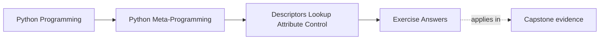
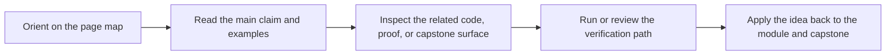

# Exercise Answers


<!-- page-maps:start -->
## Page Maps




<!-- page-maps:end -->

Use this page after attempting the exercises yourself. The point is not to match every
example literally. The point is to compare your reasoning against answers that keep
descriptor mechanics, storage, and ownership boundaries honest.

## Answer 1: Build one minimal descriptor on purpose

Example answer:

```python
class UpperName:
    def __get__(self, obj, owner=None):
        if obj is None:
            return self
        return obj.__dict__.get("_name", "").upper()
```

Good conclusion:

This is still a descriptor because `__get__` alone is enough. It does not need `__set__`
or `__delete__` if the design only cares about reads, and class access returns the
descriptor itself for inspection.

## Answer 2: Show precedence with two concrete cases

Example answer:

For a data descriptor:

- `obj.__dict__["value"] = 999` does not bypass a descriptor that defines `__set__`

For a non-data descriptor:

- an instance assignment like `obj.value = 999` places a same-named entry in `obj.__dict__`
- later reads return that instance value instead of calling the descriptor

Good conclusion:

The outcomes differ because data descriptors beat the instance dictionary, while non-data
descriptors yield to it.

## Answer 3: Explain ordinary method binding

Example answer:

- `Class.method` returns the underlying function object
- `obj.method` returns a bound method object
- the bound method exposes `__func__` for the original function and `__self__` for the instance

Good conclusion:

Method binding is descriptor behavior, not special syntax magic. Functions on classes are
non-data descriptors whose `__get__` logic produces bound methods on instance access.

## Answer 4: Build one reusable validating field

Example answer:

```python
class PositiveInt:
    def __set_name__(self, owner, name):
        self.public_name = name
        self.private_name = f"_{name}"

    def __get__(self, obj, owner=None):
        if obj is None:
            return self
        return obj.__dict__.get(self.private_name, 0)

    def __set__(self, obj, value):
        number = int(value)
        if number < 0:
            raise ValueError(f"{self.public_name} must be non-negative")
        obj.__dict__[self.private_name] = number
```

Good conclusion:

`__set_name__` removes hard-coded field names, and the stored values live on the instance,
not on the descriptor object.

## Answer 5: Reject one bad storage design

Example answer:

Broken design:

```python
class BrokenField:
    def __init__(self):
        self.value = None
```

Leak example:

- assigning through one instance changes what another instance later reads

Safer redesign:

- store by private name in `obj.__dict__`
- or use `WeakKeyDictionary` when slotted instances need external storage

Good conclusion:

The descriptor object is shared at the class level, so descriptor-held field values are
usually shared-state bugs waiting to happen.

## Answer 6: Place one field rule on the ownership ladder

Example answer:

Requirement:

- every `email` field across several model classes should normalize to lowercase and reject blank values

Best owner:

- reusable descriptor

Rejected stronger option:

- a metaclass is unnecessary because the problem is field behavior, not class-creation control

Rejected weaker option:

- a single property on one class would not scale cleanly across several repeated fields

Good conclusion:

Strong answers justify the chosen owner by naming both the repeated field semantics and
the clearer alternatives that were rejected.

## What strong Module 07 answers have in common

Across the whole set, strong answers share the same habits:

- they explain lookup mechanically
- they distinguish data descriptors from non-data descriptors precisely
- they keep state ownership explicit
- they choose descriptor power only when a field-level boundary truly needs it

If an answer still sounds like "descriptors are advanced so they fit here," revise it
until you can say exactly what attribute rule they own and why.

## Continue through Module 07

- Previous: [Exercises](exercises.md)
- Return: [Overview](index.md)
- Next module: [Module 08](../module-08-descriptor-systems-validation-framework-design/index.md)
- Terms: [Glossary](glossary.md)
