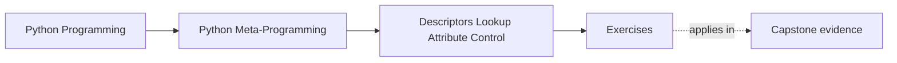

# Exercises

<!-- page-maps:start -->
## Page Maps

<!-- page-maps:end -->

Use these after reading the five core lessons and the worked example. The goal is not to
memorize descriptor trivia. The goal is to make protocol hooks, precedence, storage, and
ownership boundaries explicit.

Each exercise asks for three things:

- the attribute behavior or invariant you are trying to explain or enforce
- the descriptor or lower-power tool you chose
- the reason that choice is the clearest owner

## Exercise 1: Build one minimal descriptor on purpose

Write a descriptor that implements one narrow behavior using the smallest useful set of
hooks.

What to hand in:

- the hooks you implemented
- one sentence explaining why those hooks are enough
- one sentence explaining what class access returns

## Exercise 2: Show precedence with two concrete cases

Build or inspect one data descriptor and one non-data descriptor.

What to hand in:

- one case where the descriptor beats `obj.__dict__`
- one case where `obj.__dict__` shadows the descriptor
- one explanation of why the results differ

## Exercise 3: Explain ordinary method binding

Use one small class with an instance method and inspect the method through both the class
and an instance.

What to hand in:

- what `Class.method` gives you
- what `obj.method` gives you
- one explanation using `__func__` and `__self__`

## Exercise 4: Build one reusable validating field

Implement one field descriptor such as `NonEmptyString`, `PositiveInt`, or `Choices`.

What to hand in:

- the field rule it enforces
- how `__set_name__` helps the implementation
- where per-instance state is stored

## Exercise 5: Reject one bad storage design

Take a descriptor design that stores values on the descriptor object itself and explain why
it fails.

What to hand in:

- the broken storage approach
- one concrete example of state leaking across instances
- one safer replacement using either `obj.__dict__` or weak-reference storage

## Exercise 6: Place one field rule on the ownership ladder

Choose one requirement and decide between:

- plain attribute or method
- property
- reusable descriptor
- wider class machinery

What to hand in:

- the requirement
- the owner you chose
- one sentence rejecting at least one stronger option as unnecessary

## Mastery standard for this exercise set

Across all six answers, the module wants the same habits:

- you explain descriptor behavior mechanically instead of mystically
- you use precedence rules precisely
- you keep per-instance state separate from descriptor state
- you choose descriptor power only when attribute-level ownership really justifies it

If an answer still sounds like "Python just does magic here," keep going.

## Continue through Module 07

- Previous: [Worked Example: Building a Unit-Aware Quantity Descriptor](worked-example-building-a-unit-aware-quantity-descriptor.md)
- Next: [Exercise Answers](exercise-answers.md)
- Return: [Overview](index.md)
- Terms: [Glossary](glossary.md)
