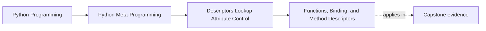
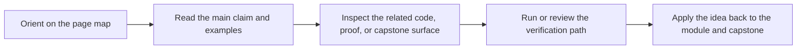

# Functions, Binding, and Method Descriptors


<!-- page-maps:start -->
## Page Maps




<!-- page-maps:end -->

This core takes the most familiar everyday feature in the module and re-explains it in
descriptor language:

ordinary instance methods bind because functions on classes are non-data descriptors.

## The sentence to keep

When Python reads a plain function from a class through an instance, the function's
descriptor behavior binds the instance and produces a bound method.

That is the hidden descriptor many people use every day without naming it.

## What a bound method really contains

A bound method is not mysterious. It is a small object that carries:

- `__func__`, the original function
- `__self__`, the instance it was bound to

Calling the bound method is effectively:

```python
bound.__func__(bound.__self__, *args, **kwargs)
```

Once that is visible, method objects become much easier to inspect and debug.

## A compact example

```python
def describe(self, label):
    return f"{self.name}: {label}"


class Item:
    name = "widget"
    describe = describe


item = Item()
bound = item.describe

print(bound.__func__ is describe)  # True
print(bound.__self__ is item)      # True
print(bound("stock"))              # widget: stock
```

The key move is not special method syntax. It is descriptor binding on attribute access.

## Why functions are non-data descriptors

Plain functions on classes define `__get__`, but they do not define `__set__` or
`__delete__`.

That means they are non-data descriptors.

So the previous core's rule applies directly:

- the function can bind on instance access
- but a same-named value in the instance dictionary can still shadow it

That shadowability is part of the design, not a weird corner case.

## Why this matters for debugging

Once you know the descriptor story, you can explain:

- why `obj.method` is different from `Class.method`
- why bound methods expose `__func__` and `__self__`
- why wrappers around methods still need to preserve ordinary function behavior

This is one of those places where metaprogramming knowledge makes normal Python less
mysterious, not more abstract.

## Class access versus instance access

The difference is simple:

- `Class.method` gives you the underlying function object
- `obj.method` gives you a bound method

That means descriptor behavior depends on how the attribute is accessed, not only on what
the class attribute is.

This is the same pattern you saw in the first core when a descriptor returns itself on
class access.

## Why decorators need to preserve the function surface

Method decorators are easy to get wrong conceptually.

If a decorator returns a plain function, normal binding still works.

If a decorator returns something stranger that does not behave like a function descriptor,
ordinary method access can become much harder to reason about.

That is why helpers such as `functools.wraps` matter: they preserve the function surface
that you and your tools expect to find.

## `classmethod` and `staticmethod` are descriptor variants

This core is about plain functions, but two familiar built-ins sharpen the point:

- `classmethod` changes binding so the class is passed automatically
- `staticmethod` disables ordinary instance binding and returns the underlying callable

Those tools are useful because they alter descriptor behavior in explicit, reviewable
ways.

## What this core is not saying

The lesson is not that you should manually call `function.__get__` in ordinary code.

The lesson is that you can now explain what Python is already doing for you.

That distinction keeps the course grounded in clarity rather than cleverness.

## A compact mental model

```text
plain function on a class
  -> non-data descriptor
  -> instance access binds self
  -> class access leaves the function unbound
```

That is enough to explain most method-binding questions you will see in practice.

## Review rules for method descriptors

When reviewing method binding behavior, keep these questions close:

- is this still a plain function descriptor, or did a wrapper replace it with something stranger?
- what does instance access return here: a bound method, a plain value, or a custom descriptor result?
- is shadowing by an instance attribute possible and relevant?
- are `__func__` and `__self__` available when debugging would benefit from them?
- is a method decorator preserving ordinary readability and inspection?

## What to practice from this page

Try these before moving on:

1. Inspect `obj.method.__func__` and `obj.method.__self__` on one small class.
2. Shadow a non-data method descriptor with an instance attribute and explain why that works.
3. Compare `Class.method` and `obj.method` using descriptor language instead of only syntax language.

If those feel ordinary, the next step is to build reusable field descriptors that own
attribute behavior on purpose.

## Continue through Module 07

- Previous: [Data and Non-Data Descriptor Precedence](data-and-non-data-descriptor-precedence.md)
- Next: [Reusable Field Descriptors and Storage](reusable-field-descriptors-and-storage.md)
- Return: [Overview](index.md)
- Terms: [Glossary](glossary.md)
