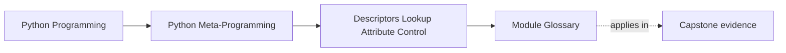
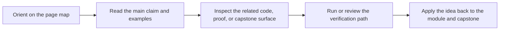

# Module Glossary

<!-- page-maps:start -->
## Page Maps

<!-- page-maps:end -->

This glossary belongs to **Module 07: Descriptors, Lookup, and Attribute Control** in
**Python Metaprogramming**. It keeps the language of this directory stable so the same
ideas keep the same names across lessons, practice, review, and capstone discussion.

## How to use this glossary

Use the glossary when descriptor discussions start to blur together protocol hooks,
precedence, method binding, field storage, and ownership decisions. Module 07 is meant to
keep those boundaries explicit.

## Terms in this directory

| Term | Meaning in this directory |
| --- | --- |
| Attribute boundary | The point where a read, write, or delete crosses into descriptor-controlled behavior for one attribute. |
| Bound method | The object produced when a function descriptor binds an instance and exposes `__func__` plus `__self__`. |
| Data descriptor | A descriptor that defines `__set__`, `__delete__`, or both, and therefore wins over the instance dictionary for the same name. |
| Descriptor | Any object stored on a class that defines `__get__`, `__set__`, or `__delete__`. |
| Descriptor precedence | The lookup rule that gives data descriptors priority over the instance dictionary, and gives the instance dictionary priority over non-data descriptors. |
| External storage descriptor | A descriptor that keeps per-instance values outside `obj.__dict__`, often for slotted compatibility. |
| Field descriptor | A reusable descriptor that models one field rule such as validation, coercion, or normalization. |
| Method descriptor behavior | The non-data descriptor behavior by which plain functions on classes bind instances into bound methods. |
| Non-data descriptor | A descriptor that defines only `__get__` and can therefore be shadowed by an instance attribute of the same name. |
| Per-instance storage | The rule that descriptor-managed values belong to each instance, not on the shared descriptor object. |
| `property` | A built-in descriptor type that provides managed attribute access and is treated as a data descriptor. |
| Shadowing | The case where an instance dictionary entry replaces the result of a non-data descriptor with the same public name. |
| `__delete__` | The descriptor hook that controls what `del obj.attr` means. |
| `__get__` | The descriptor hook that controls reads through `obj.attr` or `Class.attr`. |
| `__set__` | The descriptor hook that controls writes through `obj.attr = value`. |
| `__set_name__` | The class-creation hook that tells a descriptor which class and attribute name it was installed under. |
| Weak-reference storage | External storage using `WeakKeyDictionary` or a similar mechanism so descriptor-held mappings do not keep instances alive accidentally. |

## Keep the module connected

- Return to [Module 07 Overview](index.md) for the full learning route.
- Use [Exercises](exercises.md) and [Exercise Answers](exercise-answers.md) to pressure-test the descriptor vocabulary.
- Revisit the [Worked Example](worked-example-building-a-unit-aware-quantity-descriptor.md) when a reusable field starts to carry normalization or validation policy that needs review.
