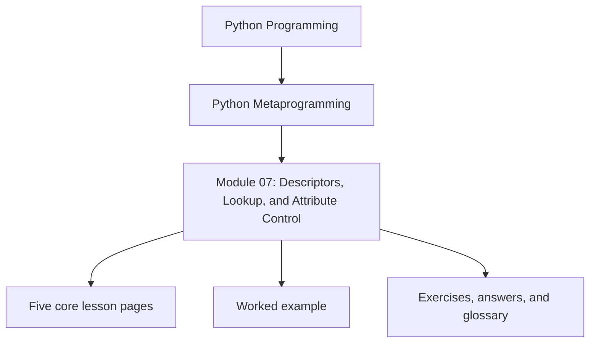
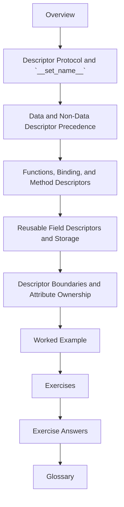

# Module 07: Descriptors, Lookup, and Attribute Control

<!-- page-maps:start -->
## Module Position

<!-- page-maps:end -->

Module 07 is where attribute access stops feeling intuitive and starts becoming a visible
runtime protocol. The goal is not to memorize descriptor trivia. The goal is to
understand what actually happens when Python reads, writes, or deletes an attribute, and
to decide when a descriptor is the honest owner of that behavior.

This module now uses the same ten-file learning surface as the deep-dive series so the
overview, five cores, worked example, practice set, answers, and glossary each have one
clear job.

## What this module is for

By the end of Module 07, you should be able to explain five things clearly:

- what makes an object a descriptor and when Python invokes it
- why data descriptors and non-data descriptors have different precedence
- how plain functions become bound methods through descriptor behavior
- where reusable field descriptors should keep per-instance state
- when a descriptor is the right owner instead of a property, wrapper, or wider class hook

## Keep these pages open

- [Mid-Course Map](../module-00-orientation/mid-course-map.md)
- [Pressure Routes](../guides/pressure-routes.md)
- [Topic Boundaries](../reference/topic-boundaries.md)
- [Capstone Map](../capstone/capstone-map.md)

## The ten files in this module

1. Overview (`index.md`)
2. [Descriptor Protocol and `__set_name__`](descriptor-protocol-and-set-name.md)
3. [Data and Non-Data Descriptor Precedence](data-and-non-data-descriptor-precedence.md)
4. [Functions, Binding, and Method Descriptors](functions-binding-and-method-descriptors.md)
5. [Reusable Field Descriptors and Storage](reusable-field-descriptors-and-storage.md)
6. [Descriptor Boundaries and Attribute Ownership](descriptor-boundaries-and-attribute-ownership.md)
7. [Worked Example: Building a Unit-Aware Quantity Descriptor](worked-example-building-a-unit-aware-quantity-descriptor.md)
8. [Exercises](exercises.md)
9. [Exercise Answers](exercise-answers.md)
10. [Glossary](glossary.md)

## How to use the file set

| If you need to... | Start here |
| --- | --- |
| understand the full descriptor protocol and the role of `__set_name__` | [Descriptor Protocol and `__set_name__`](descriptor-protocol-and-set-name.md) |
| make sense of shadowing and precedence during lookup | [Data and Non-Data Descriptor Precedence](data-and-non-data-descriptor-precedence.md) |
| explain how instance methods bind through function descriptors | [Functions, Binding, and Method Descriptors](functions-binding-and-method-descriptors.md) |
| build reusable validated fields without shared-state bugs | [Reusable Field Descriptors and Storage](reusable-field-descriptors-and-storage.md) |
| decide whether attribute behavior truly belongs to a descriptor | [Descriptor Boundaries and Attribute Ownership](descriptor-boundaries-and-attribute-ownership.md) |
| see those choices combined in one bounded field system | [Worked Example: Building a Unit-Aware Quantity Descriptor](worked-example-building-a-unit-aware-quantity-descriptor.md) |
| pressure-test your understanding before moving into framework-grade descriptor systems | [Exercises](exercises.md) |
| compare your reasoning against a reference answer | [Exercise Answers](exercise-answers.md) |
| stabilize the descriptor vocabulary used in this directory | [Glossary](glossary.md) |

## The running question

Carry this question through every page:

> What belongs to attribute access itself, and what would become more confusing if I hid it behind a wrapper or wider class hook?

Strong Module 07 answers usually mention one or more of these:

- the descriptor protocol on class attributes
- precedence rules between descriptors and instance state
- method binding as non-data descriptor behavior
- per-instance storage that does not leak across objects
- a lower-power decision that rejects unnecessary class-wide machinery

## Learning outcomes

By the end of this module, you should be able to:

- explain the descriptor protocol without treating it as exotic magic
- predict lookup precedence for data descriptors, non-data descriptors, instance dictionaries, and plain class attributes
- describe how bound methods are created and what `__func__` and `__self__` mean
- choose storage patterns for reusable descriptors that keep instance behavior independent
- reject descriptor use when a simpler attribute boundary would be clearer

## Exit standard

Do not move on until all of these are true:

- you can explain what descriptor methods participate in reads, writes, and deletes
- you can say why data descriptors beat instance dictionaries while non-data descriptors can be shadowed
- you can trace ordinary method binding back to `function.__get__`
- you can place one field invariant honestly on the descriptor side of the power ladder

When those feel ordinary, Module 07 has done its job and Module 08 can extend the same
ideas into larger descriptor systems.
