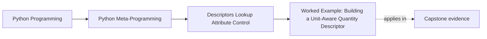

# Worked Example: Building a Unit-Aware Quantity Descriptor


<!-- page-maps:start -->
## Page Maps




<!-- page-maps:end -->

The five core lessons in Module 07 become easier to trust when they meet one field design
that is useful, realistic, and easy to overstate.

A bounded quantity descriptor is exactly that kind of example.

It combines:

- descriptor protocol hooks
- field-level validation and coercion
- per-instance storage
- a clear boundary between attribute semantics and broader unit-system ambitions

That makes it the right worked example for the module.

## The incident

Assume a team wants length-like fields that can accept:

- plain numbers interpreted as metres
- strings such as `"2 km"`
- existing quantity values

They also want reads to return a small helper object that can:

- preserve a display unit
- convert to other supported units
- support a small amount of scalar arithmetic

Those are reasonable design goals. The mistake would be pretending this is now a full
units framework.

## The first design rule: keep the scope bounded

This worked example is intentionally narrow.

It supports:

- length-like units only
- canonical storage in metres
- scalar multiplication and division

It does not claim:

- full dimensional analysis
- arbitrary unit algebra
- production-grade parsing

That refusal is part of what makes the example honest.

## Step 1: keep canonical storage separate from display

The descriptor should store one internal representation.

For this example, that representation is metres.

That means:

- numbers are treated as metres
- string inputs are parsed and converted to metres
- display preference is a presentation concern, not the storage format

This separation is the backbone of the design.

## Step 2: let `__set_name__` derive storage keys

Like the reusable field descriptors from the fourth core, `Quantity` should learn its name
when the owning class is created.

That allows it to derive a private per-instance storage key such as:

```python
_length_metres
```

without hard-coding field names into the descriptor implementation.

## Step 3: return a helper object on reads

The descriptor does not have to return a raw float.

Returning a small value object is useful here because it can hold:

- the canonical metres value
- the display unit
- convenience conversion methods

That makes reads more expressive while still keeping storage normalized underneath.

## A bounded implementation

```python
import re


CONVERSIONS = {
    "mm": 0.001,
    "cm": 0.01,
    "m": 1.0,
    "km": 1000.0,
}

UNIT_PATTERN = re.compile(r"^\s*(\d*\.?\d+)\s*([a-zA-Z]+)\s*$")


class QuantityValue:
    __slots__ = ("_metres", "_display_unit")

    def __init__(self, metres, display_unit):
        self._metres = float(metres)
        self._display_unit = display_unit

    def to(self, unit):
        try:
            factor = CONVERSIONS[unit]
        except KeyError:
            raise ValueError(f"unknown unit {unit!r}") from None
        return self._metres / factor

    @property
    def in_metres(self):
        return self._metres

    def __mul__(self, scalar):
        return QuantityValue(self._metres * scalar, self._display_unit)

    __rmul__ = __mul__

    def __truediv__(self, scalar):
        return QuantityValue(self._metres / scalar, self._display_unit)

    def __repr__(self):
        return f"{self.to(self._display_unit):.3f} {self._display_unit}"


class Quantity:
    def __init__(self, display_unit="m"):
        if display_unit not in CONVERSIONS:
            raise ValueError(f"unsupported display unit {display_unit!r}")
        self.display_unit = display_unit

    def __set_name__(self, owner, name):
        self.public_name = name
        self.storage_name = f"_{name}_metres"

    def __get__(self, obj, owner=None):
        if obj is None:
            return self
        metres = obj.__dict__.get(self.storage_name, 0.0)
        return QuantityValue(metres, self.display_unit)

    def __set__(self, obj, value):
        if isinstance(value, QuantityValue):
            metres = value.in_metres
        elif isinstance(value, (int, float)):
            metres = float(value)
        elif isinstance(value, str):
            match = UNIT_PATTERN.match(value)
            if not match:
                raise ValueError(f"cannot parse quantity string {value!r}")
            scalar_text, unit = match.groups()
            try:
                factor = CONVERSIONS[unit]
            except KeyError:
                raise ValueError(f"unknown unit {unit!r}") from None
            metres = float(scalar_text) * factor
        else:
            raise TypeError(
                f"{self.public_name} does not support values of type {type(value).__name__}"
            )
        obj.__dict__[self.storage_name] = metres


class Distance:
    length = Quantity("m")


distance = Distance()
distance.length = "2 km"
print(distance.length)           # 2000.000 m
print(distance.length.to("cm"))  # 200000.0
print(distance.length.in_metres) # 2000.0
```

## Why this is useful for review

This example keeps the important choices visible:

- `Quantity` is a data descriptor because it owns assignment
- `__set_name__` derives the storage name automatically
- per-instance state lives in the instance dictionary, not on the descriptor object
- the read surface is richer than the stored representation

That makes the example reviewable instead of magical.

## Where the boundary shows up

This example is still intentionally limited.

For example, this is not supported:

- adding incompatible dimensions
- preserving the exact original textual unit from assignment
- checking real-world unit compatibility beyond the declared conversion table

Those limitations are not defects. They are part of the module's honesty.

## Why this belongs to a descriptor

The field behavior here belongs to attribute access itself:

- writes should normalize values
- reads should produce a shaped quantity object
- each installed field should keep the same behavior across instances

That is a strong descriptor case.

If the example instead needed:

- object-wide coordination across many fields
- schema registration at class-creation time
- full measurement-system architecture

then the ownership would be broader than one reusable descriptor.

## What this example makes clear about Module 07

This worked example ties the module together:

- the descriptor protocol becomes concrete
- precedence matters because this is a data descriptor
- `__set_name__` removes hard-coded field names
- per-instance storage choices stay visible
- descriptor power is useful only because the ownership boundary is honest

That is the durable takeaway. The point is not to build a perfect unit system. The point
is to make descriptor ownership visible in one coherent field design.

## Continue through Module 07

- Previous: [Descriptor Boundaries and Attribute Ownership](descriptor-boundaries-and-attribute-ownership.md)
- Next: [Exercises](exercises.md)
- Reference: [Exercise Answers](exercise-answers.md)
- Terms: [Glossary](glossary.md)
