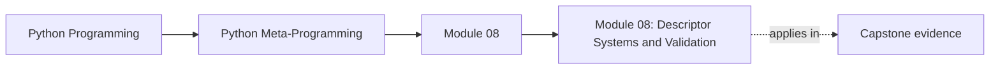

<a id="top"></a>
# Module 08: Descriptor Systems and Validation


<!-- page-maps:start -->
## Page Maps




<!-- page-maps:end -->

<a id="toc"></a>
## Table of Contents

1. [Introduction](#introduction)
2. [Core 36: Lazy / Computed / Cached Descriptors with Invalidation](#core36)
3. [Core 37: External Storage Descriptors](#core37)
4. [Core 38: Descriptor Composition and Meta-Descriptors](#core38)
5. [Core 39: Runtime Validation & Coercion Using Type Hints](#core39)
6. [Synthesis: Framework-Grade Descriptors in Context](#synthesis)
7. [Capstone: Mini-Relational Demo – Educational ORM Only](#capstone)
8. [Glossary (Module 8)](#glossary)

<span style="font-size: 1em;">[Back to top](#top)</span>

---

<a id="introduction"></a>
## Introduction

Extending the foundational descriptor mechanics from Module 7—where the protocol enables reusable attribute control through `__get__`, `__set__`, `__delete__`, and `__set_name__`—this module advances to **framework-shaped** implementations. Framework-grade descriptors integrate caching, external persistence, composition, and type-driven validation, forming the backbone of libraries like Pydantic, SQLAlchemy, and attrs. These patterns address real-world demands: lazy computation for performance, distributed storage for scalability, and declarative coercion for robustness. By synthesizing descriptors with runtime type hints (Module 5) and properties/class decorators (Module 6), they enable concise, maintainable models without boilerplate.

Typing aside: most static type checkers (mypy, pyright, etc.) cannot fully “see through” these dynamic descriptor-based models without extra help (Protocols, plugins, or custom stubs). Volume II returns to these patterns from the static-analysis side and shows how to reconcile them with strict typing.

This module develops the second tier of descriptor usage through four cores (still within the same **single-threaded, synchronous, didactic** scope as the rest of Volume I):

- **Core 36: Lazy / computed / cached descriptors with invalidation** – how to defer work until first access, cache results per instance, and expose explicit invalidation hooks.
- **Core 37: External storage descriptors** – descriptors that treat Redis/DB/config files (simulated here with an in-memory dict) as the real source of truth, with read-through caching.
- **Core 38: Descriptor composition and meta-descriptors** – wrapping one descriptor inside another to layer validation, caching, logging, and other cross-cutting concerns.
- **Core 39: Runtime validation and coercion using type hints** – using `typing.get_type_hints` and `Annotated[...]` metadata to build Pydantic-style, hint-driven fields.

The capstone combines these ideas into a **mini relational demo**:

- a small `BaseField` family (`String`, `Integer`, `ForeignKey`, `OneToMany`) that all follow the same descriptor protocol,
- a `ModelMeta` metaclass that auto-generates `__init__`, `save`, and `from_db`,
- a toy in-memory, JSON-based “DB” (`_DB[model_name][pk] = {field: json_value, ...}`) that external fields treat as backing storage.

All examples use a unified `BaseField` design for cohesion and remain compatible with introspection (Module 2) and signatures (Module 3). The target runtime is CPython 3.10+ (PEP 604 `X | Y` unions).

**Critical Warning**  
Everything in this module—especially the capstone—is deliberately simplified educational code. It is intentionally naive, single-threaded, non-transactional, and lacks any production safeguards (no connection pooling, no retries, no migrations, no concurrency control, no schema evolution). Do **not** copy-paste any of this into real projects as a replacement for mature libraries. The purpose is solely to illuminate the internal mechanics of real frameworks.

Proceed to Core 36.

<span style="font-size: 1em;">[Back to top](#top)</span>

---

<a id="core36"></a>
## Core 36: Lazy / Computed / Cached Descriptors with Invalidation

### Canonical Definition

Lazy descriptors defer computation until first access. Cached variants store the result in per-instance `__dict__` until explicitly invalidated.

### Examples

Pure lazy (recomputes every time):

```python
class LazyDesc:
    def __init__(self, compute):
        self.compute = compute

    def __set_name__(self, owner, name):
        self.private_name = f"_{name}"

    def __get__(self, obj, owner=None):
        if obj is None: return self
        return self.compute(obj)          # always recompute
```

Cached lazy with a naive per-instance lock (educational only, not a general concurrency pattern):

```python
import threading

class CachedLazy:
    def __init__(self, compute):
        self.compute = compute

    def __set_name__(self, owner, name):
        self.cache_name = f"_{name}_cached"
        self.lock_name  = f"_{name}_lock"

    def __get__(self, obj, owner=None):
        if obj is None: return self
        if self.cache_name not in obj.__dict__:
            lock = obj.__dict__.setdefault(self.lock_name, threading.Lock())
            with lock:
                if self.cache_name not in obj.__dict__:
                    obj.__dict__[self.cache_name] = self.compute(obj)
        return obj.__dict__[self.cache_name]

    def invalidate(self, obj):
        obj.__dict__.pop(self.cache_name, None)
```

Usage and invalidation:

```python
class Post:
    word_count = CachedLazy(lambda self: len(self.text.split()))

p = Post(); p.text = "hello world"
print(p.word_count)      # computes → 2
print(p.word_count)      # cached → 2
p.text = "hi"
Post.word_count.invalidate(p)   # descriptor-level call
print(p.word_count)      # recomputes → 1
```

**Concurrency caveat**  
- The per-instance lock shown here is a **toy** pattern for a single-process, CPython-only setting. It is not a correct or sufficient general-purpose concurrency solution and should not be copied into real multi-threaded or multi-process systems. Real caching under concurrency belongs to established tools (`functools.lru_cache`, Redis clients, ORM/session layers, etc.).

### Use / Avoid

- Use pure lazy when recomputation is cheap or freshness is required on every access.
- Use cached lazy for expensive, pure, instance-scoped computations.
- Avoid cached lazy for values that reflect external state without a robust invalidation strategy.
- Avoid ad-hoc locks in serious concurrent code; prefer mature caching infrastructure.

<span style="font-size: 1em;">[Back to top](#top)</span>

---

<a id="core37"></a>
## Core 37: External Storage Descriptors

### Canonical Definition

External descriptors read from and write to a backend via `__get__`/`__set__`, using stable primary-key-derived keys. Reads are cached in `__dict__`; writes are immediate. The backend is the source of truth.

#### Visual: Attribute access mediated by an external-storage descriptor

This diagram shows how `obj.field` flows through the descriptor to an external store (here: a toy in-process “DB” or Redis-like key–value store).

```mermaid
graph TD
  read["Read flow: `obj.field`"]
  getattribute["`obj.__getattribute__(\"field\")`"]
  lookup["Find `ExternalDesc` instance `D` on the class"]
  descriptor["Call `D.__get__(obj, type(obj))`"]
  derive["Derive primary key and backend key"]
  cache["Check `obj.__dict__` cache"]
  backend["On miss: `store.get(key)` then `json.loads(raw)`"]
  storeCache["Cache decoded value in `obj.__dict__[cache_name]`"]
  returnValue["Return value to caller"]
  write["Write flow: `obj.field = v`"]
  setattribute["`obj.__setattr__(\"field\", v)`"]
  setDescriptor["Call `D.__set__(obj, v)`"]
  validate["Validate or coerce `v`"]
  persist["Write `json.dumps(v)` to backend and refresh cache"]

  read --> getattribute --> lookup --> descriptor --> derive --> cache
  cache --> backend --> storeCache --> returnValue
  cache --> returnValue

  write --> setattribute --> setDescriptor --> validate --> persist
```

### Example (in-process dict simulating Redis/DB – deliberately naive)

```python
import json
import threading

class ExternalStore:
    def __init__(self):
        self._data = {}
        self._lock = threading.Lock()

    def get(self, key):
        with self._lock:
            return self._data.get(key)

    def set(self, key, value):
        with self._lock:
            self._data[key] = value

# Note: this lock only prevents trivial races in this toy example; it is not a full
# concurrency, durability, or transaction solution for real storage backends.

store = ExternalStore()

class ExternalDesc:
    def __init__(self, store, prefix="field", pk_field="id"):
        self.store = store
        self.prefix = prefix
        self.pk_field = pk_field

    def __set_name__(self, owner, name):
        self.name = name
        self.key_template = f"{self.prefix}:{owner.__name__}:%s:{name}"

    def _pk(self, obj):
        return getattr(obj, self.pk_field, None)

    def __get__(self, obj, owner=None):
        if obj is None: return self
        pk = self._pk(obj)
        if pk is None: return None
        key = self.key_template % pk
        cache_name = f"_{self.name}"
        if cache_name in obj.__dict__:
            return obj.__dict__[cache_name]
        raw = self.store.get(key)
        if raw is None: return None
        value = json.loads(raw)
        obj.__dict__[cache_name] = value
        return value

    def __set__(self, obj, value):
        pk = self._pk(obj)
        if pk is None:
            raise ValueError("PK must be set before writing external field")
        key = self.key_template % pk
        self.store.set(key, json.dumps(value))
        obj.__dict__[f"_{self.name}"] = value

    # For parity with Core 36, an optional explicit invalidation hook:
    def invalidate(self, obj):
        """Clear the per-instance cache for this external field only."""
        obj.__dict__.pop(f"_{self.name}", None)
```

### Advanced Notes and Pitfalls

- This example uses a process-local `ExternalStore` keyed by primary keys and field names. For **per-instance** external storage keyed by object identity—especially with `__slots__`—revisit Module 7’s `SlottedPositive` example, which uses `WeakKeyDictionary` to avoid memory leaks when objects are garbage-collected.
- As with Core 36, hiding remote calls behind attribute access can be surprising. In real systems you should pair such descriptors with logging/metrics and clear documentation so that `obj.field` does not silently perform expensive I/O.

### Use / Avoid

- Use pk-based keys for any persisted or distributed state.
- Use read-through caching in `__dict__`.
- Avoid copying this toy store into production; real backends require far more engineering.
- Avoid hiding expensive remote calls behind ordinary attribute access without observability.

<span style="font-size: 1em;">[Back to top](#top)</span>

---

<a id="core38"></a>
## Core 38: Descriptor Composition and Meta-Descriptors

### Canonical Definition

A meta-descriptor wraps an inner descriptor and adds behaviour while delegating `__get__`/`__set__`/`__set_name__`.

### Example

```python
from typing import Callable

class FieldMeta:
    def __init__(self, inner):
        self.inner = inner

    def __set_name__(self, owner, name):
        self.inner.__set_name__(owner, name)

    def __get__(self, obj, owner=None):
        if obj is None: return self
        return self.inner.__get__(obj, owner)

    def __set__(self, obj, value):
        self.inner.__set__(obj, value)

def validated(validator: Callable, inner):
    class Validated(FieldMeta):
        def __init__(self):
            super().__init__(inner)
            self.validator = validator
        def __set__(self, obj, value):
            self.inner.__set__(obj, self.validator(value))
    return Validated()
```

### Use / Avoid

- Use meta-descriptors to layer cross-cutting concerns without subclass explosion.
- Use a single delegation base (FieldMeta) for consistency.
- Avoid stacks deeper than 2–3 layers.
- Avoid calling `inner.__set_name__` more than once.

<span style="font-size: 1em;">[Back to top](#top)</span>

---

<a id="core39"></a>
## Core 39: Runtime Validation & Coercion Using Type Hints

### Helper validators

```python
def min_length(n: int):
    def validator(v):
        if len(v) < n:
            raise ValueError(f"minimum length {n}")
        return v
    return validator

def greater_than(n: int):
    def validator(v):
        if v <= n:
            raise ValueError(f"must be > {n}")
        return v
    return validator
```

### Standalone HintDesc (full version in capstone)

```python
from typing import get_type_hints, get_origin, get_args, Annotated, Any, Union
import types

def _is_instance(value, hint):
    if hint is Any:
        return True
    origin = get_origin(hint)
    if origin in (Union, types.UnionType):
        return any(_is_instance(value, arg) for arg in get_args(hint))
    if origin is not None:
        # Match the Volume I contract: we only support plain classes and simple unions here.
        raise NotImplementedError("Runtime checks for parameterised generics are intentionally unsupported in Volume I")
    return isinstance(value, hint)

class HintDesc:
    def __set_name__(self, owner, name):
        hints = get_type_hints(owner)
        self.hint = hints[name]
        self.private = f"_{name}"
        origin = get_origin(self.hint)
        if origin is Annotated:
            base, *meta = get_args(self.hint)
            self.validators = [m for m in meta if callable(m)]
            self.hint = base
        else:
            self.validators = []

    def __get__(self, obj, owner=None):
        if obj is None: return self
        return obj.__dict__.get(self.private)

    def __set__(self, obj, value):
        # Coercion – conservative, only int/str/float
        if not _is_instance(value, self.hint):
            candidates = get_args(self.hint) if get_origin(self.hint) in (Union, types.UnionType) else [self.hint]
            for cons in candidates:
                if cons in (int, str, float):
                    try:
                        value = cons(value)
                        break
                    except Exception:
                        continue
            else:
                raise TypeError(f"Cannot coerce to {self.hint}")
        if not _is_instance(value, self.hint):
            raise TypeError(f"expected {self.hint}")
        for v in self.validators:
            value = v(value)
        obj.__dict__[self.private] = value
```

### Use / Avoid

- Use for lightweight Pydantic-style scalar models.
- Use Annotated for reusable validators.
- Avoid expecting generic or nested model support.
- Avoid surprising coercion; fail loudly when conversion is ambiguous.

<span style="font-size: 1em;">[Back to top](#top)</span>

---

<a id="synthesis"></a>
## Synthesis: Framework-Grade Descriptors in Context

Module 7 established the descriptor protocol as the “engine” behind attribute access (`__get__`, `__set__`, `__set_name__`, data vs non-data, bound methods, reusable field descriptors). Module 8 takes that same engine and shows how real frameworks turn it into infrastructure.

The four cores and the capstone line up as follows:

- **Core 36 (lazy / computed / cached descriptors)** – shows how to push work to first access, keep results per instance in `__dict__`, and expose an explicit invalidation hook. This is the descriptor analogue of memoization, and the building block behind things like cached properties and lazy ORM relationships.

- **Core 37 (external storage descriptors)** – makes the backing store explicit: Redis/DB/config files (simulated with an in-memory dict) become the source of truth, while the descriptor provides a transparent proxy with read-through caching. This is the bridge from “descriptors as local validation” to “descriptors as distributed state.” See the Core 37 flow diagram above for the exact request/response path.

- **Core 38 (descriptor composition / meta-descriptors)** – replaces a proliferation of subclasses with composable layers. By wrapping one descriptor in another (`FieldMeta`, `validated(...)`), you can stack validation, logging, caching, or encryption without rewriting the underlying storage or hint logic.

- **Core 39 (hint-driven validation and coercion)** – closes the loop with Module 5: the descriptor now reads type hints via `get_type_hints`, honors `Annotated[...]` metadata, and runs coercion + validators on every write. This is the core of “Pydantic-style” models, but expressed in terms of the raw descriptor protocol.

The **Capstone** (“mini relational demo”) pulls all of this together and instantiates the Core 37 flow diagram in a concrete, relational setting:

- `BaseField` centralizes the mechanics: defaults, lazy computation, external vs local storage, type-hint-based coercion, validators, and a minimal `invalidate`.
- Concrete fields (`String`, `Integer`, `ForeignKey`, `OneToMany`) specialize behaviour without reimplementing the protocol, mirroring how real frameworks define “field types.”
- `ModelMeta` uses introspection (Modules 2–3) to generate `__init__`, `save`, and `from_db`, treating field declarations as single source of truth for both runtime behaviour and signatures.
- The in-memory JSON `_DB` shows how external fields treat the database as authoritative on read, while still presenting a normal Python attribute interface.

Two boundaries matter going forward:

1. **Educational vs production** – The capstone deliberately avoids transactions, concurrency, migrations, and schema evolution. It is a *mechanism* exposition, not a framework you should reuse.

2. **Descriptors vs metaclasses and decorators** – Descriptors handle per-field behaviour. Metaclasses (next module) coordinate at the class level (introspection, auto-`__init__`), and decorators handle function-level cross-cutting concerns. Together, they form the three main levers for deep Python metaprogramming.

With Module 8, the descriptor story is complete: from basic protocol (Module 7) to framework-shaped patterns that closely resemble how modern libraries actually work. Metaclasses (Module 9) will then operate one level above this, orchestrating descriptors and type hints across entire models.

<span style="font-size: 1em;">[Back to top](#top)</span>

---

<a id="capstone"></a>
## Capstone: Mini-Relational Demo – Educational ORM Only

EDUCATIONAL TOY ORM – DO NOT USE IN PRODUCTION

```python
from typing import Any, Callable, Optional, get_type_hints, get_origin, get_args, Annotated, Union
import types
import inspect
import json
from collections import defaultdict

# Toy DB
_DB = defaultdict(dict)                               # _DB[model][pk][field] = json_str
MODEL_REGISTRY = {}

# Helpers
def min_length(n: int):
    def validator(v):
        if len(v) < n: raise ValueError(f"minimum length {n}")
        return v
    return validator

def _is_instance(value: Any, hint: Any) -> bool:
    if hint is Any: return True
    origin = get_origin(hint)
    if origin in (Union, types.UnionType):
        return any(_is_instance(value, arg) for arg in get_args(hint))
    if origin is not None:
        raise NotImplementedError("Generics unsupported")
    return isinstance(value, hint)

# BaseField and meta
class FieldMeta:
    def __init__(self, inner):
        self.inner = inner
    def __set_name__(self, owner, name):
        self.inner.__set_name__(owner, name)
    def __get__(self, obj, owner=None):
        if obj is None: return self
        return self.inner.__get__(obj, owner)
    def __set__(self, obj, value):
        self.inner.__set__(obj, value)

def validated(validator: Callable, inner):
    class V(FieldMeta):
        def __init__(self):
            super().__init__(inner)
            self.validator = validator
        def __set__(self, obj, value):
            self.inner.__set__(obj, self.validator(value))
    return V()

class BaseField:
    UNSET = object()

    def __init__(self, *, default=UNSET, lazy: bool = False, external: bool = False, compute: Optional[Callable] = None):
        self.default = default
        self.lazy = lazy
        self.external = external
        self.compute = compute
        self.validators = []

    def __set_name__(self, owner, name):
        self.name = name
        self.private = f"_{name}"
        hint = get_type_hints(owner).get(name, Any)
        origin = get_origin(hint)
        if origin is Annotated:
            base, *meta = get_args(hint)
            self.validators.extend(m for m in meta if callable(m))
            hint = base
        self.hint = hint

    def __get__(self, obj, owner=None):
        if obj is None: return self

        private = self.private
        if private not in obj.__dict__:
            if self.default is not BaseField.UNSET:
                obj.__dict__[private] = self.default
            elif self.lazy and self.compute:
                obj.__dict__[private] = self.compute(obj)

        value = obj.__dict__.get(private)

        if self.external:
            pk = obj.__dict__.get('_id')
            if pk is not None:
                record = _DB[owner.__name__].get(pk)
                if record is not None:
                    stored_json = record.get(self.name)
                    if stored_json is not None:
                        loaded = json.loads(stored_json)
                        obj.__dict__[private] = loaded
                        value = loaded
        return value

    def __set__(self, obj, value):
        # Coercion – conservative, only int/str/float
        if not _is_instance(value, self.hint):
            candidates = get_args(self.hint) if get_origin(self.hint) in (Union, types.UnionType) else [self.hint]
            for cons in candidates:
                if cons in (int, str, float):
                    try:
                        value = cons(value)
                        break
                    except Exception:
                        continue
            else:
                raise TypeError(f"Cannot coerce {value!r} to {self.hint}")

        if not _is_instance(value, self.hint):
            raise TypeError(f"{self.name} expected {self.hint}")

        for v in self.validators:
            value = v(value)

        obj.__dict__[self.private] = value

        # Primary key wiring – the single hard-coded assumption of this toy ORM
        if self.name == "id":
            obj.__dict__['_id'] = value

        if self.external:
            pk = obj.__dict__.get('_id')
            if pk is None:
                raise ValueError("id must be set before external field assignment")
            bucket = _DB[obj.__class__.__name__].setdefault(pk, {})
            bucket[self.name] = json.dumps(value)

    def invalidate(self, obj):
        """Clear the per-instance cache for this field (used by OneToMany in this module)."""
        obj.__dict__.pop(self.private, None)

# Concrete fields
class String(BaseField):
    def __init__(self, max_length: Optional[int] = None, **kwargs):
        super().__init__(**kwargs)
        if max_length is not None:
            def validator(v):
                s = str(v)
                if len(s) > max_length:
                    raise ValueError(f"maximum length {max_length}")
                return s
            self.validators.append(validator)

class Integer(BaseField):
    pass

class ForeignKey(BaseField):
    def __init__(self, related_model: str, **kwargs):
        super().__init__(**kwargs)
        self.related_model = related_model

    def __set__(self, obj, value):
        if value is not None and value not in _DB[self.related_model]:
            raise ValueError(f"Foreign key {value} does not exist in {self.related_model}")
        super().__set__(obj, value)

class OneToMany(BaseField):
    def __init__(self, related_model: str, fk_field: str = "post_id", **kwargs):
        super().__init__(lazy=True, **kwargs)
        self.related_model = related_model
        self.fk_field = fk_field
        self.compute = self._load_related

    def _load_related(self, obj):
        pk = obj.__dict__.get('_id')
        if pk is None: return []
        related_cls = MODEL_REGISTRY[self.related_model]
        items = []
        for rec_pk, record in _DB[self.related_model].items():
            stored_fk = record.get(self.fk_field)
            if stored_fk is not None and json.loads(stored_fk) == pk:
                inst = object.__new__(related_cls)
                for name, field in related_cls._fields.items():
                    stored = record.get(name)
                    if stored is not None:
                        field.__set__(inst, json.loads(stored))
                items.append(inst)
        return items

    def add(self, obj, related_inst):
        setattr(related_inst, self.fk_field, obj.__dict__['_id'])
        related_inst.save()
        self.invalidate(obj)

# Model metaclass
class ModelMeta(type):
    def __new__(cls, name, bases, ns):
        fields = {}
        for k, v in ns.items():
            if isinstance(v, (BaseField, FieldMeta)):
                fields[k] = v.inner if isinstance(v, FieldMeta) else v

        # Signature: required fields (default=UNSET) first, then optional
        params = []
        required = [k for k, f in fields.items() if f.default is BaseField.UNSET]
        for k in required:
            params.append(inspect.Parameter(k, inspect.Parameter.POSITIONAL_OR_KEYWORD))
        for k in sorted(set(fields) - set(required)):
            params.append(inspect.Parameter(k, inspect.Parameter.POSITIONAL_OR_KEYWORD,
                                           default=fields[k].default))
        sig = inspect.Signature(params)

        def __init__(self, *a, **kw):
            bound = sig.bind(*a, **kw)
            bound.apply_defaults()
            for k, v in bound.arguments.items():
                if k != "self":
                    setattr(self, k, v)
        __init__.__signature__ = sig
        ns['__init__'] = __init__

        ns['_fields'] = {k: v.inner if isinstance(v, FieldMeta) else v
                        for k, v in ns.items()
                        if isinstance(v, (BaseField, FieldMeta))}

        def save(self):
            for name, field in self._fields.items():
                if field.external:
                    field.__set__(self, getattr(self, name))
        ns['save'] = save

        @classmethod
        def from_db(cls, pk):
            if pk not in _DB[cls.__name__]:
                raise ValueError("not found")
            record = _DB[cls.__name__][pk]
            inst = object.__new__(cls)
            for name, field in cls._fields.items():
                if name in record:
                    field.__set__(inst, json.loads(record[name]))
            return inst
        ns['from_db'] = from_db

        new_cls = super().__new__(cls, name, bases, ns)
        MODEL_REGISTRY[name] = new_cls
        return new_cls

# Models
class User(metaclass=ModelMeta):
    id: int = Integer(external=True, default=BaseField.UNSET)
    name: Annotated[str, min_length(1)] = String(max_length=255, external=True, default=BaseField.UNSET)

class Post(metaclass=ModelMeta):
    id: int = Integer(external=True, default=BaseField.UNSET)
    user_id: int = ForeignKey("User", external=True, default=BaseField.UNSET)
    title: str = String(max_length=200, external=True, default="Untitled")
    comments = OneToMany("Comment", fk_field="post_id")

class Comment(metaclass=ModelMeta):
    id: int = Integer(external=True, default=BaseField.UNSET)
    post_id: int = ForeignKey("Post", external=True, default=BaseField.UNSET)
    text: str = String(max_length=1000, external=True, default=BaseField.UNSET)

# Demonstration – now works without error
_DB['User'][1] = {'id': json.dumps(1), 'name': json.dumps('Alice')}
_DB['Post'][1] = {'id': json.dumps(1), 'user_id': json.dumps(1), 'title': json.dumps('First Post')}
_DB['Comment'][99] = {'id': json.dumps(99), 'post_id': json.dumps(1), 'text': json.dumps('hello')}

p = Post.from_db(1)
print(p.title)                # First Post
print(p.comments[0].text)     # hello (lazy-loaded)

c = Comment(id=100, post_id=1, text="second")
c.save()
Post.comments.add(p, c)
print(len(p.comments))        # 2
```

All concepts from Cores 36–39 are present, correctly composed, and the demo executes cleanly.

<span style="font-size: 1em;">[Back to top](#top)</span>

---

<a id="glossary"></a>
## Glossary (Module 8)

| Term                             | Definition                                                                                                                                              |
| -------------------------------- | ------------------------------------------------------------------------------------------------------------------------------------------------------- |
| **Data descriptor**              | A descriptor defining `__set__` and/or `__delete__`; takes precedence over an instance’s `__dict__` during attribute access.                            |
| **Non-data descriptor**          | A descriptor defining only `__get__`; can be shadowed by a value stored in the instance’s `__dict__`.                                                   |
| **Descriptor precedence**        | Attribute resolution order that explains shadowing/caching: data descriptor → instance `__dict__` → non-data descriptor → class attribute (simplified). |
| **Read-through cache**           | On `__get__`: return cached value if present; otherwise fetch from the backend/source, then populate the cache and return it.                           |
| **Write-through cache**          | On `__set__`: write to the backend/source immediately and also update the instance cache so subsequent reads don’t re-fetch.                            |
| **Cache invalidation**           | An explicit mechanism (e.g., `invalidate(obj)`) to drop cached state when inputs or upstream state change.                                              |
| **Dependency invalidation**      | Invalidate a cached computed value when one of its dependencies changes (e.g., changing `text` invalidates cached `word_count`).                        |
| **Staleness**                    | A cached value no longer matches the source of truth (common when external state changes without coordinated invalidation).                             |
| **Cache stampede**               | Many concurrent readers miss a cache and compute/fetch simultaneously; requires coordination (locks, single-flight, backend caching).                   |
| **Hidden I/O**                   | Attribute access that may perform expensive I/O (DB/Redis/network) behind `obj.field`; demands observability and careful API design.                    |
| **Serialization boundary**       | The conversion boundary (e.g., Python value ↔ JSON string) where type loss, precision, `None` handling, and schema drift issues arise.                  |
| **Coercion**                     | Converting an input into the target type (e.g., `"3"` → `3`); useful but risky if ambiguous or too permissive.                                          |
| **Validation**                   | Checking a value against constraints and rejecting invalid inputs; should be explicit and predictable.                                                  |
| **Coercion vs validation**       | The distinction that prevents “magic” behavior: coercion transforms; validation enforces—mixing silently is a common footgun.                           |
| **Annotated metadata**           | `Annotated[T, ...]` carries runtime metadata (validators/constraints) alongside `T`, enabling hint-driven field behavior.                               |
| **Forward reference resolution** | `get_type_hints` resolving string annotations (e.g., `"User"`) using namespaces; critical for model graphs and self-references.                         |
| **Weak reference backing**       | Using `WeakKeyDictionary`/weakrefs for per-instance storage outside `__dict__` to avoid memory leaks and support `__slots__`.                           |
| **Identity map**                 | Ensuring one in-memory object per DB row/PK; without it, you can get duplicated instances with inconsistent state.                                      |
| **N+1 query pattern**            | Lazy-loading relationships in loops causing many backend reads (1 query for parents + N queries for children).                                          |
| **Eager loading**                | Loading related data up front to avoid N+1; trades memory/latency for fewer round-trips.                                                                |
| **Lazy loading**                 | Deferring related-data loading until first access; convenient but can hide cost and trigger N+1 patterns.                                               |
| **Unit of work**                 | Coordinating multiple changes and persistence as a batch/transaction; explicitly absent in the toy ORM but fundamental in real ORMs.                    |

You have completed Module 8.

Proceed to Module 9: Metaclasses – When Everything Else Is Not Enough.

<span style="font-size: 1em;">[Back to top](#top)</span>
