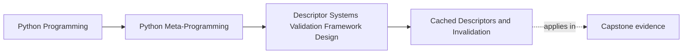

# Cached Descriptors and Invalidation


<!-- page-maps:start -->
## Page Maps




<!-- page-maps:end -->

Module 08 begins with the first way descriptor systems usually grow beyond simple field
validation:

they stop returning raw stored values and start managing time.

Lazy computation, cached results, and invalidation all live there.

## The sentence to keep

A cached descriptor is not only a descriptor that remembers a value. It is a descriptor
that must define when the value is computed, where it is stored, and how it becomes
invalid.

That is the real design surface.

## Three related patterns

Keep these three patterns separate:

- pure computed access recalculates on every read
- lazy access computes on first read and may or may not retain the result
- cached access stores a result and reuses it until something invalidates it

People often blur these together, but they create different review questions.

## A pure computed descriptor

```python
class ComputedField:
    def __init__(self, compute):
        self.compute = compute

    def __get__(self, obj, owner=None):
        if obj is None:
            return self
        return self.compute(obj)
```

This is simple because it does not promise reuse or freshness beyond the current read.

## A cached descriptor with explicit storage

```python
class CachedField:
    def __init__(self, compute):
        self.compute = compute

    def __set_name__(self, owner, name):
        self.cache_name = f"_{name}_cached"

    def __get__(self, obj, owner=None):
        if obj is None:
            return self
        if self.cache_name not in obj.__dict__:
            obj.__dict__[self.cache_name] = self.compute(obj)
        return obj.__dict__[self.cache_name]

    def invalidate(self, obj):
        obj.__dict__.pop(self.cache_name, None)
```

This is already a stronger design because the cache policy is visible:

- one per-instance cache slot
- first-read computation
- explicit invalidation hook

## Why invalidation is part of the field contract

Suppose a cached descriptor computes `word_count` from `text`.

If `text` changes but `word_count` stays cached, the descriptor has become stale.

That means the real contract is not just:

- how do we cache?

It is also:

- what changes make the cached value outdated?
- who is responsible for clearing it?

If those answers are missing, the cache design is incomplete.

## A dependency example

```python
class Post:
    def __init__(self, text):
        self.text = text

    word_count = CachedField(lambda obj: len(obj.text.split()))


post = Post("hello world")
print(post.word_count)  # 2
post.text = "hello careful world"
Post.word_count.invalidate(post)
print(post.word_count)  # 3
```

This is a small example, but it keeps the right instinct visible:

dependencies matter just as much as the cache itself.

## Where cached values should live

For most course-level cached descriptors, the safest owner is still the instance:

```python
obj.__dict__[cache_name]
```

That keeps cached state:

- per instance
- easy to inspect during debugging
- separate from the shared descriptor object

The same storage rule from Module 07 still applies.

## Why hidden freshness assumptions are dangerous

Caching often makes code look faster and cleaner while quietly making it less truthful.

Common failure modes are:

- input changes that do not invalidate cached outputs
- external dependencies changing behind the cache
- no clear distinction between cached data and current data

This is why cache review is really state review.

## A note on concurrency

You may see educational examples that use simple locks around first-load caching.

That can be useful as a bounded example, but the key point is:

serious concurrent caching is larger than one clever descriptor.

For this course, the important boundary is:

- per-instance cache mechanics can be shown in a descriptor
- real concurrent cache coordination usually belongs to stronger infrastructure

## When cached descriptors are a good fit

Use them when:

- the value is expensive to compute
- the value is meaningfully instance-scoped
- freshness can be described clearly
- invalidation can be made explicit

That is the sweet spot.

## When they are a poor fit

Cached descriptors are a weaker fit when:

- the value depends on volatile external state
- the invalidation story is unclear
- the system needs cross-instance or distributed coherence
- the cost of being stale is high

Those cases usually need more architecture than a field object alone.

## Review rules for cached descriptors

When reviewing a cached descriptor, keep these questions close:

- when is the value first computed?
- where is the cached value stored?
- what dependencies can make the cache stale?
- who invalidates it and how explicitly?
- is this still an attribute-level cache, or is it drifting toward wider caching infrastructure?

## What to practice from this page

Try these before moving on:

1. Implement one descriptor that computes on every read and one that caches after the first read.
2. Add an explicit `invalidate(obj)` method and show one stale-cache bug it prevents.
3. Write one short review note rejecting a cached descriptor because the freshness story is too vague.

If those feel ordinary, the next step is external storage, where the descriptor stops
owning the source of truth entirely.

## Continue through Module 08

- Previous: [Overview](index.md)
- Next: [External Storage Descriptors](external-storage-descriptors.md)
- Practice: [Exercises](exercises.md)
- Terms: [Glossary](glossary.md)
