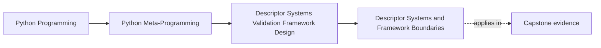

# Descriptor Systems and Framework Boundaries


<!-- page-maps:start -->
## Page Maps




<!-- page-maps:end -->

This final core is the design page for Module 08.

The mechanics are already on the table:

- caching
- invalidation
- external storage
- composition
- hint-driven validation

The remaining question is the important one:

when is this still a descriptor system, and when has it become framework architecture?

## The sentence to keep

Descriptor systems stay honest when they still own one attribute contract at a time; once
they start coordinating identity, transactions, query planning, object graphs, or broader
lifecycle behavior, the design has crossed into framework architecture.

That is the boundary the module keeps visible.

## Why this boundary matters

Descriptor systems are seductive because they can make rich behavior appear simple:

- `obj.field`
- `obj.related`
- `obj.title = "..."`.

But that surface can hide a lot:

- remote storage
- cache invalidation
- coercion policy
- relationship loading
- persistence rules

If those concerns pile up without a broader design boundary, the descriptor starts looking
more powerful than it really is.

## The framework pressure ladder

A useful review ladder for this module is:

```text
single field descriptor
  -> wrapped or composed field descriptor
  -> coordinated descriptor system
  -> explicit framework services and model architecture
  -> metaclass or class-creation orchestration when model-wide generation is required
```

This is not a “more advanced is better” ladder. It is a blast-radius ladder.

## What still belongs to one attribute

Strong descriptor cases in this module still sound like:

- normalize this one field on assignment
- cache this one computed attribute with explicit invalidation
- read this one field through a backend-backed descriptor
- attach one validator layer around one inner field

Those are all still field-level ownership stories.

## What starts to exceed one attribute

The design is moving beyond one descriptor when it needs:

- identity maps across many records
- transaction or unit-of-work coordination
- relationship loading strategy across collections
- schema evolution and migrations
- global model registries with lifecycle behavior

At that point, the descriptor is no longer the whole story. It is one component inside a
larger framework.

## Why hidden architecture is risky

One of the easiest mistakes in metaprogramming is hiding architecture inside “smart field”
objects.

That can make code look elegant while making it harder to answer basic questions such as:

- where does persistence actually happen?
- who invalidates related objects?
- what guarantees object identity?
- how are writes coordinated?

If the answer is “the field sort of handles it,” the design boundary is already blurry.

## Descriptors versus explicit services

A strong rule of thumb is:

- keep per-field semantics in descriptors
- move cross-field or cross-record orchestration into explicit services, sessions, or framework objects

That split keeps the descriptor layer narrow enough to inspect while still allowing the
overall system to grow.

This is why real frameworks do not stop at descriptors. They build surrounding
architecture.

## Descriptors versus metaclasses

Module 08 is still mostly about field behavior.

But once the system wants:

- generated constructors
- automatic registries
- class-level field collection
- model-wide signatures or save hooks

the design is starting to ask class-creation questions as well.

That is the bridge into Module 09.

Descriptors can participate in those systems, but they do not replace the need for
class-level orchestration.

## What strong Module 08 design notes sound like

Good review notes in this module usually sound like:

- "this cache policy still belongs to one field"
- "this relationship-loading logic is now bigger than one descriptor"
- "this coercion layer is fine, but identity mapping needs a wider owner"
- "this is no longer only a field abstraction; it wants explicit session or model infrastructure"

That tone is what keeps powerful descriptor systems from sounding magical.

## Review rules for framework boundaries

When reviewing a framework-shaped descriptor design, keep these questions close:

- does this behavior still belong to one attribute contract?
- what responsibilities are now shared across multiple fields or records?
- is the descriptor hiding architecture that deserves an explicit owner?
- is class-level orchestration starting to appear?
- would explicit framework services make the system more honest than increasingly smart fields?

## What to practice from this page

Try these before moving on:

1. Take one field system idea and split its responsibilities into field-level versus framework-level owners.
2. Write one short review note saying why identity mapping is not “just another descriptor feature.”
3. Reject one design that hides transactions or relationship loading entirely behind attribute syntax.

If those feel ordinary, the worked example can now combine the module's mechanisms inside
one intentionally bounded educational model layer.

## Continue through Module 08

- Previous: [Hint-Driven Validation and Coercion](hint-driven-validation-and-coercion.md)
- Next: [Worked Example: Building an Educational Mini Relational Model](worked-example-building-an-educational-mini-relational-model.md)
- Return: [Overview](index.md)
- Terms: [Glossary](glossary.md)
