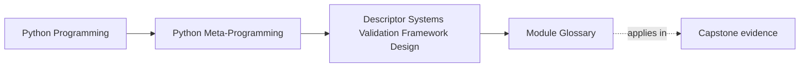

# Module Glossary

<!-- page-maps:start -->
## Page Maps

<!-- page-maps:end -->

This glossary belongs to **Module 08: Descriptor Systems, Validation, and Framework Design**
in **Python Metaprogramming**. It keeps the language of this directory stable so the same
ideas keep the same names across lessons, practice, review, and capstone discussion.

## How to use this glossary

Use the glossary when framework-shaped descriptor discussions start to blur together cache
policy, external sources of truth, wrapper fields, hint-driven validation, and broader
architecture. Module 08 is meant to keep those boundaries explicit.

## Terms in this directory

| Term | Meaning in this directory |
| --- | --- |
| Cache invalidation | The explicit act of clearing or refreshing a cached descriptor value when its dependencies or source data change. |
| Composed field | A descriptor built by wrapping one field descriptor in another so an extra concern can be layered through delegation. |
| External source of truth | The backing store outside the instance that ultimately owns a field's persisted value. |
| External-storage descriptor | A descriptor that reads from or writes to backend-managed state rather than relying only on instance-local storage. |
| Field wrapper | A delegating descriptor layer that adds one concern around an inner descriptor, such as validation or logging. |
| Framework boundary | The point where descriptor behavior is no longer just per-field semantics and now requires explicit architectural owners. |
| Hidden I/O | The case where ordinary attribute access performs backend reads, writes, or serialization work that is not obvious from the syntax alone. |
| Hint-driven field | A descriptor that reads annotations or `Annotated[...]` metadata as runtime evidence for validation or coercion. |
| Identity map | A broader framework mechanism that keeps one in-memory object per record identity, explicitly outside the scope of a single descriptor. |
| Read-through cache | A cache strategy where a descriptor fetches from the authoritative backend on miss, stores the value locally, and returns it. |
| Serialization boundary | The conversion point between Python values and stored representations such as JSON strings. |
| Source of truth | The location or system whose value should be treated as authoritative when field state and cached state diverge. |
| Unit of work | A wider framework pattern for coordinating multiple persistence changes together, beyond what one field descriptor should own. |
| Write-through behavior | The strategy of persisting a new field value to the backend immediately when assignment occurs, while also updating local cached state. |
| `Annotated[...]` metadata | Extra runtime metadata attached to a type annotation and often used here for validator-style field behavior. |

## Keep the module connected

- Return to [Module 08 Overview](index.md) for the full learning route.
- Use [Exercises](exercises.md) and [Exercise Answers](exercise-answers.md) to pressure-test the framework-descriptor vocabulary.
- Revisit the [Worked Example](worked-example-building-an-educational-mini-relational-model.md) when a field system starts to look like broader architecture and needs a boundary check.
