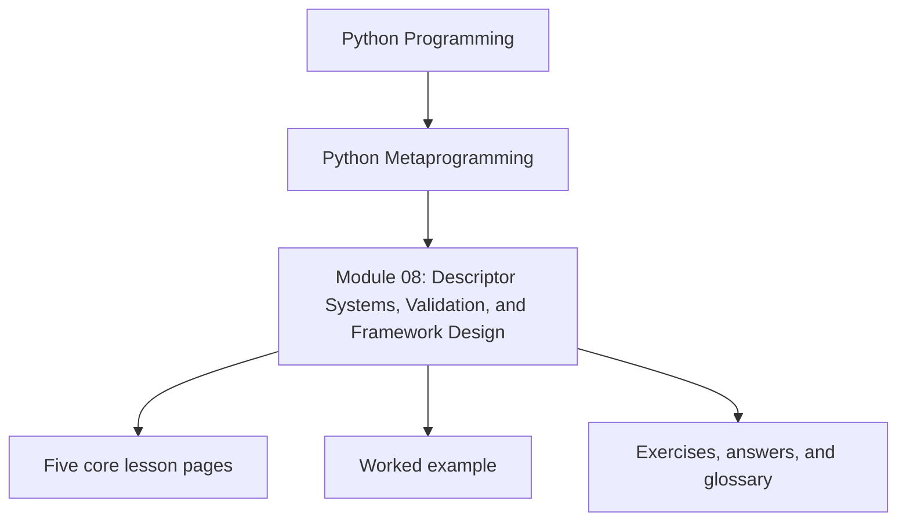
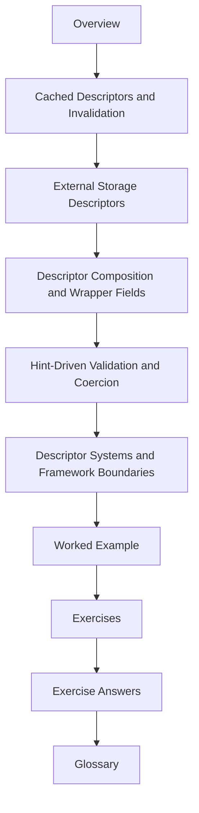

# Module 08: Descriptor Systems, Validation, and Framework Design

<!-- page-maps:start -->
## Module Position

<!-- page-maps:end -->

Module 08 picks up where Module 07 stopped: descriptors are no longer just field-level
mechanics, but the starting point for framework-shaped systems. The goal is not to make
descriptor code look more impressive. The goal is to understand how caching, external
storage, composition, and hint-driven validation widen the design surface, and where that
wider surface stops being “just one field object.”

This module now uses the same ten-file learning surface as the deep-dive series so the
overview, five cores, worked example, practice set, answers, and glossary each have one
clear job.

## What this module is for

By the end of Module 08, you should be able to explain five things clearly:

- when cached descriptors need explicit invalidation instead of hand-waving about freshness
- how external-storage descriptors differ from ordinary per-instance field storage
- how descriptor composition layers behavior without multiplying subclasses
- how hint-driven validation and coercion can stay useful without pretending to be a full framework
- when a descriptor system is still one-attribute ownership and when it has become framework architecture

## Keep these pages open

- [Mid-Course Map](../module-00-orientation/mid-course-map.md)
- [Anti-Pattern Atlas](../reference/anti-pattern-atlas.md)
- [Boundary Review Prompts](../reference/boundary-review-prompts.md)
- [Capstone Architecture Guide](../capstone/capstone-architecture-guide.md)

## The ten files in this module

1. Overview (`index.md`)
2. [Cached Descriptors and Invalidation](cached-descriptors-and-invalidation.md)
3. [External Storage Descriptors](external-storage-descriptors.md)
4. [Descriptor Composition and Wrapper Fields](descriptor-composition-and-wrapper-fields.md)
5. [Hint-Driven Validation and Coercion](hint-driven-validation-and-coercion.md)
6. [Descriptor Systems and Framework Boundaries](descriptor-systems-and-framework-boundaries.md)
7. [Worked Example: Building an Educational Mini Relational Model](worked-example-building-an-educational-mini-relational-model.md)
8. [Exercises](exercises.md)
9. [Exercise Answers](exercise-answers.md)
10. [Glossary](glossary.md)

## How to use the file set

| If you need to... | Start here |
| --- | --- |
| reason about lazy fields, cached values, and explicit invalidation | [Cached Descriptors and Invalidation](cached-descriptors-and-invalidation.md) |
| review descriptor designs whose source of truth lives outside the instance | [External Storage Descriptors](external-storage-descriptors.md) |
| layer validation, logging, or policy around an inner field descriptor | [Descriptor Composition and Wrapper Fields](descriptor-composition-and-wrapper-fields.md) |
| use type hints and `Annotated[...]` metadata as runtime field evidence | [Hint-Driven Validation and Coercion](hint-driven-validation-and-coercion.md) |
| decide when a descriptor system has crossed into framework architecture | [Descriptor Systems and Framework Boundaries](descriptor-systems-and-framework-boundaries.md) |
| see those choices combined in one educational model layer | [Worked Example: Building an Educational Mini Relational Model](worked-example-building-an-educational-mini-relational-model.md) |
| pressure-test your understanding before metaclasses take over | [Exercises](exercises.md) |
| compare your reasoning against a reference answer | [Exercise Answers](exercise-answers.md) |
| stabilize the framework-descriptor vocabulary used in this directory | [Glossary](glossary.md) |

## The running question

Carry this question through every page:

> When a field system grows more powerful, which responsibilities still belong to one attribute and which ones should move to explicit framework code?

Strong Module 08 answers usually mention one or more of these:

- cached values with real invalidation rules
- external sources of truth with read-through and write-through behavior
- composable wrapper fields that do not collapse into subclass sprawl
- hint-aware validation that stays narrow about what it supports
- a boundary decision that rejects “clever descriptor” overreach

## Learning outcomes

By the end of this module, you should be able to:

- explain why cache invalidation is part of descriptor design, not an afterthought
- compare instance-local storage with backend-backed descriptor state
- compose descriptor behavior while keeping ownership readable
- use type hints for scalar validation and coercion without overstating runtime typing support
- identify when descriptor systems need broader architectural owners such as explicit framework services or metaclasses

## Exit standard

Do not move on until all of these are true:

- you can explain what makes a cached descriptor safe or stale
- you can say where an external-storage descriptor gets its source of truth
- you can distinguish simple descriptor reuse from layered composition
- you can place one “framework-shaped” field behavior honestly on either the descriptor side or the architecture side of the boundary

When those feel ordinary, Module 08 has done its job and Module 09 can move one level
up into class-creation control.
