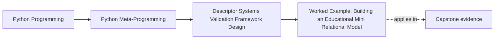
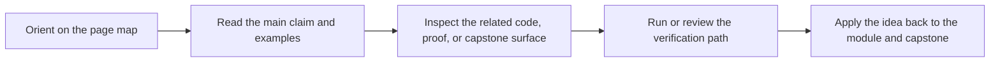

# Worked Example: Building an Educational Mini Relational Model


<!-- page-maps:start -->
## Page Maps




<!-- page-maps:end -->

The five core lessons in Module 08 become easier to trust when they meet one example that
is powerful enough to look like a framework, but still small enough to inspect.

A miniature relational model layer is exactly that kind of example.

It combines:

- cached descriptor reads
- external storage
- wrapper-field composition
- hint-aware validation
- the boundary between field behavior and model-wide orchestration

That makes it the right worked example for the module.

## The incident

Assume a team wants a tiny model system that can:

- declare fields on classes
- read and write some values through a backing store
- validate selected values
- lazy-load simple relationships

Those are reasonable educational goals. The mistake would be pretending this is now a real
ORM.

## The first design rule: keep the “ORM” claim narrow

This worked example is intentionally limited.

It can teach:

- how a field descriptor can read from or write to external storage
- how field wrappers can add validators
- how one relationship field can lazy-load related records

It does not claim:

- transactions
- migrations
- query planning
- identity maps
- session management

That refusal is what keeps the example honest.

## Step 1: define a base field with visible responsibilities

The base field in this example owns only a few things:

- a field name learned through `__set_name__`
- optional default values
- optional external persistence
- a place to run hint-driven coercion and validators

That is already a lot of responsibility, so the page keeps those responsibilities visible
instead of scattering them across several hidden helpers.

## Step 2: keep external persistence field-shaped

The field should persist one attribute value, not the whole object graph.

That means the educational model uses a tiny backing store shaped roughly like:

```python
DB[model_name][primary_key][field_name]
```

This is enough to show:

- backend-backed reads
- backend-backed writes
- why primary keys matter

without pretending to be a real storage engine.

## Step 3: let wrappers add narrow extra policy

Validation is layered as a wrapper concern, not built into every field subclass.

That keeps the field system readable:

- one base field for storage and coercion
- one wrapper for extra validation

This reuses the composition lesson instead of bypassing it.

## Step 4: keep relationships lazy but honest

A relationship field such as `OneToMany` can demonstrate:

- lazy loading on first access
- cache invalidation after related writes
- why relationship loading is already pushing past “just one scalar field”

This is exactly where the framework boundary starts to show.

## A bounded implementation

```python
import json
from collections import defaultdict
from typing import Any, Annotated, Callable, Union, get_args, get_origin, get_type_hints
import types


DB = defaultdict(dict)
MODEL_REGISTRY = {}


def min_length(n):
    def validator(value):
        if len(value) < n:
            raise ValueError(f"minimum length {n}")
        return value
    return validator


def supports_instance(value, hint):
    if hint is Any:
        return True
    origin = get_origin(hint)
    if origin in (Union, types.UnionType):
        return any(supports_instance(value, arg) for arg in get_args(hint))
    if origin is not None:
        raise NotImplementedError("parameterized generics are unsupported here")
    return isinstance(value, hint)


class BaseField:
    UNSET = object()

    def __init__(self, *, default=UNSET, external=False):
        self.default = default
        self.external = external
        self.validators = []

    def __set_name__(self, owner, name):
        self.name = name
        self.private_name = f"_{name}"
        hint = get_type_hints(owner).get(name, Any)
        origin = get_origin(hint)
        if origin is Annotated:
            base, *metadata = get_args(hint)
            hint = base
            self.validators.extend(item for item in metadata if callable(item))
        self.hint = hint

    def __get__(self, obj, owner=None):
        if obj is None:
            return self
        if self.private_name not in obj.__dict__ and self.default is not BaseField.UNSET:
            obj.__dict__[self.private_name] = self.default
        if self.external:
            pk = obj.__dict__.get("_id")
            if pk is not None:
                record = DB[owner.__name__].get(pk)
                if record is not None and self.name in record:
                    obj.__dict__[self.private_name] = json.loads(record[self.name])
        return obj.__dict__.get(self.private_name)

    def __set__(self, obj, value):
        if not supports_instance(value, self.hint):
            for candidate in (int, float, str):
                if candidate is self.hint:
                    try:
                        value = candidate(value)
                        break
                    except Exception:
                        pass
            else:
                raise TypeError(f"cannot coerce {value!r} to {self.hint!r}")

        for validator in self.validators:
            value = validator(value)

        obj.__dict__[self.private_name] = value

        if self.name == "id":
            obj.__dict__["_id"] = value

        if self.external:
            pk = obj.__dict__.get("_id")
            if pk is None:
                raise ValueError("id must be set before external field assignment")
            DB[obj.__class__.__name__].setdefault(pk, {})[self.name] = json.dumps(value)

    def invalidate(self, obj):
        obj.__dict__.pop(self.private_name, None)


class FieldWrapper:
    def __init__(self, inner):
        self.inner = inner

    def __set_name__(self, owner, name):
        self.inner.__set_name__(owner, name)

    def __get__(self, obj, owner=None):
        if obj is None:
            return self
        return self.inner.__get__(obj, owner)

    def __set__(self, obj, value):
        self.inner.__set__(obj, value)


def validated(validator: Callable, inner):
    class ValidatedField(FieldWrapper):
        def __set__(self, obj, value):
            self.inner.__set__(obj, validator(value))
    return ValidatedField(inner)


class OneToMany(BaseField):
    def __init__(self, related_model, fk_field="post_id"):
        super().__init__(default=BaseField.UNSET, external=False)
        self.related_model = related_model
        self.fk_field = fk_field

    def __get__(self, obj, owner=None):
        if obj is None:
            return self
        if self.private_name not in obj.__dict__:
            pk = obj.__dict__.get("_id")
            related_cls = MODEL_REGISTRY[self.related_model]
            items = []
            for record_pk, record in DB[self.related_model].items():
                fk_raw = record.get(self.fk_field)
                if fk_raw is not None and json.loads(fk_raw) == pk:
                    related = object.__new__(related_cls)
                    for field_name, field in related_cls._fields.items():
                        if field_name in record:
                            field.__set__(related, json.loads(record[field_name]))
                    items.append(related)
            obj.__dict__[self.private_name] = items
        return obj.__dict__[self.private_name]


class ModelMeta(type):
    def __new__(cls, name, bases, namespace):
        new_cls = super().__new__(cls, name, bases, namespace)
        new_cls._fields = {
            key: value.inner if isinstance(value, FieldWrapper) else value
            for key, value in namespace.items()
            if isinstance(value, (BaseField, FieldWrapper))
        }
        MODEL_REGISTRY[name] = new_cls
        return new_cls


class User(metaclass=ModelMeta):
    id: int = BaseField(external=True)
    name: Annotated[str, min_length(1)] = validated(min_length(1), BaseField(external=True))


class Post(metaclass=ModelMeta):
    id: int = BaseField(external=True)
    title: str = BaseField(external=True)
    comments = OneToMany("Comment", fk_field="post_id")


class Comment(metaclass=ModelMeta):
    id: int = BaseField(external=True)
    post_id: int = BaseField(external=True)
    text: str = BaseField(external=True)
```

## Why this is useful for review

This example keeps every major responsibility visible:

- the field layer owns attribute reads and writes
- the external store is obviously simplistic
- validation is layered as a wrapper concern
- relationship loading is visible as a bigger step than ordinary scalar fields

That makes the example usable as a boundary exercise rather than as a fake production
recipe.

## Where the framework boundary appears

Even in this small example, you can already see responsibilities that do not belong to one
field forever:

- model registration
- object reconstruction
- relationship coordination
- persistence conventions

That is the exact point of the exercise. The field layer is still useful, but it is no
longer the whole architecture.

## What this example makes clear about Module 08

This worked example ties the module together:

- cached and lazy behavior shapes attribute reads
- external storage changes the source of truth
- wrapper fields add policy without immediate subclass sprawl
- hint-driven validation creates a declarative field surface
- the whole system still needs broader architectural owners once it grows

That is the durable takeaway. The point is not to produce an ORM. The point is to see
where a descriptor system stops being just a set of fields and starts becoming framework
design.

## Continue through Module 08

- Previous: [Descriptor Systems and Framework Boundaries](descriptor-systems-and-framework-boundaries.md)
- Next: [Exercises](exercises.md)
- Reference: [Exercise Answers](exercise-answers.md)
- Terms: [Glossary](glossary.md)
