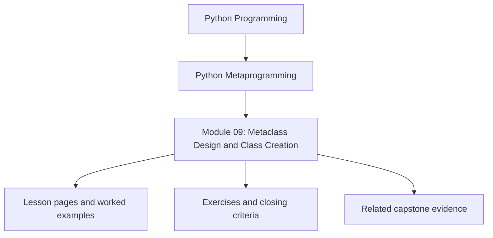
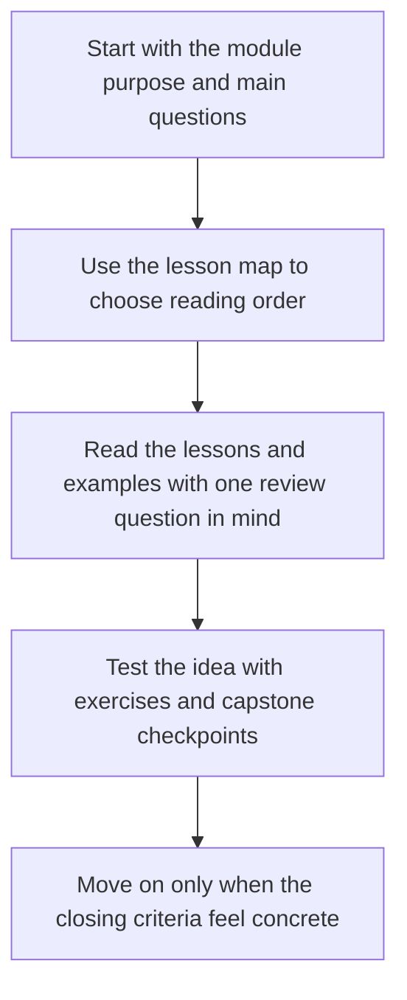
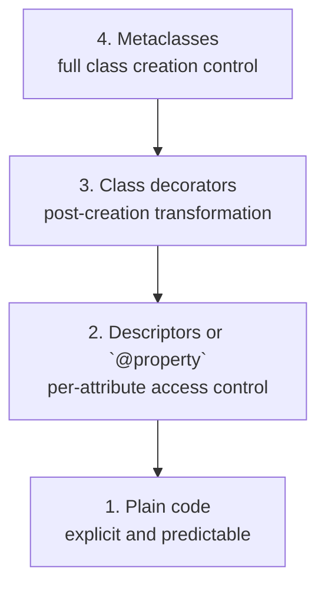
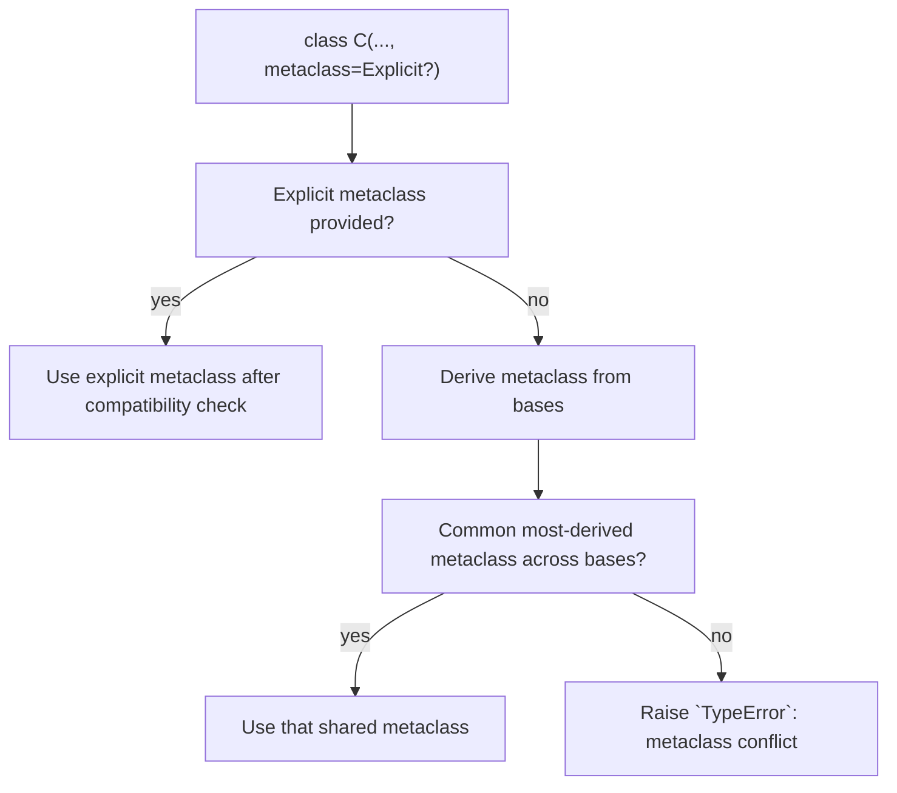
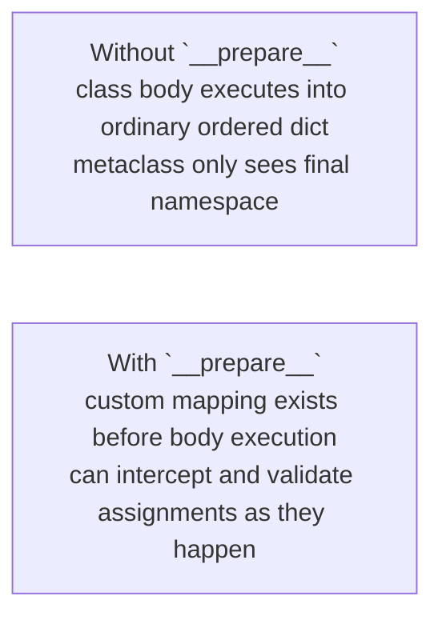

<a id="top"></a>
# Module 09: Metaclass Design and Class Creation


<!-- page-maps:start -->
## Module Position




<!-- page-maps:end -->

Read the first diagram as a placement map: this page sits between the course promise, the lesson pages listed below, and the capstone surfaces that pressure-test the module. Read the second diagram as the study route for this page, so the diagrams point you toward the `Lesson map`, `Exercises`, and `Closing criteria` instead of acting like decoration.

<a id="toc"></a>
## Table of Contents

1. [Introduction](#introduction)
2. [Visual: Tooling Power Ladder](#visual-ladder)
3. [Visual: Class Creation Pipeline](#visual-pipeline)
4. [Core 1: `type(name, bases, namespace)` — Manual Class Creation](#core41)
5. [Core 2: `class X(metaclass=MyMeta)` — Resolution, Timing, Conflicts](#core42)
6. [Core 3: Metaclass `__new__` vs `__init__`](#core43)
7. [Core 4: `__prepare__` — Declaration-Time Enforcement](#core44)
8. [Capstone: `PluginMeta` — Automatic Plugin Registration](#capstone)
9. [Learning outcomes](#learning-outcomes)
10. [Common failure modes](#common-failure-modes)
11. [Exercises](#exercises)
12. [Self-test](#self-test)
13. [Closing criteria](#closing-criteria)
14. [Power Ladder Checkpoint](#power-checkpoint)
15. [Glossary (Module 9)](#glossary)

<span style="font-size: 1em;">[Back to top](#top)</span>

---

<a id="introduction"></a>
## Introduction

This is the narrowest and highest-power mechanism in the course. That is exactly why the
module has to work harder than the others: if metaclasses appear merely powerful, the
reader has learned the wrong lesson. The real lesson is why most designs should still stop
lower on the ladder.

Metaclasses intervene during class creation itself. They are justified only when the
invariant belongs to a whole class family at definition time and lower-power tools cannot
own it cleanly. If a class decorator, descriptor, or explicit registration function can do
the job honestly, that lower boundary should win.

Keep one question in view while reading:

> What specifically must happen before the class exists, and why would a lower-power tool fail to own that responsibility cleanly?

The capstone answers that question with one concrete use: deterministic plugin registration.
Everything else in the course should make that single metaclass feel more constrained, not
more glamorous.

## Why this module matters in the course

This is the highest-power mechanism in the core runtime ladder. That is exactly why the
module has to work harder pedagogically: readers need to learn not only what metaclasses
can do, but why most problems should still be solved below this level.

The value of this module is not "now you can use metaclasses everywhere." The value is
that you can finally judge when they are truly the right boundary.

## Questions this module should answer

By the end of the module, you should be able to answer:

- What work belongs at class-creation time rather than instance or call time?
- Which invariants justify a metaclass instead of a class decorator or descriptor?
- Why do metaclass conflicts appear, and what do they tell you about the design?
- How do you keep metaclass behavior deterministic, inspectable, and reviewable?

If those answers remain weak, the safest move in real code is still to avoid metaclasses.

## What to inspect in the capstone

Keep the capstone open while reading this module and inspect:

- `PluginMeta` in `capstone/src/incident_plugins/`
- tests that assert deterministic registration and resettable registries
- the boundary between class-definition work and runtime manifest export

The capstone should make one point concrete here: metaclasses are justified when they enforce class-creation invariants that lower-power tools cannot own cleanly.

<span style="font-size: 1em;">[Back to top](#top)</span>

---

<a id="visual-ladder"></a>
## Visual: Tooling Power Ladder



Caption: Always select the lowest viable level on the ladder.

<span style="font-size: 1em;">[Back to top](#top)</span>

---

## Visual: Class Creation Pipeline { #visual-pipeline }

```mermaid
graph TD
  source["`class C(Base1, Base2, metaclass=M): ...`"]
  resolve["1. Resolve metaclass `M`"]
  prepare["2. `ns = M.__prepare__(...)`<br/>optional custom mapping"]
  execute["3. Execute class body into `ns`"]
  construct["4. `cls = M(name, bases, ns, **kw)`"]
  new["`M.__new__` creates class object"]
  init["`M.__init__` performs post-creation init or registration"]
  bind["5. Bind resulting class object to name `C`"]
  source --> resolve --> prepare --> execute --> construct
  construct --> new
  construct --> init
  new --> bind
  init --> bind
```

Caption: The entire pipeline runs before any instance of `C` can exist.

<span style="font-size: 1em;">[Back to top](#top)</span>

---

## Core 1: `type(name, bases, namespace)` — Manual Class Creation { #core41 }

### Canonical idea

`type` is the default metaclass. In its 3-argument form it constructs a class dynamically.

```text
type(name: str, bases: tuple[type, ...], namespace: dict[str, object]) -> type
```

### Meaning

* `name` becomes `__name__` (and a simple `__qualname__`).
* `bases` drives MRO and inheritance.
* `namespace` is copied into the class dict (exposed as a read-only `mappingproxy`).

### Example: build classes from data

```python
def make_greeter_class(class_name: str, greeting: str):
    def greet(self):
        return f"{greeting} from {self.__class__.__name__}"

    ns = {
        "__doc__": f"{class_name} generated by type()",
        "greet": greet,
        "tag": "generated",
    }
    return type(class_name, (object,), ns)

Hello = make_greeter_class("Hello", "Hi")
h = Hello()
print(h.greet())      # Hi from Hello
print(Hello.tag)      # generated
print(Hello.__doc__)  # Hello generated by type()
```

### Precision note: `__module__`

A `class` statement injects `__module__` automatically. If you call `type(...)` directly and care about repr/pickling/docs, set it yourself.

```python
def make_class_in_module(name: str, module: str):
    ns = {"__module__": module, "x": 1}
    return type(name, (object,), ns)

C = make_class_in_module("C", "my_project.models")
print(C.__module__)  # my_project.models
```

### Exercise

Implement `dynamic_dataclass(fields: dict[str, type]) -> type` using only `type(...)` that generates:

* `__init__` with a sane signature (`inspect.Signature`)
* `__repr__`

<span style="font-size: 1em;">[Back to top](#top)</span>

---

<a id="core42"></a>
## Core 2: `class X(metaclass=MyMeta)` — Resolution, Timing, Conflicts

### Timing (no illusions)

Everything in the metaclass pipeline runs at **definition time** (typically **import time**). If your metaclass does I/O or heavy work, you are paying it during import.

### Visual: Metaclass Resolution



Caption: Conflicts are the most common metaclass surprise in multiple inheritance.

### Example: a metaclass that injects a tag

```python
class SimpleMeta(type):
    def __new__(mcs, name, bases, ns):
        ns["tag"] = f"created by {mcs.__name__}"
        return super().__new__(mcs, name, bases, ns)

class Base(metaclass=SimpleMeta):
    pass

class Child(Base):
    pass  # inherits metaclass implicitly

print(Base.tag)   # created by SimpleMeta
print(Child.tag)  # created by SimpleMeta
```

### Example: metaclass conflict (expected failure)

```python
class MetaA(type):
    pass

class MetaB(type):
    pass

class A(metaclass=MetaA):
    pass

class B(metaclass=MetaB):
    pass

try:
    class Bad(A, B):
        pass
except TypeError as e:
    print("Expected:", e)
```

### Fix pattern: a joint metaclass (only if semantically valid)

```python
class MetaAB(MetaA, MetaB):
    pass

class A2(metaclass=MetaAB):
    pass

class B2(metaclass=MetaAB):
    pass

class OK(A2, B2):
    pass

print(type(OK) is MetaAB)  # True
```

<span style="font-size: 1em;">[Back to top](#top)</span>

---

<a id="core43"></a>
## Core 3: Metaclass `__new__` vs `__init__`

### Visual: the split

```mermaid
graph TD
  new["`Metaclass.__new__(mcs, name, bases, ns, **kw)`<br/>receives mutable namespace<br/>use for structural edits, base rewrites, and namespace validation"]
  classObj["Creates and returns class object"]
  init["`Metaclass.__init__(cls, name, bases, ns, **kw)`<br/>receives created class with read-only `__dict__` view<br/>use for registration, final validation, and bookkeeping"]
  new --> classObj --> init
```

Caption: Structural changes belong in `__new__`; bookkeeping and registration belong in `__init__`.

### Example: enforce an interface + register classes

```python
class ValidatingMeta(type):
    registry = []

    def __new__(mcs, name, bases, ns):
        has_run_here = "run" in ns
        has_run_in_bases = any(hasattr(b, "run") for b in bases)
        if not has_run_here and not has_run_in_bases:
            raise TypeError(f"{name} must define run()")

        ns["from_meta"] = lambda self: "ok"
        return super().__new__(mcs, name, bases, ns)

    def __init__(cls, name, bases, ns):
        super().__init__(name, bases, ns)
        ValidatingMeta.registry.append(cls)

class Task(metaclass=ValidatingMeta):
    def run(self):
        return "running"

print(Task().from_meta())              # ok
print(Task in ValidatingMeta.registry) # True

try:
    class BadTask(metaclass=ValidatingMeta):
        pass
except TypeError as e:
    print("Expected:", e)
```

### Exercise

Write `AutoReprMeta` that injects `__repr__` in `__new__` using `__annotations__`:

* include only public annotated fields
* handle missing attributes: `getattr(self, name, "<missing>")`

<span style="font-size: 1em;">[Back to top](#top)</span>

---

<a id="core44"></a>
## Core 4: `__prepare__` — Declaration-Time Enforcement

### Visual: why `__prepare__` is unique



Caption: `__prepare__` enables declaration-time enforcement that is impossible otherwise.

### Example: forbid duplicate assignment (except dunders)

```python
class NoDupesMeta(type):
    class NoDupesDict(dict):
        def __setitem__(self, key, value):
            is_dunder = key.startswith("__") and key.endswith("__")
            if key in self and not is_dunder:
                raise ValueError(f"Duplicate assignment to {key!r}")
            super().__setitem__(key, value)

    @classmethod
    def __prepare__(mcs, name, bases, **kw):
        return NoDupesMeta.NoDupesDict()

class OK(metaclass=NoDupesMeta):
    x = 1
    y = 2

print(OK.x, OK.y)  # 1 2

try:
    class Bad(metaclass=NoDupesMeta):
        x = 1
        x = 2
except ValueError as e:
    print("Expected:", e)
```

### Exercise

Write `TracingMeta`:

* `__prepare__` returns a mapping that records assignment order
* `__new__` stores that order as `__definition_order__`

<span style="font-size: 1em;">[Back to top](#top)</span>

---

<a id="capstone"></a>
## Capstone: `PluginMeta` — Automatic Plugin Registration

This demonstrates the main “honest” use case for metaclasses: **automatic, hierarchy-wide enforcement and registration**.

Design goals:

* Base classes opt out via `__abstract__ = True`
* Subclasses register by `group`
* Duplicate names rejected within a group
* Registry is testable via `clear()`

### Visual: metaclass-driven registry

```mermaid
graph TD
  import["Module import"]
  plugin["`class Plugin(..., metaclass=PluginMeta)`"]
  body["Class body executes into namespace"]
  new["`PluginMeta.__new__` runs"]
  validate["Validate invariants such as duplicate names"]
  register["Register class into `_registry[group]`"]
  more["Subsequent imports add more registrations"]
  import --> plugin
  plugin --> body
  plugin --> new
  new --> validate --> register --> more
```

All concrete subclasses register automatically.

Caption: Registration is automatic and hierarchy-wide (infectious).

### Implementation (runnable, testable)

```python
from collections import defaultdict
from threading import RLock
from typing import Dict, List, Tuple, Type, Optional

_registry: Dict[str, List[Tuple[str, Type[object]]]] = defaultdict(list)
_lock = RLock()

class PluginMeta(type):
    @classmethod
    def __prepare__(mcs, name, bases, **kw):
        return dict()

    def __new__(mcs, name, bases, ns, **kw):
        cls = super().__new__(mcs, name, bases, ns)

        if ns.get("__abstract__", False):
            return cls

        group = ns.get("group")
        if group is None:
            for b in bases:
                if hasattr(b, "group"):
                    group = getattr(b, "group")
                    break
        if group is None:
            group = "default"
        cls.group = group

        with _lock:
            items = _registry[group]
            if any(existing_name == name for existing_name, _ in items):
                raise ValueError(f"Duplicate plugin {name!r} in group {group!r}")
            items.append((name, cls))
            items.sort(key=lambda t: t[0])

        return cls

    @classmethod
    def get_plugins(mcs, group: str) -> List[Tuple[str, Type[object]]]:
        with _lock:
            return list(_registry.get(group, []))

    @classmethod
    def clear(mcs, group: Optional[str] = None) -> None:
        with _lock:
            if group is None:
                _registry.clear()
            else:
                _registry.pop(group, None)

## Usage

class Logger(metaclass=PluginMeta):
    __abstract__ = True
    group = "logging"
    def log(self, msg: str) -> str:
        raise NotImplementedError

class FileLogger(Logger):
    def log(self, msg: str) -> str:
        return f"[FILE] {msg}"

class ConsoleLogger(Logger):
    def log(self, msg: str) -> str:
        return f"[CONSOLE] {msg}"

print([name for name, _ in PluginMeta.get_plugins("logging")])
## ['ConsoleLogger', 'FileLogger']
```

### Caveats (must be stated bluntly)

* Import-order dependent registration.
* Reload can double-register unless you clear/reset.
* Metaclass conflicts with other frameworks’ metaclasses are common.
* Global registries complicate tests unless you expose reset hooks (we did).

### Exercise

Extend the capstone:

1. Add `priority: int = 0` and sort by `(-priority, name)`.
2. Add `disable(name: str, group: str)` to remove an entry.
3. Add tests that call `PluginMeta.clear()` between runs.

<a id="learning-outcomes"></a>
## Learning outcomes

By the end of this module, you should be able to:

- Explain the full class-creation pipeline from metaclass resolution through `__prepare__`, `__new__`, and `__init__`.
- Distinguish what belongs in manual `type(...)` construction, metaclass `__new__`, metaclass `__init__`, or a lower-power tool.
- Predict common metaclass conflict cases and explain why "just combine them" is often unsafe.
- Recognize when declaration-time enforcement is genuinely required instead of retrofitting checks after class creation.
- Build a metaclass example that stays deterministic, resettable, and honest about import-time side effects.

<a id="common-failure-modes"></a>
## Common failure modes

- Using a metaclass for automatic registration when an explicit decorator or registry call would stay clearer and easier to reverse.
- Putting expensive work in class creation and then acting surprised when imports become slow or order-dependent.
- Mutating class structure in metaclass `__init__` even though the important namespace decisions needed to happen earlier in `__new__` or `__prepare__`.
- Ignoring metaclass conflicts until multiple inheritance appears, then treating a joint metaclass as a mechanical fix instead of a semantic design choice.
- Shipping a global registry without reset hooks, duplicate handling, or deterministic ordering for tests.

<a id="exercises"></a>
## Exercises

- Rebuild one capstone example as a class decorator and write down exactly what behavior you lose without a metaclass.
- Implement a tiny `OrderedMeta` that captures declaration order via `__prepare__`, then compare it with what plain class dictionaries already guarantee in modern Python.
- Add a metaclass conflict on purpose, explain the failure message, and document the minimum safe conditions for a shared joint metaclass.
- Extend `PluginMeta` with explicit enable/disable policy while preserving deterministic ordering and a reset path for tests.

<a id="self-test"></a>
## Self-test

- Can you explain why `__prepare__` is the only hook that can see assignments during class body execution?
- Can you name one rule in your codebase that truly belongs to class creation and one that does not?
- Can you explain why import-time side effects make metaclass designs harder to test and reason about?
- Can you justify the capstone metaclass against a decorator-based alternative without appealing to "power" or "magic"?

<a id="closing-criteria"></a>
## Closing criteria

You are ready for Module 10 when you can defend a metaclass decision with concrete ownership rules:

- The invariant must belong to class creation itself or to every subclass in the hierarchy.
- Lower-power tools must have been considered and rejected for a specific, named reason.
- Import-time effects, reset hooks, and ordering guarantees must be explicit in the design.
- The behavior must remain inspectable enough that a reviewer can explain what happens without reverse-engineering hidden state.

<span style="font-size: 1em;">[Back to top](#top)</span>

---

<a id="glossary"></a>
## Glossary (Module 9)

| Term                              | Definition                                                                                                                         |
| --------------------------------- | ---------------------------------------------------------------------------------------------------------------------------------- |
| **Metaclass**                     | The “class of a class”; customizes how classes are created and initialized.                                                        |
| **`type(name, bases, ns)`**       | The primitive 3-arg constructor that builds a class dynamically (what a `class` statement ultimately uses).                        |
| **Class creation pipeline**       | The definition-time sequence: resolve metaclass → `__prepare__` → execute body → metaclass `__new__` → metaclass `__init__`.       |
| **Definition time / import time** | When class bodies execute and metaclass hooks run; heavy work here slows imports and can create side effects.                      |
| **Metaclass resolution**          | The rule set that chooses the effective metaclass from an explicit `metaclass=` or from base classes.                              |
| **Metaclass conflict**            | `TypeError` raised when bases’ metaclasses have no compatible common “most-derived” metaclass in multiple inheritance.             |
| **Joint metaclass**               | A metaclass that subclasses multiple metaclasses to satisfy conflict rules (only valid if the behaviors compose).                  |
| **`__prepare__`**                 | Metaclass hook returning the namespace mapping used *while* executing the class body (enables declaration-time enforcement).       |
| **Custom namespace mapping**      | A dict-like object returned by `__prepare__` that can intercept assignments (e.g., forbid duplicates, record order).               |
| **Declaration-time enforcement**  | Constraints enforced during class body execution (via custom namespace), impossible to implement reliably after the fact.          |
| **Metaclass `__new__`**           | Constructs the class object from `(name, bases, ns)`; best place for structural edits and namespace-driven validation.             |
| **Metaclass `__init__`**          | Runs after class creation; best place for registration and bookkeeping using `setattr` (final MRO is known).                       |
| **Namespace mutability window**   | The phase where `ns` is still mutable (inside metaclass `__new__`); after creation, `cls.__dict__` is a read-only `mappingproxy`.  |
| **`mappingproxy`**                | Read-only view of a class’s dict (`cls.__dict__`), preventing direct mutation post-creation.                                       |
| **Class decorators**              | Post-creation, opt-in class transformations (less invasive than metaclasses; don’t affect subclasses automatically).               |
| **Hierarchy-wide invariants**     | Rules enforced automatically for every subclass in an inheritance tree (the main legitimate reason to use a metaclass).            |
| **Automatic registration**        | Pattern where concrete subclasses register themselves at definition time into a registry (e.g., plugins).                          |
| **Abstract base opt-out**         | Convention like `__abstract__ = True` to prevent base classes from being registered/enforced as concrete plugins.                  |
| **Registry**                      | A global or metaclass-owned mapping from keys (e.g., group) to classes; must be resettable for tests.                              |
| **Duplicate-name rejection**      | Enforcing uniqueness constraints at class creation (e.g., no two plugins with the same name in one group).                         |
| **Import-order dependence**       | Registration side effects depend on what modules import first; can cause missing/extra registrations across runs.                  |
| **Reload hazard**                 | Module reload can re-run class definitions and double-register unless the registry is cleared or guarded.                          |
| **Test isolation hook**           | A `clear()`/reset API to make global registries deterministic in unit tests.                                                       |
| **Infectious behavior**           | Metaclass effects propagate to subclasses automatically (useful for invariants, risky for surprises).                              |
| **MRO (method resolution order)** | The linearization that determines attribute lookup across bases; finalized after class creation (relevant to `__init__`).          |
| **`__module__` injection**        | `class` statements set `__module__` automatically; manual `type(...)` creation should set it when repr/pickling/docs matter.       |
| **Signature injection**           | Attaching `__signature__` (or generating `__init__`) during class creation to control introspection and call semantics.            |
| **Metaclass vs descriptor**       | Metaclasses coordinate class-level structure and invariants; descriptors implement per-attribute behavior once the class exists.   |
| **Power ladder**                  | Heuristic: prefer plain code → descriptors → class decorators → metaclasses; metaclasses are the highest-magic, highest-risk tool. |

<a id="power-checkpoint"></a>
## Power Ladder Checkpoint

- Use a metaclass only when the invariant belongs to class creation itself or must apply automatically across a subclass hierarchy.
- Stay with class decorators when opt-in post-creation transformation is enough.
- Stay with descriptors when the rule belongs to fields or methods on an already-created class.
- Do not use a metaclass for registration alone when an explicit decorator or registry call would stay clearer and more reversible.
- Run the [Runtime Power Ladder](../reference/runtime-power-ladder.md) questions before approving any metaclass in review.

Proceed to **Module 10**.

<span style="font-size: 1em;">[Back to top](#top)</span>
