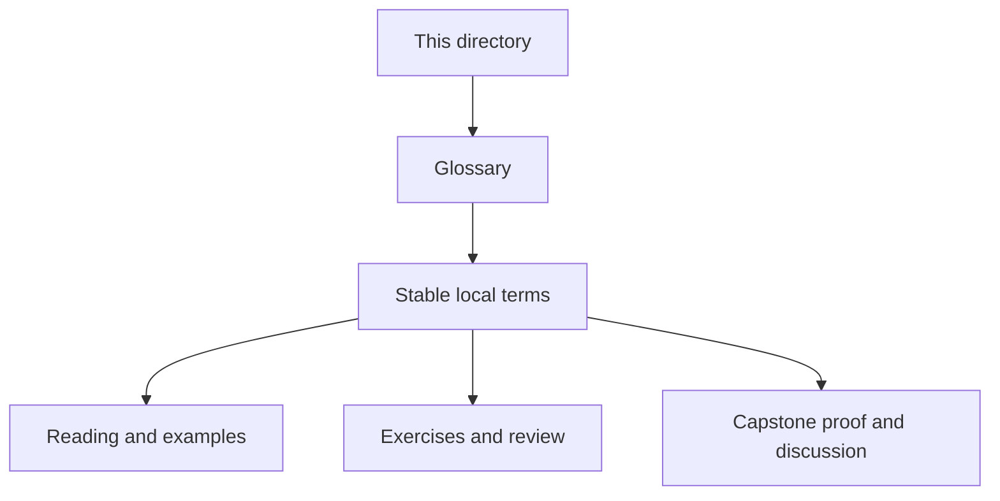
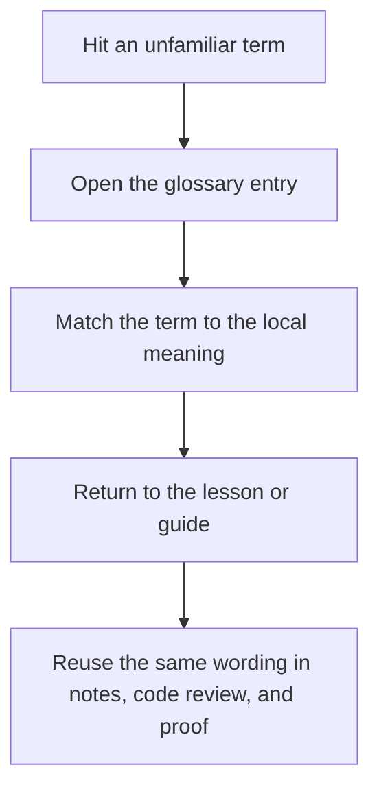

# Module Glossary

<!-- page-maps:start -->
## Glossary Fit

<!-- page-maps:end -->

This glossary belongs to **Module 09: Metaclass Design and Class Creation** in
**Python Metaprogramming**. It keeps the language of this directory stable so the same
ideas keep the same names across lessons, practice, review, and capstone discussion.

## How to use this glossary

Use the glossary when metaclass discussions start to blur together class creation,
definition-time hooks, namespace control, and lower-power alternatives. Module 09 is meant
to keep those boundaries explicit.

## Terms in this directory

| Term | Meaning in this directory |
| --- | --- |
| Class creation pipeline | The definition-time sequence from metaclass resolution through `__prepare__`, class-body execution, metaclass `__new__`, and metaclass `__init__`. |
| Declaration-time enforcement | A rule enforced while the class body is still executing, typically through a custom mapping supplied by `__prepare__`. |
| Definition time | The moment a class statement executes and metaclass hooks run, usually during module import. |
| Effective metaclass | The single metaclass Python resolves as the class-creation owner for a new class. |
| Import-time side effect | Any registry update, validation, or global mutation caused by class creation while a module is being imported. |
| Joint metaclass | A metaclass that subclasses multiple metaclasses in an attempt to satisfy conflict rules, valid only when the behaviors truly compose. |
| Metaclass | The class of a class object; in this module, the owner of class-creation-time behavior. |
| Metaclass conflict | The failure that occurs when multiple bases imply incompatible metaclass owners and Python cannot derive one coherent effective metaclass. |
| Metaclass `__init__` | The post-creation hook that receives the finished class object and is usually best for registration or bookkeeping. |
| Metaclass `__new__` | The class-construction hook that receives the class name, bases, and namespace and is best for structural decisions. |
| Namespace mapping | The mapping object that receives class-body assignments before the class object is created. |
| `__prepare__` | The metaclass hook that returns the namespace mapping used while the class body executes. |
| Reset hook | An explicit API such as `clear()` that makes metaclass-owned global state deterministic and testable. |
| `type(name, bases, namespace)` | The default class-construction primitive that shows class creation as a runtime event. |
| Hierarchy-wide invariant | A rule that should apply automatically across every subclass in a class family and can therefore justify metaclass control more often than one-off rules. |

## Keep the module connected

- Return to [Module 09 Overview](index.md) for the full learning route.
- Use [Exercises](exercises.md) and [Exercise Answers](exercise-answers.md) to pressure-test the metaclass vocabulary.
- Revisit the [Worked Example](worked-example-building-a-deterministic-plugin-registry-with-pluginmeta.md) when a registry proposal needs to be checked against import-time and reset boundaries.
