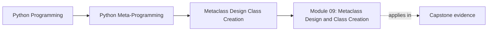
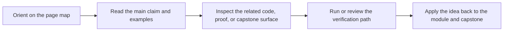

# Module 09: Metaclass Design and Class Creation

<!-- page-maps:start -->
## Page Maps

<!-- page-maps:end -->

Module 09 is the highest-power runtime mechanism in the course, which is exactly why it
has to stay narrower than you might expect. The goal is not to make metaclasses look
impressive. The goal is to understand what truly belongs to class creation time, what
lower-power tools still own more honestly, and how to keep metaclass designs
deterministic, inspectable, and reviewable.

This module now uses the same ten-file learning surface as the deep-dive series so the
overview, five cores, worked example, practice set, answers, and glossary each have one
clear job.

## What this module is for

By the end of Module 09, you should be able to explain five things clearly:

- how `type(name, bases, namespace)` exposes the raw class-construction primitive
- how metaclass selection, import-time timing, and conflicts actually work
- what belongs in metaclass `__new__` versus metaclass `__init__`
- why `__prepare__` is the only hook that can enforce rules during class body execution
- when metaclasses are justified and when a class decorator, descriptor, or explicit helper still owns the problem better

## Keep these pages open

- [Mastery Map](../module-00-orientation/mastery-map.md)
- [Pressure Routes](../guides/pressure-routes.md)
- [Review Checklist](../reference/review-checklist.md)
- [Capstone Architecture Guide](../capstone/capstone-architecture-guide.md)

## The ten files in this module

1. Overview (`index.md`)
2. [Manual Class Creation with `type(...)`](manual-class-creation-with-type.md)
3. [Metaclass Resolution, Timing, and Conflicts](metaclass-resolution-timing-and-conflicts.md)
4. [Metaclass `__new__` and `__init__`](metaclass-new-and-init.md)
5. [`__prepare__` and Declaration-Time Enforcement](prepare-and-declaration-time-enforcement.md)
6. [Metaclass Boundaries and Class-Creation Ownership](metaclass-boundaries-and-class-creation-ownership.md)
7. [Worked Example: Building a Deterministic Plugin Registry with `PluginMeta`](worked-example-building-a-deterministic-plugin-registry-with-pluginmeta.md)
8. [Exercises](exercises.md)
9. [Exercise Answers](exercise-answers.md)
10. [Glossary](glossary.md)

## How to use the file set

| If you need to... | Start here |
| --- | --- |
| understand the raw primitive behind class creation | [Manual Class Creation with `type(...)`](manual-class-creation-with-type.md) |
| explain metaclass selection, import-time effects, and conflicts | [Metaclass Resolution, Timing, and Conflicts](metaclass-resolution-timing-and-conflicts.md) |
| decide whether structural work belongs in `__new__` or bookkeeping belongs in `__init__` | [Metaclass `__new__` and `__init__`](metaclass-new-and-init.md) |
| enforce declaration-time rules that cannot be checked after class creation | [`__prepare__` and Declaration-Time Enforcement](prepare-and-declaration-time-enforcement.md) |
| decide whether class-creation control is truly required at all | [Metaclass Boundaries and Class-Creation Ownership](metaclass-boundaries-and-class-creation-ownership.md) |
| see one honest metaclass case around deterministic registration | [Worked Example: Building a Deterministic Plugin Registry with `PluginMeta`](worked-example-building-a-deterministic-plugin-registry-with-pluginmeta.md) |
| pressure-test your understanding before the mastery review module | [Exercises](exercises.md) |
| compare your reasoning against a reference answer | [Exercise Answers](exercise-answers.md) |
| stabilize the metaclass vocabulary used in this directory | [Glossary](glossary.md) |

## The running question

Carry this question through every page:

> What must happen before the class exists, and why would a descriptor, class decorator, or explicit registration function still be the wrong owner?

Strong Module 09 answers usually mention one or more of these:

- class creation as a runtime pipeline
- import-time and definition-time side effects
- structural edits in `__new__` versus final bookkeeping in `__init__`
- declaration-time namespace control through `__prepare__`
- a lower-power decision that rejects metaclass escalation

## Learning outcomes

By the end of this module, you should be able to:

- explain the full class-creation pipeline without treating metaclasses as mystical
- predict common metaclass conflict cases and explain why they arise
- keep metaclass behavior deterministic, resettable, and reviewable
- distinguish real class-creation invariants from problems that still belong to lower-power tools
- justify one metaclass design using ownership rather than appeal to power

## Exit standard

Do not move on until all of these are true:

- you can explain when class creation begins and what hooks run before the class name is bound
- you can say why a joint metaclass is a semantic decision, not a mechanical fix
- you can distinguish `__prepare__`, `__new__`, and `__init__` by responsibility rather than by memorized order alone
- you can reject at least one metaclass proposal in favor of a lower-power tool for a named reason

When those feel ordinary, Module 09 has done its job and Module 10 can become a mastery
and review surface instead of another power escalation.
