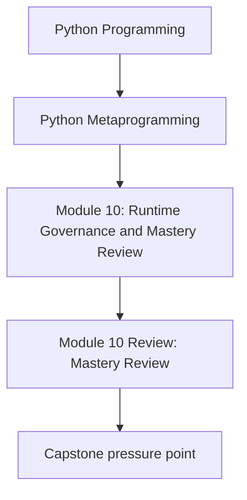
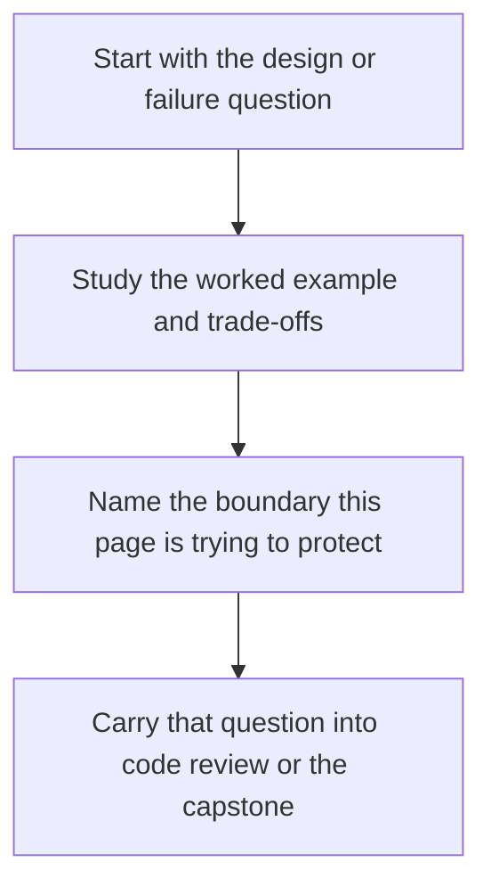

# Module 10 Review: Mastery Review

<!-- page-maps:start -->
## Concept Position

<!-- page-maps:end -->

Read the first diagram as a placement map: this page is one concept inside its parent module, not a detached essay, and the capstone is the pressure test for whether the idea holds. Read the second diagram as the working rhythm for the page: name the problem, study the example, identify the boundary, then carry one review question forward.

You have now moved through the full runtime ladder inside this course: observation, wrapping, attribute
control, class creation, and governance. This final module exists to turn that material
into review judgment and explicit exit criteria.

## What you should now be able to explain

- what happens at import time, class-definition time, instance time, and call time
- which metadata or signatures must remain visible after wrapping
- why a descriptor or metaclass is justified in one design and unjustified in another
- which dynamic mechanisms are too dangerous for routine application code

## What you should now be able to review

- a decorator that claims to preserve callable identity
- a descriptor that claims to own validation semantics
- a metaclass that claims to enforce class-definition-time invariants
- a plugin or registry design that claims to stay deterministic and testable

## Capstone exit checks

- run the course proof route
- inspect the public manifest before invoking a plugin action
- explain which file owns registration, field validation, and runtime invocation
- identify one change you would reject as making the system more magical than necessary

## What mastery means here

Mastery in this course does not mean reaching for metaclasses faster. It means reaching
for metaprogramming less often, and using it more precisely when the design truly needs it.
