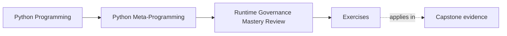
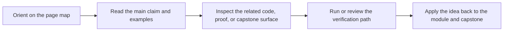

# Exercises

<!-- page-maps:start -->
## Page Maps

<!-- page-maps:end -->

Use these after reading the five core lessons and the worked example. The goal is not to
collect more advanced mechanisms. The goal is to make trust boundaries, interface claims,
observability rules, hook boundaries, and escalation decisions explicit.

Each exercise asks for three things:

- the runtime pressure or design you are reviewing
- the governance decision you made
- the evidence or reasoning that makes that decision defensible

## Exercise 1: Reject one unsafe dynamic execution idea

Take one proposed `eval`, `exec`, or code-generation design.

What to hand in:

- where the input comes from
- whether the input is trusted, partially trusted, or untrusted
- the lower-power or isolated replacement you chose

## Exercise 2: Compare one ABC and one protocol honestly

Choose one interface shape that could be expressed either nominally or structurally.

What to hand in:

- which part of the contract is runtime-enforced and which part is static only
- whether `@runtime_checkable` adds useful value here or only false confidence
- one sentence explaining why your chosen surface is the clearest owner

## Exercise 3: Add a reversal path to one dynamic mechanism

Take one registry, wrapper, or patching design and make it operationally reversible.

What to hand in:

- the reset hook, disable path, or context manager you added
- one failure mode that cleanup now prevents
- one explanation of how the runtime fact remains observable after the change

## Exercise 4: Review one import hook or AST transform proposal

Choose one proposal that changes import behavior or rewrites code.

What to hand in:

- whether the problem is tooling-grade or application-grade
- one lower-power alternative you considered first
- one explanation of the cleanup, ordering, or location-preservation risk

## Exercise 5: Defend or reject one escalation

Take one design that uses a decorator, descriptor, metaclass, import hook, or dynamic
execution path and review it against the runtime power ladder.

What to hand in:

- the lower-power mechanism you compared first
- the ownership reason that made you approve or reject escalation
- one note on observability, reversibility, or performance evidence

## Exercise 6: Review the capstone runtime as Module 10 evidence

Use the worked example and the capstone proof route as a case study.

What to hand in:

- one observational surface that earns trust before invocation
- one mechanism the capstone uses responsibly
- one higher-power change you would reject as making the runtime less reviewable

## Mastery standard for this exercise set

Across all six answers, the module wants the same habits:

- you name trust boundaries honestly
- you keep interface claims smaller than the mechanism's reputation
- you require reset and disable paths for dynamic behavior
- you distinguish tooling-grade escalation from application defaults
- you justify power with ownership and evidence rather than taste

If an answer still sounds like "the runtime can do it, so the design is fine," keep going.

## Continue through Module 10

- Previous: [Worked Example: Reviewing a Plugin Runtime for Observability and Control](worked-example-reviewing-a-plugin-runtime-for-observability-and-control.md)
- Next: [Exercise Answers](exercise-answers.md)
- Return: [Overview](index.md)
- Terms: [Glossary](glossary.md)
