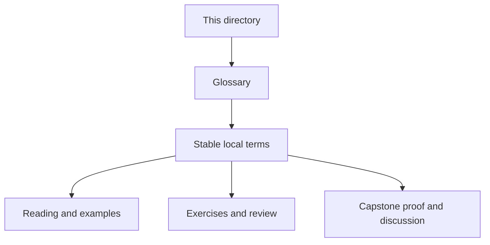
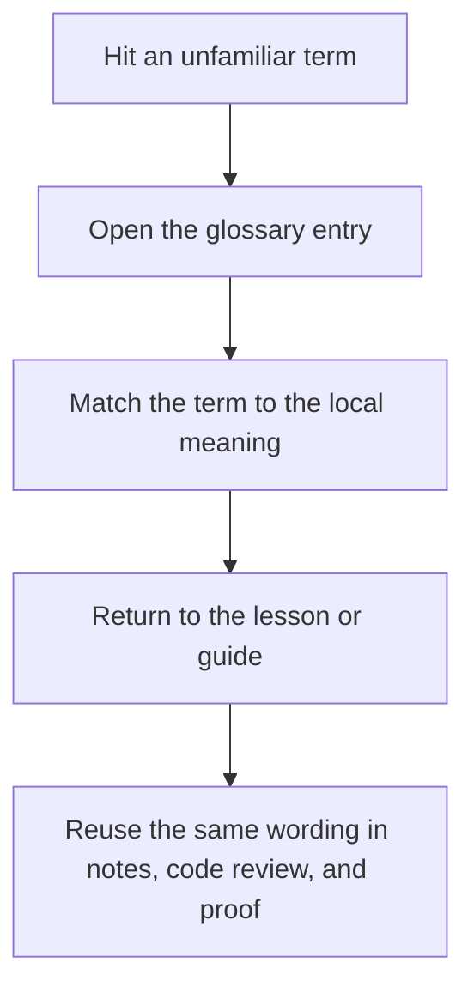

# Module Glossary

<!-- page-maps:start -->
## Glossary Fit

<!-- page-maps:end -->

This glossary belongs to **Module 10: Runtime Governance and Mastery Review** in **Python Metaprogramming**.
It keeps the language of this directory stable so the same ideas keep the same names
across core lessons, the worked example, practice, review, and capstone proof.

## How to use this glossary

Read the directory index first, then return here whenever a page, command, or review
discussion starts to feel more vague than the course intends. The goal is stable language,
not extra theory.

## Terms in this directory

| Term | Meaning in this directory |
| --- | --- |
| Approval gate | The point in review where a mechanism must justify its ownership, observability, and reversal story before it is accepted. |
| Blast radius | The scope of collateral impact when dynamic behavior fails or surprises reviewers. |
| Dynamic execution | Running runtime-generated code through `compile`, `eval`, or `exec`. |
| Escalation boundary | The point where a higher-power mechanism must prove that a lower-power tool cannot own the problem honestly. |
| Feature flag | A configuration switch that can disable or narrow a dynamic behavior during tests, rollout, or incident response. |
| Hook ordering risk | The uncertainty introduced when import hooks or other global mechanisms behave differently depending on installation order. |
| In-process trust boundary | The limit of what the current Python process can honestly protect without stronger isolation. |
| Interface claim | The actual promise made by an ABC, protocol, or virtual subclass rule, as distinct from the reputation of the mechanism. |
| Lowest-power choice | The least invasive mechanism that still owns the behavior at the right timing and scope. |
| Observational surface | A command, manifest, or API that reveals runtime facts without triggering the business behavior under inspection. |
| Operational honesty | The discipline of describing what a runtime mechanism really guarantees about safety, timing, visibility, and rollback. |
| Process isolation | A separate runtime boundary used when hostile input or risky execution must not share memory and globals with the current process. |
| Reset hook | An explicit function or method that restores shared runtime state to a known baseline. |
| Restricted-globals fallacy | The false belief that narrowing `globals` or `__builtins__` makes in-process dynamic execution safe against untrusted input. |
| Reversibility | The ability to turn dynamic behavior off, undo it, or restore baseline state cleanly. |
| Runtime power ladder | The ordered view of mechanisms by blast radius and review cost, from explicit code up to import hooks and dynamic execution. |
| Shallow runtime check | A runtime interface check that verifies visible structure only and does not prove semantics or deep behavioral correctness. |
| Tooling-grade mechanism | A mechanism that may be justified for instrumentation, tracing, or analysis even when it would be a poor default for application code. |
| Virtual subclassing | Structural acceptance of a type by an ABC through `__subclasshook__` rather than through nominal inheritance. |

## Keep the module connected

- Return to [Overview](index.md) for the full module route.
- Use [Exercises](exercises.md) and [Exercise Answers](exercise-answers.md) to pressure-test the vocabulary.
