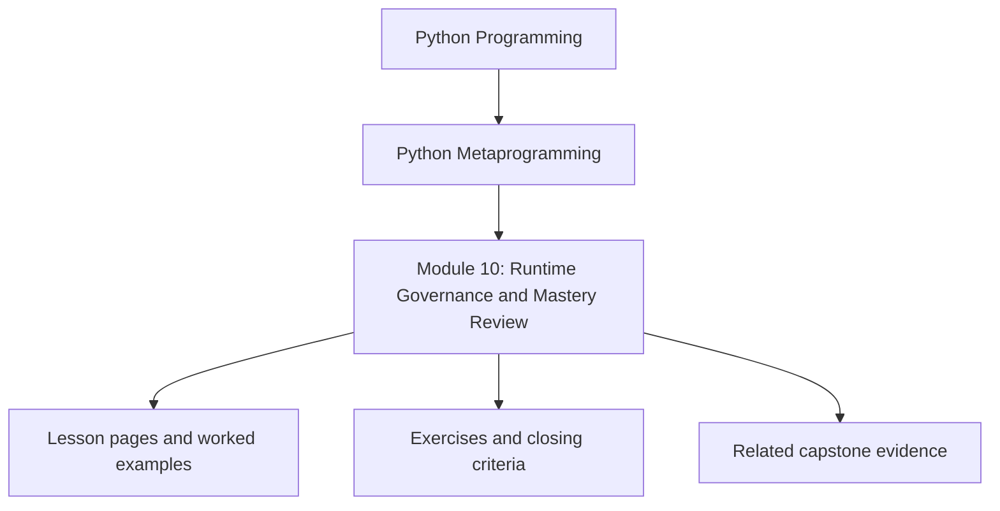
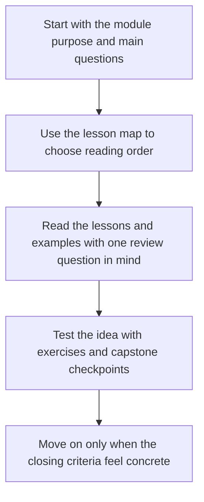
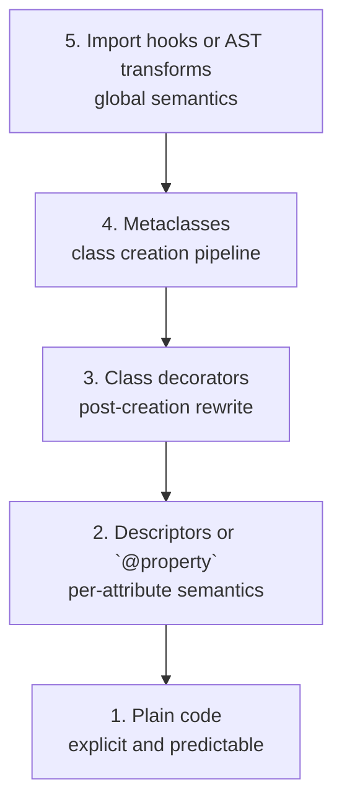
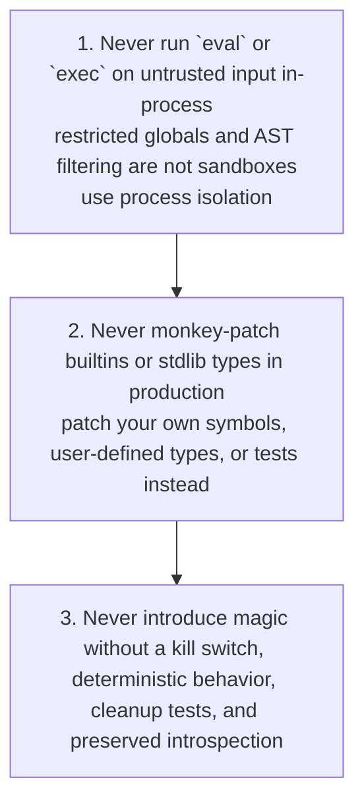

<a id="top"></a>
# Module 10: Runtime Governance and Mastery Review


<!-- page-maps:start -->
## Module Position




<!-- page-maps:end -->

Read the first diagram as a placement map: this page sits between the course promise, the lesson pages listed below, and the capstone surfaces that pressure-test the module. Read the second diagram as the study route for this page, so the diagrams point you toward the `Lesson map`, `Exercises`, and `Closing criteria` instead of acting like decoration.

## Keep These Pages Open

Use these support surfaces while reading so the final module turns mechanism knowledge
into durable review judgment instead of into one more list of dangerous tools:

- [Mastery Map](../module-00-orientation/mastery-map.md) for the late-course review route
- [Boundary Review Prompts](../reference/boundary-review-prompts.md) for keep/change/reject decisions under governance pressure
- [Review Checklist](../reference/review-checklist.md) for the stable engineering bar
- [Capstone Proof Checklist](../capstone/capstone-proof-checklist.md) for the final claim-to-proof route through the runtime

Carry this question into the module:

> Which runtime powers are still defensible once debugging cost, observability, and team trust become the real review criteria?

<a id="toc"></a>
## Table of Contents

1. [Introduction](#introduction)
2. [Visual: Responsibility Ladder](#visual-ladder)
3. [Visual: Non-Negotiables (Red Lines)](#visual-redlines)
4. [Core 1: Dynamic Execution — `compile` / `eval` / `exec` Without Lying to Yourself](#core46)
5. [Core 2: ABCs, Protocols, `__subclasshook__` — Interfaces With Controlled Semantics](#core47)
6. [Core 3: Responsible Metaprogramming — Tracebacks, Performance, Globals, Monkey-Patching](#core48)
7. [Core 4: Import Hooks & AST Transforms — Tooling-Grade, Not App-Grade](#core49)
8. [Capstone: Plugin Architectures — Decorator vs Metaclass vs Import Hook](#capstone)
9. [Learning outcomes](#learning-outcomes)
10. [Common failure modes](#common-failure-modes)
11. [Exercises](#exercises)
12. [Self-test](#self-test)
13. [Closing criteria](#closing-criteria)
14. [Power Ladder Checkpoint](#power-checkpoint)
15. [Glossary (Module 10)](#glossary)

<span style="font-size: 1em;">[Back to top](#top)</span>

---

<a id="introduction"></a>
## Introduction

This module closes the mechanism ladder by turning it into review policy. No new hook in
this chapter is more important than the judgment it teaches. Dynamic execution, import
hooks, monkey-patching, and interface tricks only become defensible when the team can still
observe, test, and reverse the behavior without folklore.

Non-negotiable thesis:

> If your metaprogramming makes failures harder to debug than the boring alternative, it is a liability.

The practical goal here is simple: leave the course with red lines you can actually use in
code review. Earlier modules taught what the runtime can do. This module decides what the
runtime should be allowed to do in real engineering work.

## Why this module matters in the course

This is the module that turns runtime power into engineering judgment. Without it, the
course would teach mechanisms but not the boundaries that keep those mechanisms from
damaging debuggability, observability, and team trust.

It matters because metaprogramming becomes dangerous exactly when it starts working well
enough to hide its own cost.

## Questions this module should answer

By the end of the module, you should be able to answer:

- Which runtime hooks are too dangerous for ordinary application code?
- Which red lines are about security, and which are about maintainability or team trust?
- How do you add power without making failures harder to observe and reverse?
- What should a reviewer ask before approving dynamic execution, monkey-patching, or import-hook work?

If this module feels optional, the earlier modules have not been learned responsibly yet.

## What to inspect in the capstone

Keep the capstone open while reading this module and inspect:

- how manifest export avoids executing plugin actions
- how registration stays deterministic and resettable in tests
- where runtime behavior remains introspectable instead of hidden behind magic

The capstone should make one final point concrete: metaprogramming is only defensible when the runtime stays observable.

### Use this module when

- the mechanics are clear but the approval standard is still fuzzy
- a dynamic design needs explicit red lines around safety, debuggability, or reviewability
- you need to turn mechanism knowledge into code-review judgment

### Closing bar

Before finishing the course, you should be able to explain:

- which runtime powers belong only in tooling or exceptional cases
- what makes a dynamic design reversible, observable, and reviewable
- why the capstone remains defensible because its runtime facts stay visible from the public surface

<span style="font-size: 1em;">[Back to top](#top)</span>

---

<a id="visual-ladder"></a>
## Visual: Responsibility Ladder



Caption: Choose the lowest-power tool that solves the problem, then add guardrails.

<span style="font-size: 1em;">[Back to top](#top)</span>

---

## Visual: Non-Negotiables (Red Lines) { #visual-redlines }



<span style="font-size: 1em;">[Back to top](#top)</span>

---

<a id="core46"></a>
## Core 1: Dynamic Execution — `compile` / `eval` / `exec` Without Lying to Yourself

### The only honest rule

> **Never** run `eval`/`exec` on **untrusted input** in-process.
> If input is untrusted, you need **process isolation**. Anything else is self-deception.

### Visual: What actually happens

```mermaid
graph TD
  source["Source string or AST"]
  compile["`compile(..., mode=\"eval\" | \"exec\")` -> code object"]
  eval["`eval(code, globals, locals)`<br/>returns value for expressions"]
  exec["`exec(code, globals, locals)`<br/>returns `None` and mutates mappings"]
  source --> compile
  compile --> eval
  compile --> exec
```

Caption: You control where code executes only through the globals and locals mappings. Those mappings do not provide security.

### Canonical facts (precise)

* `compile(source_or_ast, filename, mode)` returns a **code object**.

  * `mode="eval"`: expression
  * `mode="exec"`: statements
* `eval(...)` evaluates an expression and returns its value.
* `exec(...)` executes statements and returns `None`.
* If `globals` lacks `__builtins__`, Python may inject it. If you care about restriction, **set it explicitly**.

### Example: expression compilation + evaluation (explicit builtins)

```python
co = compile("x * 2 + 1", "<expr>", "eval")

globals_ = {"__builtins__": {}, "x": 10}
print(eval(co, globals_, {}))  # 21
```

### Example: statements into isolated locals

```python
co = compile("x = 42\ny = x * 2", "<stmt>", "exec")

globals_ = {"__builtins__": {}}
locals_ = {}

exec(co, globals_, locals_)
print(locals_["y"])       # 84
print("x" in globals_)    # False
```

### “Restricted namespace” (only for **trusted** internal config)

Whitelisting is useful to prevent accidental footguns in code you ship. It is **not** a security boundary.

```python
src = "result = len('abc') + int('3')"

globals_ = {"__builtins__": {"len": len, "int": int}}
locals_ = {}

exec(compile(src, "<trusted-config>", "exec"), globals_, locals_)
print(locals_["result"])  # 6
```

### Tiny AST whitelist DSL (still **not** for untrusted input)

```python
import ast

_ALLOWED = (
    ast.Expression,
    ast.BinOp, ast.UnaryOp,
    ast.Add, ast.Sub, ast.Mult, ast.Div, ast.Mod, ast.Pow,
    ast.USub, ast.UAdd,
    ast.Constant,
    ast.Name, ast.Load,
)

def safe_eval_expr(expr: str, allowed_names: dict):
    tree = ast.parse(expr, mode="eval")
    for node in ast.walk(tree):
        if not isinstance(node, _ALLOWED):
            raise ValueError(f"Forbidden syntax: {type(node).__name__}")
    co = compile(tree, "<safe-eval>", "eval")
    globals_ = {"__builtins__": {}}
    globals_.update(allowed_names)
    return eval(co, globals_, {})

print(safe_eval_expr("x * 2 + 1", {"x": 10}))  # 21

try:
    safe_eval_expr("__import__('os').system('echo hi')", {"x": 1})
except ValueError as e:
    print("Expected:", e)
```

### Checklist: before adding `eval`/`exec`

```text
Dynamic execution checklist

□ Can it be expressed as data (JSON/TOML/YAML) + normal code?
□ Is the input *guaranteed trusted* (no user path, no third-party injection)?
□ Are you compiling once (startup) not compiling in a hot loop?
□ Are builtins explicitly whitelisted (not implicitly injected)?
□ Do you have tests proving forbidden syntax is rejected and failures are explicit?
□ If any doubt about trust → isolate in a separate process.
```

<span style="font-size: 1em;">[Back to top](#top)</span>

---

<a id="core47"></a>
## Core 2: ABCs, Protocols, `__subclasshook__` — Interfaces With Controlled Semantics

### Visual: “Interface” options and what they guarantee

```text
Interfaces: what you actually get

ABC (abc.ABC + @abstractmethod)
  - Enforces "must implement" at instantiation time.
  - Runtime guarantee: weak but real (cannot instantiate if abstract).

Protocol (typing.Protocol)
  - Primary value: static typing (mypy/pyright).
  - With @runtime_checkable: shallow isinstance/issubclass structural check.
  - Does NOT validate signatures/invariants/behavior.

__subclasshook__
  - Lets an ABC declare virtual subclasses based on structure.
  - Must remain boring: trivial hasattr/callable checks + NotImplemented fallback.
```

### ABC enforcement (nominal interface)

```python
from abc import ABC, abstractmethod

class Drawable(ABC):
    @abstractmethod
    def draw(self) -> str: ...

class Circle(Drawable):
    def draw(self) -> str:
        return "circle"

print(Circle().draw())  # circle

try:
    Drawable()
except TypeError as e:
    print("Expected:", e)
```

### Protocol (static-first); runtime check is shallow

```python
from typing import Protocol, runtime_checkable

@runtime_checkable
class SupportsClose(Protocol):
    def close(self) -> None: ...

def ensure_closed(obj):
    if not isinstance(obj, SupportsClose):
        raise TypeError(f"{obj!r} does not implement close()")
    obj.close()

class FileLike:
    def close(self) -> None:
        print("closed")

ensure_closed(FileLike())  # closed

try:
    ensure_closed(123)
except TypeError as e:
    print("Expected:", e)
```

### `__subclasshook__` virtual subclassing (keep it boring)

```python
from abc import ABC

class HasLen(ABC):
    @classmethod
    def __subclasshook__(cls, sub):
        if hasattr(sub, "__len__") and callable(getattr(sub, "__len__", None)):
            return True
        return NotImplemented

class MyList:
    def __len__(self): return 5

print(issubclass(MyList, HasLen))   # True
print(isinstance(MyList(), HasLen)) # True
```

### Checklist: before adding an ABC / Protocol

```text
Interface checklist

□ Is the interface stable and worth naming?
□ Do you have ≥2 independent implementations (or a real plan)?
□ Do you need runtime checks, or is static typing enough?
□ If you use __subclasshook__, is it trivial and defaulting to NotImplemented?
□ Do you have tests for one "good" and one "bad" implementation?
```

<span style="font-size: 1em;">[Back to top](#top)</span>

---

<a id="core48"></a>
## Core 3: Responsible Metaprogramming — Tracebacks, Performance, Globals, Monkey-Patching

### Visual: Guardrails for “magic”

```text
Magic Guardrails (minimum bar)

Observability:
  - functools.wraps
  - stable names/qualnames
  - consistent exception chaining policy
  - no traceback destruction

Reversibility:
  - context-managed patches
  - reset hooks for registries
  - feature flags / kill switches

Determinism:
  - no import-order dependence (or explicitly documented + tested)
  - stable ordering in registries
```

### 48.1 Preserve tracebacks

```python
import functools

def trace_safe(func):
    @functools.wraps(func)
    def wrapper(*args, **kwargs):
        try:
            return func(*args, **kwargs)
        except Exception:
            # Bare raise keeps the original traceback intact.
            raise
    return wrapper

@trace_safe
def risky():
    raise ValueError("boom")

try:
    risky()
except ValueError as e:
    print("Expected:", e)
```

If you must add context, chain explicitly:

```python
import functools

def wrap_with_context(func):
    @functools.wraps(func)
    def wrapper(*args, **kwargs):
        try:
            return func(*args, **kwargs)
        except Exception as exc:
            raise RuntimeError(f"{func.__name__} failed") from exc
    return wrapper
```

### 48.2 Measure overhead (don’t guess)

```python
import timeit

def baseline(x): return x + 1

def wrapper(x):
    return baseline(x)

print(timeit.timeit("baseline(1)", globals=globals(), number=200000))
print(timeit.timeit("wrapper(1)",  globals=globals(), number=200000))
```

### 48.3 Global registries must be testable

```python
from collections import defaultdict

_REGISTRY = defaultdict(list)

def registry_add(group, name, obj):
    _REGISTRY[group].append((name, obj))
    _REGISTRY[group].sort(key=lambda t: t[0])

def registry_clear(group=None):
    if group is None:
        _REGISTRY.clear()
    else:
        _REGISTRY.pop(group, None)
```

### 48.4 Monkey-patching: the real boundary

#### Demonstrate the failure (expected)

Many core types are immutable at the type level, so patching can fail:

```python
try:
    list.append = lambda self, x: None
except TypeError as e:
    print("Expected:", e)
```

#### Correct patterns

**(A) Patch a user-defined type (safe target):**

```python
from contextlib import contextmanager

@contextmanager
def patch_attr(obj, name, new_value):
    old = getattr(obj, name)
    setattr(obj, name, new_value)
    try:
        yield old
    finally:
        setattr(obj, name, old)

class MyList(list):
    pass

def noisy_append(self, x):
    print(f"append({x})")
    return super(MyList, self).append(x)

with patch_attr(MyList, "append", noisy_append):
    m = MyList([1])
    m.append(2)  # append(2)

m = MyList([1])
m.append(2)  # normal (reverted)
```

**(B) Patch your module symbol, not the builtin (preferred in production):**

```python
# Imagine your module does: from time import time as now
# Patch YOUR module's `now`, not `time.time` globally.
```

**Policy statement:** patching builtins/stdlib belongs in tests only, and even there prefer `unittest.mock.patch` against your module symbol.

<span style="font-size: 1em;">[Back to top](#top)</span>

---

<a id="core49"></a>
## Core 4: Import Hooks & AST Transforms — Tooling-Grade, Not App-Grade

### Visual: Why this is “outer darkness” for apps

```text
Import hooks / AST transforms (blast radius)

- Touch every import (global semantics)
- Order-sensitive and hard to reason about
- Reload behavior is tricky
- Debuggers/profilers/IDEs need location preservation

Caption: Use for tooling (coverage, tracing, macro systems), not typical app features.
```

### 49.1 Minimal meta-path virtual module (reversible)

```python
import sys
import types
from importlib.machinery import ModuleSpec

class VirtualFinder:
    def find_spec(self, fullname, path=None, target=None):
        if fullname == "virtual_mod":
            return ModuleSpec(fullname, VirtualLoader())
        return None

class VirtualLoader:
    def create_module(self, spec):
        return types.ModuleType(spec.name)

    def exec_module(self, module):
        module.answer = 42
        def hello(): return "hi"
        module.hello = hello

finder = VirtualFinder()
sys.meta_path.insert(0, finder)
try:
    import virtual_mod
    print(virtual_mod.answer)   # 42
    print(virtual_mod.hello())  # hi
finally:
    sys.meta_path.remove(finder)
```

### 49.2 Minimal AST transform (mechanics only; preserve locations)

```python
import ast

class SquareCall(ast.NodeTransformer):
    def visit_Call(self, node):
        self.generic_visit(node)
        if isinstance(node.func, ast.Name) and node.func.id == "square" and len(node.args) == 1:
            x = node.args[0]
            new = ast.BinOp(left=x, op=ast.Mult(), right=x)
            return ast.copy_location(new, node)
        return node

source = "def f(x): return square(x) + 1"
tree = ast.parse(source)
tree = SquareCall().visit(tree)
ast.fix_missing_locations(tree)

ns = {}
exec(compile(tree, "<ast>", "exec"), ns, ns)
print(ns)
```

### Checklist: before adding import hooks / AST transforms

```text
Hook/transform checklist

□ Are you building tooling (coverage/tracing/macros), not app logic?
□ Is there a full disable switch?
□ Do you test cleanup (meta_path removal), reload, and import order?
□ Do you preserve locations (copy_location + fix_missing_locations)?
□ Is there a “no-hook” mode that still runs correctly?
```

<span style="font-size: 1em;">[Back to top](#top)</span>

---

<a id="capstone"></a>
## Capstone: Plugin Architectures — Decorator vs Metaclass vs Import Hook

### Visual: Selection guidance

```text
Plugin Mechanism Choice (default rule)

Need explicit, testable, typing-friendly plugins?
  → Decorator registry (default)

Need hierarchy-wide invariants and “no opt-out” across subclasses?
  → Metaclass (accept conflicts + import-time side effects)

Need to change import semantics or instrument everything?
  → Import hooks (tooling-grade; avoid for apps)
```

### Shared registry (deterministic + resettable)

```python
from collections import defaultdict

_PLUGINS = defaultdict(list)

def plugins_clear():
    _PLUGINS.clear()

def plugins_add(group: str, name: str, obj):
    _PLUGINS[group].append((name, obj))
    _PLUGINS[group].sort(key=lambda t: t[0])

def plugins_list(group: str):
    return list(_PLUGINS.get(group, []))
```

### 1) Decorator-based (default)

```python
def register(group: str):
    def deco(cls):
        plugins_add(group, cls.__name__, cls)
        return cls
    return deco

@register("ui")
class Button:
    pass

print([n for n, _ in plugins_list("ui")])  # ['Button']
```

### 2) Metaclass-based (only when “no opt-out” is required)

```python
class PluginMeta(type):
    def __new__(mcs, name, bases, ns):
        cls = super().__new__(mcs, name, bases, ns)

        if ns.get("__abstract__", False):
            return cls

        group = ns.get("group")
        if group is None:
            for b in bases:
                group = getattr(b, "group", None)
                if group is not None:
                    break
        if group is None:
            group = "default"

        plugins_add(group, name, cls)
        cls.group = group
        return cls

class Logger(metaclass=PluginMeta):
    __abstract__ = True
    group = "logging"

class FileLogger(Logger):
    def log(self, msg): return f"[FILE] {msg}"

print([n for n, _ in plugins_list("logging")])  # ['FileLogger']
```

### 3) Import-hook-based discovery (intentionally omitted)

**Policy:** do not use import hooks for application plugin discovery. If you need discovery, use **explicit imports** or **package entry points** (outside the scope of this book).

### Final code review checklist (drop-in)

```text
Metaprogramming review checklist

□ Lowest-power tool chosen (ladder check)
□ Tracebacks preserved (wraps + clear chaining policy)
□ Deterministic behavior (ordering, import-time effects documented)
□ Reversible (context managers for patches, clear reset hooks)
□ Testable (feature on/off; registry reset; no hidden globals)
□ Measured (perf budget stated for hot paths)
□ Security honest (no in-process eval/exec for untrusted input)
```

### Selection Guidance

* **Default**: Use **decorators** for plugin registration and extension points.
* Use a **metaclass** only when plugins are tightly coupled to an inheritance hierarchy and you explicitly want “no opt-out”.
* Reserve **import hooks** for coverage / tracing / analysis tools, not for core application or library plugins.

### Code-Review Checklist for Plugin Architectures

* Have you justified why a simple decorator-based registry is insufficient?
* If using a metaclass, are import-time side effects and subclass behaviour clearly documented?
* If using import hooks, can the system run correctly with hooks disabled (feature flag / configuration)?
* Are plugin discovery and registration deterministic (no hidden import-order tricks)?
* Do tests cover plugin loading, failure modes, and disabling the plugin mechanism entirely?

### Exercise

Extend the comparison by:

* Implementing a hybrid system where an import hook discovers modules, but **registration** is still done via decorators.
* Adding mypy stubs for plugin APIs and verifying that each architecture remains type-checkable.

You now understand metaclasses thoroughly — and exactly why you should almost never write one yourself.

<a id="learning-outcomes"></a>
## Learning outcomes

By the end of this module, you should be able to:

- Apply a practical review policy to dynamic execution, monkey-patching, protocols, and import hooks instead of treating them as isolated tricks.
- Explain why restricted globals are not a real security boundary for `eval` and `exec`.
- Choose between decorators, metaclasses, entry points, and import hooks for plugin systems with an honest justification.
- Demand observability, reversibility, and measurement evidence before approving high-power runtime behavior.
- Separate tooling-grade mechanisms from application-grade defaults without overstating what the runtime can safely guarantee.

<a id="common-failure-modes"></a>
## Common failure modes

- Presenting AST validation or restricted globals as a sandbox instead of acknowledging the need for process isolation with untrusted input.
- Approving monkey patches that have no context manager, reset hook, or blast-radius boundary.
- Using protocols or `__subclasshook__` to imply semantic guarantees that only static analysis or real tests can provide.
- Treating import hooks as a convenient plugin mechanism when explicit imports or packaging entry points would be clearer and safer.
- Skipping performance measurement for wrappers and dynamic machinery on hot paths because the mechanism "seems lightweight."

<a id="exercises"></a>
## Exercises

- Take one dynamic execution example and rewrite it as a data-driven parser or explicit dispatch table; document what risk disappeared.
- Add timing evidence to one wrapper-heavy path and decide whether the abstraction still earns its keep.
- Build a context-managed monkey patch for a user-defined symbol, then write the revert path and failure test before using it.
- Compare a decorator registry, a metaclass registry, and an import-hook discovery sketch for the same plugin interface; justify the default choice in writing.

<a id="self-test"></a>
## Self-test

- Can you explain why "trusted input only" is the real line for in-process `eval` and `exec`?
- Can you name the minimum evidence you would ask for before approving an import hook in production code?
- Can you point to one use of a protocol that improves type clarity and one misuse that pretends to prove runtime semantics?
- Can you explain how to turn off, reset, or bypass each high-power mechanism covered in this module?

<a id="closing-criteria"></a>
## Closing criteria

You have completed the module when you can review high-power runtime code with operational, not aesthetic, standards:

- The lowest-power mechanism has been considered first and documented honestly.
- Security claims stop at the real boundary the implementation can enforce.
- Reversibility, observability, and test isolation are part of the design, not cleanup work for later.
- Performance-sensitive behavior comes with measurement or an explicit statement that it is off the hot path.

<a id="power-checkpoint"></a>
## Power Ladder Checkpoint

- Default to decorators for registration and callable policy when you need explicit, reversible behavior.
- Escalate to metaclasses only for hierarchy-wide class-creation rules that cannot be owned after class creation.
- Reserve import hooks and runtime-generated code for tooling-grade problems where explicit imports, entry points, or configuration are honestly insufficient.
- Reject any higher-power mechanism that does not come with reset hooks, observability, and a proof route.
- Use the [Runtime Power Ladder](../reference/runtime-power-ladder.md) as a review gate, not as optional background reading.

<span style="font-size: 1em;">[Back to top](#top)</span>

---

<a id="glossary"></a>
## Glossary (Module 10)

| Term                              | Definition                                                                                                                         |
| --------------------------------- | ---------------------------------------------------------------------------------------------------------------------------------- |
| **Responsibility ladder**         | A policy hierarchy ranking metaprogramming tools by blast radius; use the lowest-power tool that solves the problem.                                         |
| **Red lines**                     | Non-negotiable safety defaults (e.g., no in-process `eval/exec` for untrusted input, no builtin monkey-patching in production, no magic without guardrails). |
| **Blast radius**                  | The scope of collateral impact when “magic” fails (import hooks affect everything; descriptors affect one attribute).                                        |
| **Code object**                   | Immutable compiled bytecode produced by `compile(...)`, executed by `eval` or `exec`.                                                                        |
| **Dynamic execution**             | Running runtime-generated code via `compile` + `eval/exec` (strings or AST), with explicit globals/locals.                                                   |
| **Trusted vs untrusted input**    | Security boundary: only trusted, internal inputs may be dynamically executed in-process; untrusted requires isolation.                                       |
| **Process isolation**             | Executing untrusted code in a separate process/container/VM to contain compromise; the only honest “sandbox.”                                                |
| **“Restricted globals” fallacy**  | The mistaken belief that limiting `globals`/`__builtins__` makes `eval/exec` safe against a determined attacker.                                             |
| **AST whitelist DSL**             | A tiny expression language built by parsing/validating AST nodes; reduces accidental footguns but is not a security boundary.                                |
| **Builtins injection**            | Python may insert `__builtins__` into `globals` if missing; set it explicitly when controlling execution environment.                                        |
| **Compile mode `eval`**           | `compile(..., mode="eval")` produces a code object for a single expression; `eval(...)` returns its value.                                                   |
| **Compile mode `exec`**           | `compile(..., mode="exec")` produces a code object for statements; `exec(...)` returns `None` and mutates mappings.                                          |
| **Observability**                 | Ensuring magic remains debuggable: `functools.wraps`, stable names, preserved tracebacks, logging/metrics where needed.                                      |
| **Traceback preservation**        | Keeping original stack traces intact (e.g., `raise` vs creating new exceptions that erase context).                                                          |
| **Exception chaining**            | Adding context without losing the original error using `raise NewError(...) from exc`.                                                                       |
| **Overhead budgeting**            | Measuring wrapper/metaprogramming cost (e.g., `timeit`) instead of guessing; critical for hot paths.                                                         |
| **Determinism**                   | Behavior must not depend on import order, hash randomization, or incidental iteration order; stable sorting and explicit flows.                              |
| **Reversibility**                 | Ability to disable/undo magic cleanly (context-managed patches, feature flags, reset hooks for registries).                                                  |
| **Kill switch / feature flag**    | A configuration gate to turn off risky metaprogramming paths in production or during incidents.                                                              |
| **Monkey patching**               | Runtime replacement of attributes/functions/methods; acceptable in tests with discipline, risky in production.                                               |
| **Patch target boundary**         | Patch your module’s symbol (preferred) or user-defined types; avoid patching builtins/stdlib types in production.                                            |
| **Context-managed patch**         | A reversible patch pattern that restores the original value on exit (prevents test bleed and production drift).                                              |
| **Global registry**               | Shared mutable state used for plugin registration; must expose reset/clear APIs and stable ordering to be testable.                                          |
| **Test isolation hook**           | A `clear()`/reset function that makes registries and global state deterministic across tests.                                                                |
| **Interface (nominal)**           | Contract enforced by inheritance (e.g., ABC); failures typically occur at instantiation time for abstract classes.                                           |
| **Abstract Base Class (ABC)**     | `abc.ABC` + `@abstractmethod` defines required methods; abstract classes cannot be instantiated until implemented.                                           |
| **Protocol (structural typing)**  | `typing.Protocol` specifies required members for static checkers; runtime checks are shallow even with `@runtime_checkable`.                                 |
| **`@runtime_checkable`**          | Enables `isinstance`/`issubclass` structural checks for a Protocol, but does not validate semantics or signatures deeply.                                    |
| **`__subclasshook__`**            | ABC hook to define “virtual subclassing” via simple structural checks; should stay trivial and return `NotImplemented` by default.                           |
| **Import hook**                   | Custom import machinery (via `sys.meta_path`) that can synthesize/transform modules; global semantics, high risk.                                            |
| **Finder / Loader**               | Import hook components: Finder locates a module spec; Loader creates/executes the module object.                                                             |
| **Meta-path**                     | `sys.meta_path` list of finders; inserting here changes how imports work process-wide.                                                                       |
| **Virtual module**                | A module provided by a custom loader without a physical file, often used for tooling or controlled demos.                                                    |
| **AST transformation**            | Rewriting Python code at the AST level before compilation; must preserve source locations for debuggers/tracebacks.                                          |
| **Location preservation**         | Using `ast.copy_location` + `ast.fix_missing_locations` so transformed code reports correct line/column info.                                                |
| **Outer darkness**                | Colloquial label for import hooks/AST transforms: tooling-grade power that is usually inappropriate for application logic.                                   |
| **Plugin architecture selection** | Policy choice: decorator registry (default) → metaclass (hierarchy-wide invariants) → import hooks (tooling-grade only).                                     |
| **Decorator-based registration**  | Explicit, testable plugin registration mechanism; generally the professional default.                                                                        |
| **Metaclass-based registration**  | Automatic registration at class-definition time across a hierarchy; accepts import-time side effects and conflicts.                                          |
| **Entry points**                  | Packaging-level plugin discovery (e.g., installed distributions advertise plugins); preferred over import hooks for apps.                                    |

You now understand metaclasses thoroughly — and exactly why you should almost never write one yourself.

<span style="font-size: 1em;">[Back to top](#top)</span>

## Directory glossary

Use [Glossary](glossary.md) when you want the recurring language in this module kept stable while you move between lessons, exercises, and capstone checkpoints.
