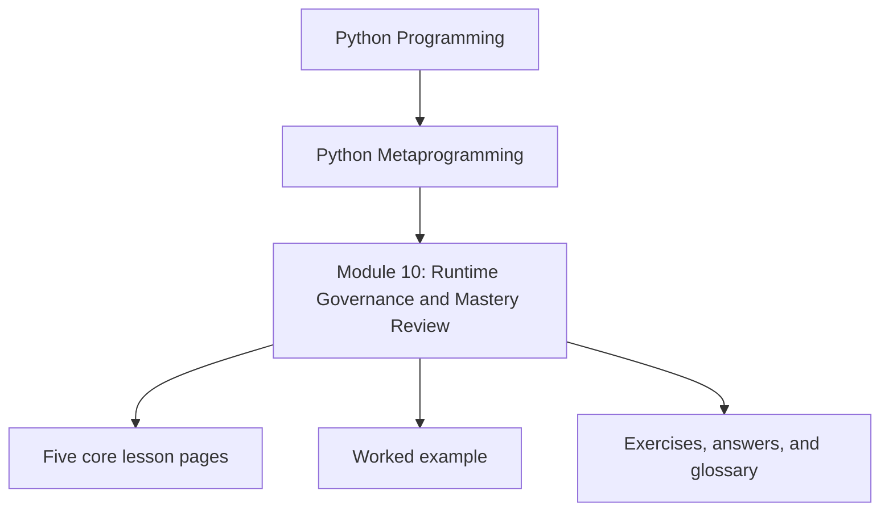
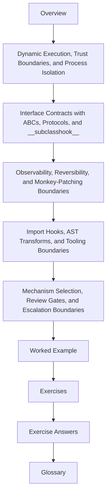

# Module 10: Runtime Governance and Mastery Review

<!-- page-maps:start -->
## Module Position

<!-- page-maps:end -->

Module 10 closes the mechanism ladder by turning it into engineering judgment. The goal is
not to add one last collection of dangerous tricks. The goal is to decide which powers are
defensible, which ones belong only to tooling or exceptional cases, and how a reviewer can
ask for evidence instead of admiring cleverness.

This module now uses the same ten-file learning surface as the deep-dive series and the
other strong metaprogramming modules: overview, five core lessons, worked example,
exercises, answer key, and glossary.

## What this module is for

By the end of Module 10, you should be able to explain five things clearly:

- why `eval` and `exec` must be governed by trust boundaries and real isolation claims
- what ABCs, protocols, and `__subclasshook__` can and cannot promise honestly
- how dynamic behavior stays observable, reversible, and testable
- why import hooks and AST transforms usually belong to tooling-grade problems
- how to choose the lowest-power mechanism and justify escalation only when ownership demands it

## Keep these pages open

- [Mastery Map](../module-00-orientation/mastery-map.md)
- [Boundary Review Prompts](../reference/boundary-review-prompts.md)
- [Review Checklist](../reference/review-checklist.md)
- [Capstone Proof Guide](../capstone/capstone-proof-guide.md)

## The ten files in this module

1. Overview (`index.md`)
2. [Dynamic Execution, Trust Boundaries, and Process Isolation](dynamic-execution-trust-boundaries-and-process-isolation.md)
3. [Interface Contracts with ABCs, Protocols, and `__subclasshook__`](interface-contracts-with-abcs-protocols-and-subclasshook.md)
4. [Observability, Reversibility, and Monkey-Patching Boundaries](observability-reversibility-and-monkey-patching-boundaries.md)
5. [Import Hooks, AST Transforms, and Tooling Boundaries](import-hooks-ast-transforms-and-tooling-boundaries.md)
6. [Mechanism Selection, Review Gates, and Escalation Boundaries](mechanism-selection-review-gates-and-escalation-boundaries.md)
7. [Worked Example: Reviewing a Plugin Runtime for Observability and Control](worked-example-reviewing-a-plugin-runtime-for-observability-and-control.md)
8. [Exercises](exercises.md)
9. [Exercise Answers](exercise-answers.md)
10. [Glossary](glossary.md)

## How to use the file set

| If you need to... | Start here |
| --- | --- |
| draw the hard line around `compile`, `eval`, and `exec` | [Dynamic Execution, Trust Boundaries, and Process Isolation](dynamic-execution-trust-boundaries-and-process-isolation.md) |
| compare runtime interfaces without overstating what they prove | [Interface Contracts with ABCs, Protocols, and `__subclasshook__`](interface-contracts-with-abcs-protocols-and-subclasshook.md) |
| keep wrappers, registries, and patches observable and reversible | [Observability, Reversibility, and Monkey-Patching Boundaries](observability-reversibility-and-monkey-patching-boundaries.md) |
| judge whether import machinery changes belong to tooling or ordinary app design | [Import Hooks, AST Transforms, and Tooling Boundaries](import-hooks-ast-transforms-and-tooling-boundaries.md) |
| decide whether a higher-power mechanism truly earns approval | [Mechanism Selection, Review Gates, and Escalation Boundaries](mechanism-selection-review-gates-and-escalation-boundaries.md) |
| see those decisions applied to one real runtime | [Worked Example: Reviewing a Plugin Runtime for Observability and Control](worked-example-reviewing-a-plugin-runtime-for-observability-and-control.md) |
| pressure-test your review habits before closing the course | [Exercises](exercises.md) |
| compare your reasoning against a reference answer | [Exercise Answers](exercise-answers.md) |
| stabilize the governance vocabulary used in this directory | [Glossary](glossary.md) |

## The running question

Carry this question through every page:

> Which runtime powers are still defensible once debugging cost, observability, reversibility, and team trust become the real review criteria?

Strong Module 10 answers usually mention one or more of these:

- trust boundaries that stop at what the process can really enforce
- interface claims sized to the actual strength of the mechanism
- explicit cleanup, reset, and disable paths
- tooling-grade powers rejected for ordinary application behavior
- an escalation decision defended by timing and ownership rather than taste

## Learning outcomes

By the end of this module, you should be able to:

- review high-power runtime code with operational standards rather than aesthetic ones
- separate trusted internal metaprogramming from unsafe in-process code execution claims
- demand observability, reversibility, and proof surfaces before approving runtime magic
- compare decorators, descriptors, metaclasses, and import hooks through ownership and blast radius
- explain why the capstone stays defensible because its public review surfaces remain observational

## Exit standard

Do not leave the course until all of these are true:

- you can name one higher-power mechanism you would reject and why a lower-power one still owns the problem
- you can explain why restricted globals are not a security boundary
- you can distinguish shallow interface checks from real behavioral proof
- you can point to one reset, cleanup, or disable surface that makes a dynamic design reviewable

When those feel ordinary, Module 10 has done its job and the course can end with judgment
instead of with one more pile of mechanisms.
