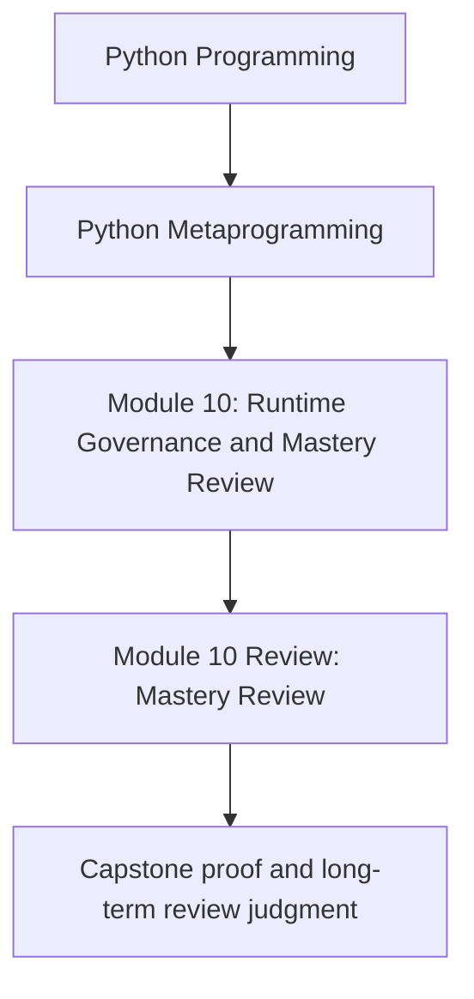
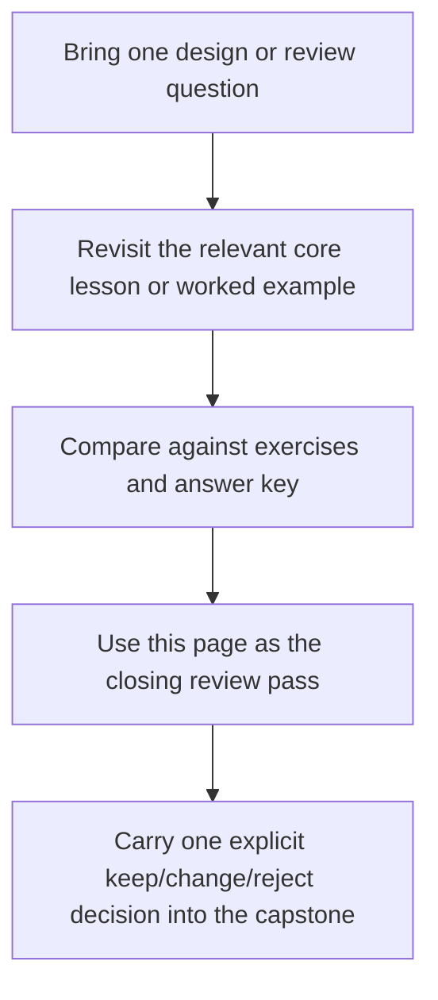

# Module 10 Review: Mastery Review

<!-- page-maps:start -->
## Concept Position

<!-- page-maps:end -->

Read the first diagram as a placement map: this page closes the module after the five core
lessons, worked example, exercises, answers, and glossary have already done their job.
Read the second diagram as a study rhythm: revisit the exact lesson you need, pressure-test
it with practice, then use this page to turn that understanding into one review judgment
you can defend.

You have now moved through the whole runtime ladder in this course: observation, wrappers,
class customization, descriptors, metaclasses, and governance. This page exists to make
that journey usable in code review, not just memorable in notes.

## What mastery should sound like now

By this point, strong answers should sound operational:

- you can say what happens at import time, class-definition time, instance time, and call time
- you can explain which surfaces stay observable after wrapping or registration
- you can reject a higher-power mechanism for a named ownership reason
- you can stop a security or safety claim at the real enforceable boundary

If the answer still sounds mostly impressed by the mechanism, the module has not landed yet.

## What you should now be able to review

You should be able to review all of these without hand-waving:

- a dynamic execution design that claims restricted globals are "safe enough"
- a protocol or ABC that claims to prove more than it actually proves
- a wrapper or patching design that claims reversibility without a real reset path
- an import hook or AST transform that claims to be ordinary application architecture
- a plugin runtime that claims to stay observable and deterministic under metaprogramming

## A final review route through Module 10

When the runtime starts feeling magical again, use this order:

1. Reopen the one core lesson that matches the pressure.
2. Revisit the [Worked Example](worked-example-reviewing-a-plugin-runtime-for-observability-and-control.md).
3. Attempt the matching [Exercises](exercises.md) or compare with the [Exercise Answers](exercise-answers.md).
4. Run the [Capstone Proof Guide](../capstone/capstone-proof-guide.md) if the question needs executable evidence.

That route keeps the course from collapsing into abstract "best practices."

## Capstone exit checks

Before you call the course complete, you should be able to do all of these:

- inspect the public manifest or registry before invoking plugin behavior
- explain why the capstone metaclass is justified and why import-hook escalation is rejected
- point to one reset or cleanup surface that keeps runtime state reviewable
- identify one change you would reject as making the public review route less observational

## The keep, change, reject test

Use this quick mastery pass when reviewing a metaprogramming design:

- Keep it if the mechanism owns a timing-sensitive responsibility and stays observable.
- Change it if the mechanism is justified but missing reset hooks, proof surfaces, or clear review language.
- Reject it if a lower-power mechanism owns the behavior honestly enough.

This is the judgment Module 10 is trying to make habitual.

## What mastery means in this course

Mastery here does not mean reaching for metaclasses or import machinery faster.

It means:

- reaching for metaprogramming less often
- choosing it more precisely when the timing or ownership really demands it
- keeping the runtime visible enough that another engineer can review, test, and reverse it

That is the durable finish line for the course.

## Continue through Module 10

- Revisit: [Overview](index.md)
- Practice: [Exercises](exercises.md)
- Compare: [Exercise Answers](exercise-answers.md)
- Stabilize language with: [Glossary](glossary.md)
