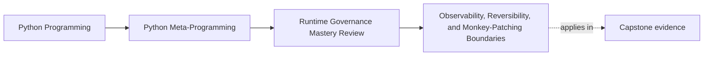

# Observability, Reversibility, and Monkey-Patching Boundaries


<!-- page-maps:start -->
## Page Maps




<!-- page-maps:end -->

Runtime power becomes expensive when it hides what happened, destroys the trail back to
the cause, or cannot be turned off cleanly.

Use this page to turn that operational cost into explicit review criteria.

## The sentence to keep

If metaprogramming changes behavior, it must also preserve observability, expose a clean
reversal path, and keep its patch boundary narrower than its benefit.

That is the minimum professional bar.

## Observability starts with not lying about callables

Wrappers should preserve identity surfaces whenever possible:

- `__name__`
- `__qualname__`
- `__doc__`
- `__wrapped__`

That is why `functools.wraps` belongs in correctness discussions, not style debates.

```python
import functools


def trace_safe(func):
    @functools.wraps(func)
    def wrapper(*args, **kwargs):
        return func(*args, **kwargs)
    return wrapper
```

Without those metadata surfaces, introspection and debugging tools pay the price later.

## Tracebacks are evidence; do not throw them away

One of the fastest ways to make dynamic code hostile is to destroy the original traceback.

Strong wrapper behavior looks like this:

```python
import functools


def preserve_traceback(func):
    @functools.wraps(func)
    def wrapper(*args, **kwargs):
        try:
            return func(*args, **kwargs)
        except Exception:
            raise
    return wrapper
```

When extra context is genuinely helpful, chain explicitly:

```python
import functools


def add_context(func):
    @functools.wraps(func)
    def wrapper(*args, **kwargs):
        try:
            return func(*args, **kwargs)
        except Exception as exc:
            raise RuntimeError(f"{func.__name__} failed") from exc
    return wrapper
```

The point is not "never wrap errors." The point is "never erase the useful evidence."

## Reversibility is part of design, not incident cleanup

Global state and patches need a defined way back to baseline.

For registries, that usually means:

- deterministic ordering
- an explicit reset hook
- tests proving cleanup between cases

```python
from collections import defaultdict

REGISTRY = defaultdict(list)


def register(group: str, name: str, obj: object) -> None:
    REGISTRY[group].append((name, obj))
    REGISTRY[group].sort(key=lambda item: item[0])


def clear_registry(group: str | None = None) -> None:
    if group is None:
        REGISTRY.clear()
    else:
        REGISTRY.pop(group, None)
```

Reset hooks are not optional polish. They are what makes a global mechanism reviewable in
tests and incidents.

## Monkey patches must have a boundary you can explain

The word "monkey patch" covers several very different actions. Governance depends on
which one you mean.

Safer end of the spectrum:

- patching your own module symbol in a test
- patching a user-defined type inside a reversible context

Higher-risk end of the spectrum:

- patching builtins
- patching standard-library types in production
- leaving the patch active outside a clearly owned scope

The point is not that every patch is forbidden. The point is that blast radius matters.

## Context-managed patches are the minimum acceptable pattern

```python
from contextlib import contextmanager


@contextmanager
def patch_attr(obj, name, new_value):
    old_value = getattr(obj, name)
    setattr(obj, name, new_value)
    try:
        yield old_value
    finally:
        setattr(obj, name, old_value)
```

That pattern is simple, but it keeps the right habit visible:

- patches have an owner
- patches have a lifetime
- patches revert even on failure

Anything wider should raise the review bar immediately.

## Patch your symbol before you patch the world

If a module does `from time import time as now`, tests should usually patch that module's
`now` symbol rather than patching `time.time` globally.

That keeps the patch aligned with the code under review instead of accidentally changing
unrelated callers elsewhere in the process.

This is one of the clearest examples of low-blast-radius design.

## Performance claims need measurement, not vibes

Every wrapper, hook, and layer adds some cost. Sometimes that cost is fine. Sometimes it
lands on a hot path and quietly becomes the real bug.

```python
import timeit


def baseline(x):
    return x + 1


def wrapped(x):
    return baseline(x)


print(timeit.timeit("baseline(1)", globals=globals(), number=200000))
print(timeit.timeit("wrapped(1)", globals=globals(), number=200000))
```

The result does not need to be dramatic to matter. What matters is that the design states
whether the path is hot and what overhead was observed.

## Kill switches are part of operational honesty

If the design adds global or difficult-to-debug behavior, it should usually come with a
disable path:

- feature flag
- configuration toggle
- no-magic fallback path
- test helper that resets state

This is not fear. It is stewardship.

## Review rules for observable and reversible metaprogramming

When reviewing wrappers, registries, or patches, ask these questions:

- what runtime fact stays visible after this abstraction is added?
- how do we restore baseline behavior in tests and incidents?
- does the traceback stay useful?
- what is the patch target and why is that blast radius acceptable?
- do we have measurement for hot-path overhead?
- can the feature be disabled without rewriting the application?

If no one can answer those quickly, the mechanism is already too magical.

## What this page makes clear

The point is not "dynamic behavior is bad."

The boundary is:

- dynamic behavior owes an operational explanation
- debugging evidence is part of correctness
- reversible systems are easier to trust than clever permanent ones

That is how runtime power stays governable.

## What to practice from this page

Try these before moving on:

1. Rewrite one irreversible patch as a context-managed patch.
2. Add one explicit reset hook to a registry design.
3. Explain one wrapper's error behavior in terms of traceback preservation and exception chaining.

If those feel ordinary, the next step is the outer edge of runtime magic: import hooks and
AST transforms, where global semantics make review costs even steeper.

## Continue through Module 10

- Previous: [Interface Contracts with ABCs, Protocols, and `__subclasshook__`](interface-contracts-with-abcs-protocols-and-subclasshook.md)
- Next: [Import Hooks, AST Transforms, and Tooling Boundaries](import-hooks-ast-transforms-and-tooling-boundaries.md)
- Practice: [Exercises](exercises.md)
- Terms: [Glossary](glossary.md)
