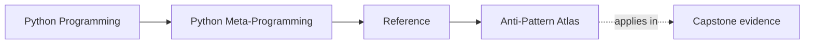
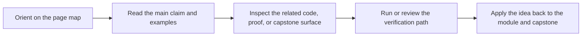

# Anti-Pattern Atlas

<!-- page-maps:start -->
## Page Maps

<!-- page-maps:end -->

Read the first diagram as a lookup map: this page is part of the review shelf, not a
first-read narrative. Read the second diagram as the reference rhythm: arrive with a
concrete ambiguity, compare the current work against the boundary on the page, then turn
that comparison into a decision.

During a real design review, people rarely remember a metaprogramming course by module
title. They remember symptoms, smells, and clumsy runtime patterns.

Use this page when the question is "what kind of bad metaprogramming idea is this?" rather
than "which module taught that?"

## Common anti-patterns

| Anti-pattern | Why it is clumsy | Primary modules | First proof or review route |
| --- | --- | --- | --- |
| wrappers that erase signatures or metadata | tooling, debugging, and review lose the original callable surface | 03, 04, 05 | `make signatures` |
| inspection that executes behavior accidentally | observation becomes a side-effectful runtime action | 02, 03 | `make manifest` |
| decorators carrying hidden retry, caching, or validation policy | callable transformation turns into an unbounded policy layer | 04, 05 | `make action` |
| descriptors owning behavior that is not really about attribute access | field machinery hides what should stay explicit | 06, 07, 08 | `make field` |
| per-instance state stored on the descriptor itself | one instance leaks into another and the abstraction lies | 07, 08 | `make inspect` |
| metaclasses used for prestige instead of class-creation need | higher-power hooks hide lower-power designs | 06, 09 | `make registry` |
| import-time work that is heavy, stateful, or surprising | import order becomes a hidden runtime dependency | 01, 09, 10 | `make tour` |
| dynamic execution treated as configurable convenience | `eval` or `exec` bypass review, safety, and observability | 10 | `make proof` |

## Symptom to anti-pattern

| Symptom | Likely anti-pattern | Better question |
| --- | --- | --- |
| "This decorated function works, but tools cannot tell what it accepts anymore." | wrapper erased the callable contract | what public signature should still be visible |
| "Reading an attribute changed runtime state." | inspection and execution were collapsed | which tool would let me inspect structure without invoking behavior |
| "Every field object knows too much about the whole model." | descriptor owns framework architecture instead of one attribute contract | what explicit layer should own the wider policy |
| "The metaclass feels powerful, but I cannot explain why it must run before the class exists." | metaclass is covering for a lower-power alternative | which class decorator, descriptor, or helper almost solved the problem |
| "This runtime only works when imported in one specific order." | import-time work has become hidden control flow | what definition-time behavior should become explicit or testable |

## Repair direction

When you identify an anti-pattern, do not jump straight to rewriting everything.

Use this order:

1. name the failure class precisely
2. find the matching module and review route
3. inspect the public runtime surface before editing the internals
4. apply the narrowest repair that moves behavior to a lower-power or more observable boundary

This keeps the course aligned with real maintenance work instead of theatrical refactoring.

## Best companion pages

Use these with the atlas:

- [Review Checklist](review-checklist.md) and [Boundary Review Prompts](boundary-review-prompts.md) for the lower-power decision rule
- [Review Checklist](review-checklist.md) for reviewer questions
- [Topic Boundaries](topic-boundaries.md) for what belongs inside this course
- [Module Dependency Map](module-dependency-map.md) for where the idea is taught in sequence
- [Capstone Map](../capstone/capstone-map.md) for the module-aware repository route
