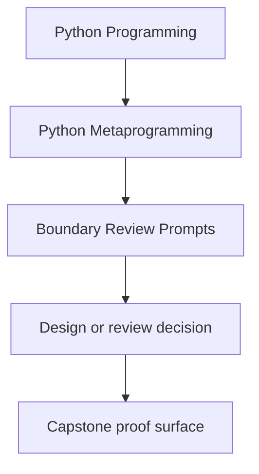
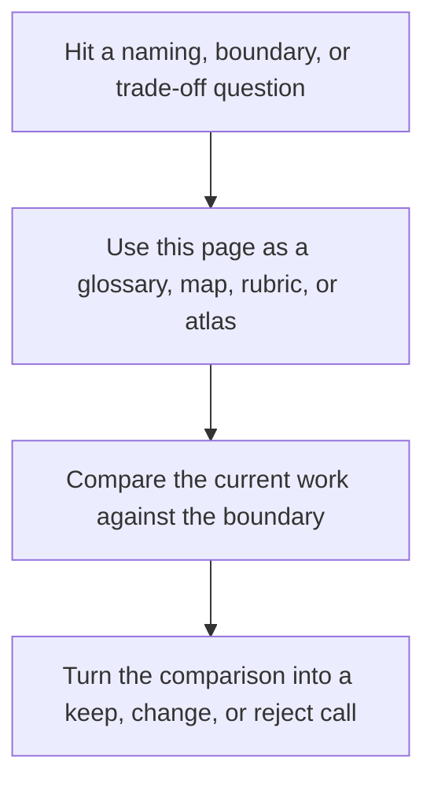

# Boundary Review Prompts

<!-- page-maps:start -->
## Reference Position

<!-- page-maps:end -->

Read the first diagram as a lookup map: this page is part of the review shelf, not a
first-read narrative. Read the second diagram as the reference rhythm: arrive with a
concrete ambiguity, compare the current work against the boundary on the page, then turn
that comparison into a decision.

Use these prompts when the code technically works but you still need to decide whether
the mechanism lives on the right boundary.

## Observation boundary

- Could this be solved with inspection instead of behavior-changing hooks?
- Does the chosen approach let a reviewer inspect the runtime shape without execution?
- What evidence is available from the public surface before opening internals?

## Wrapper boundary

- Is this still one callable transformation, or has it become a policy engine?
- Which callable facts must remain visible after wrapping?
- What would become clearer if this behavior moved into an explicit object?

## Attribute boundary

- Does the rule truly belong to attribute access?
- Would a plain method or property explain the behavior more honestly?
- Where does per-instance state live, and can one instance interfere with another?

## Class-creation boundary

- What specifically must happen before the class exists?
- Could a class decorator or explicit registration step own this instead?
- Is the class-definition work deterministic and resettable in tests?

## Governance boundary

- Is this mechanism easier to debug than the boring alternative, or harder?
- Would you trust this hook in ordinary application code, or only in tooling?
- What rollback path exists if the dynamic behavior causes trouble under real use?

## Power-ladder prompts

- What lower rung almost solved this problem?
- What new failure mode did the higher rung introduce?
- Would a reviewer still understand the behavior one file at a time?
- Is this mechanism still proportionate to the invariant it claims to own?
