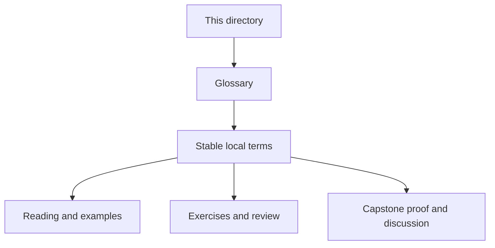
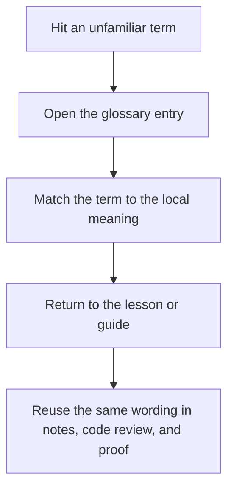

# Reference Glossary

<!-- page-maps:start -->
## Glossary Fit

<!-- page-maps:end -->

This glossary belongs to **Reference** in **Python Metaprogramming**. It keeps the language of this directory stable so the same ideas keep the same names across reading, practice, review, and capstone proof.

## How to use this glossary

Read the directory index first, then return here whenever a page, command, or review discussion starts to feel more vague than the course intends. The goal is stable language, not extra theory.

## Terms in this directory

| Term | Meaning in this directory |
| --- | --- |
| Anti-Pattern Atlas | the recurring failure catalog for anti-pattern atlas, used to recognize defect shapes before they harden into local folklore. |
| Boundary Review Prompts | the review surface for boundary review prompts, used to turn judgment into explicit keep, change, or reject calls. |
| Review Checklist | the review surface for review checklist, used to turn judgment into explicit keep, change, or reject calls. |
| Self-Review Prompts | the review surface for self-review prompts, used to turn judgment into explicit keep, change, or reject calls. |
| Topic Boundaries | the durable rule surface for topic boundaries, used when a design or review decision needs stable language instead of intuition. |
