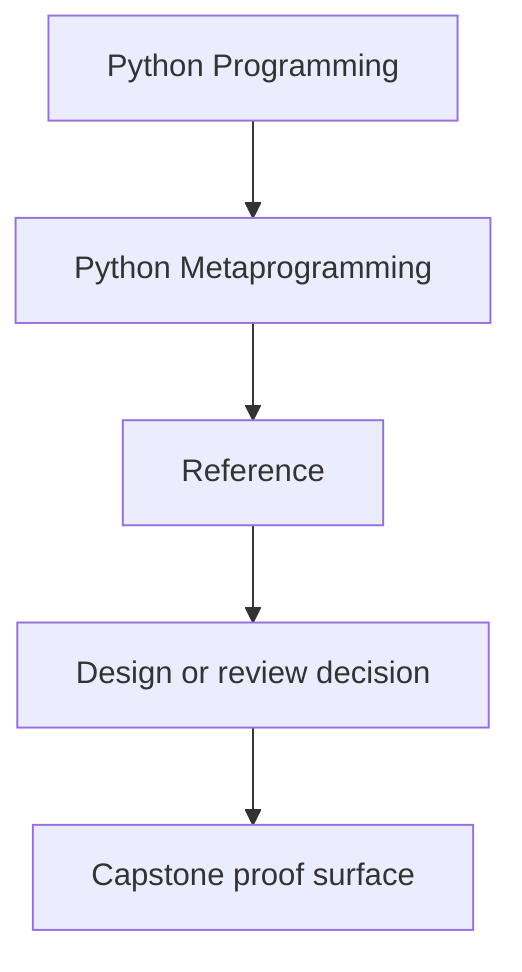
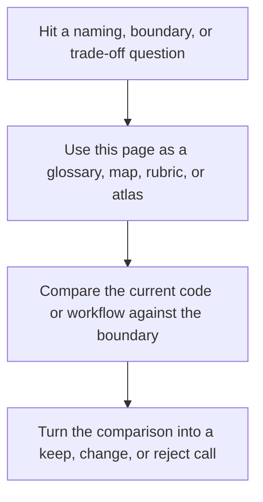

# Reference

<!-- page-maps:start -->
## Reference Position

<!-- page-maps:end -->

Read the first diagram as a lookup map: this page is part of the review shelf, not a first-read narrative. Read the second diagram as the reference rhythm: arrive with a concrete ambiguity, compare the current work against the boundary on the page, then turn that comparison into a decision.

Use this section when you need durable course standards rather than a reading route.
These pages are meant to stay open while you review code, not only while you learn the
module arc for the first time.

## Start with the decision you need to make

### "Should this use a stronger runtime mechanism at all?"

- [Runtime Power Ladder](runtime-power-ladder.md)
- [Topic Boundaries](topic-boundaries.md)
- [Anti-Pattern Atlas](anti-pattern-atlas.md)

### "How should I review or reject this design?"

- [Review Checklist](review-checklist.md)
- [Boundary Review Prompts](boundary-review-prompts.md)
- [Self-Review Prompts](self-review-prompts.md)

### "What does this course mean by this term?"

- [Glossary](glossary.md)

## Good use of this shelf

- Bring one reference page into an active review question.
- Compare the current code against the boundary on that page.
- Leave with one keep, change, or reject decision.
- Return to modules or capstone guides only after the decision is named.

## Directory glossary

Use [Glossary](glossary.md) when you want the recurring language in this shelf kept stable while you move between standards, checklists, prompts, and boundary calls.
