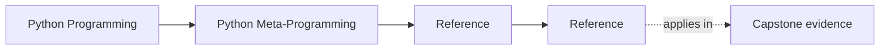
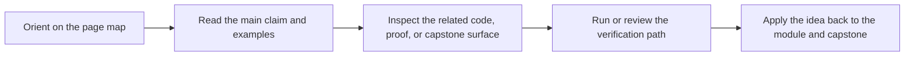

# Reference

<!-- page-maps:start -->
## Page Maps

<!-- page-maps:end -->

This shelf is for durable metaprogramming vocabulary, escalation rules, and review
judgment. Use it when the mechanism is already recognizable and you need help deciding
whether it belongs at all, where it belongs, or how to prove it cleanly.

## Choose the right reference route

| If your question is... | Best page |
| --- | --- |
| What does this term mean locally? | [Glossary](glossary.md) |
| Where does this mechanism sit in the course sequence? | [Module Dependency Map](module-dependency-map.md) |
| What should I practice or prove next? | [Practice Map](practice-map.md) |
| How should I review this mechanism? | [Review Checklist](review-checklist.md) |
| Which sharper boundary question should I ask? | [Boundary Review Prompts](boundary-review-prompts.md) |
| How can I turn this idea into active recall? | [Self-Review Prompts](self-review-prompts.md) |
| What failure shape am I seeing? | [Anti-Pattern Atlas](anti-pattern-atlas.md) |
| What counts as genuinely complete understanding? | [Completion Rubric](completion-rubric.md) |
| Does this mechanism belong in the course center or at its edge? | [Topic Boundaries](topic-boundaries.md) |

## What this shelf is for

- keeping lower-power and higher-power runtime choices distinguishable
- reviewing decorators, descriptors, and metaclasses without magic-language shortcuts
- connecting module order to practice and capstone proof surfaces
- forcing stronger runtime tools to justify their blast radius

## Guide set

- [Glossary](glossary.md)
- [Runtime Power Ladder](runtime-power-ladder.md)
- [Module Dependency Map](module-dependency-map.md)
- [Practice Map](practice-map.md)
- [Review Checklist](review-checklist.md)
- [Boundary Review Prompts](boundary-review-prompts.md)
- [Self-Review Prompts](self-review-prompts.md)
- [Anti-Pattern Atlas](anti-pattern-atlas.md)
- [Completion Rubric](completion-rubric.md)
- [Topic Boundaries](topic-boundaries.md)

## Stop here when

- you know the lowest honest mechanism for the current problem
- you can turn that judgment into one keep, change, or reject call
- you know whether the next move is back to a module or into the capstone
