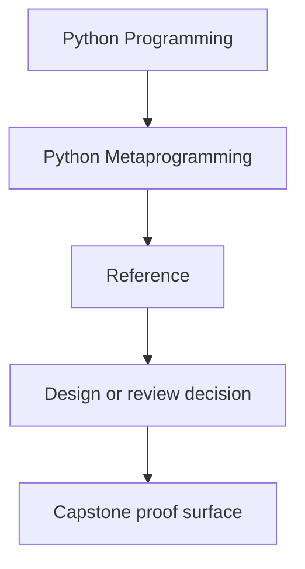
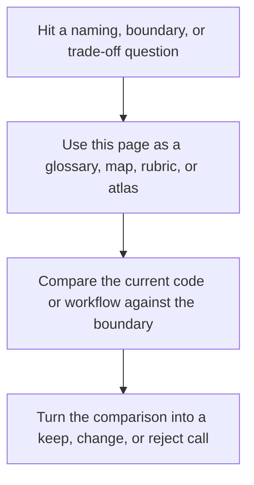

# Reference

<!-- page-maps:start -->
## Reference Position

<!-- page-maps:end -->

Read the first diagram as a lookup map: this page is part of the review shelf, not a first-read narrative. Read the second diagram as the reference rhythm: arrive with a concrete ambiguity, compare the current work against the boundary on the page, then turn that comparison into a decision.

Use this section when you need durable course standards rather than a reading route.
These pages are meant to stay open while you review code, not only while you learn the
module arc for the first time.

## Pages in this section

- [Runtime Power Ladder](runtime-power-ladder.md) for the lowest-power decision rule
- [Glossary](glossary.md) for shared course language
- [Review Checklist](review-checklist.md) for code review judgment
- [Self-Review Prompts](self-review-prompts.md) for learner-side readiness checks
- [Boundary Review Prompts](boundary-review-prompts.md) for keep, change, or reject review calls
- [Topic Boundaries](topic-boundaries.md) for what belongs at the center of this course
- [Anti-Pattern Atlas](anti-pattern-atlas.md) for symptom-first review of clumsy metaprogramming ideas

## Directory glossary

Use [Glossary](glossary.md) when you want the recurring language in this shelf kept stable while you move between standards, checklists, prompts, and boundary calls.
