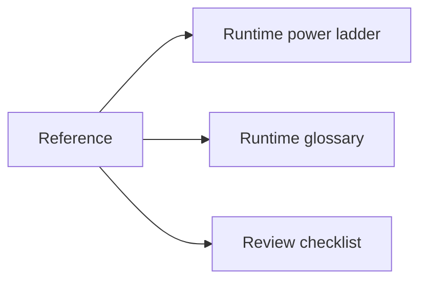
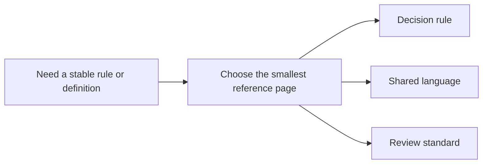

# Reference

<!-- page-maps:start -->
## Page Maps

<!-- page-maps:end -->

Use this section when you need durable course standards rather than a reading route.
These pages are meant to stay open while you review code, not only while you learn the
module arc for the first time.

## Pages in this section

- [Runtime Power Ladder](runtime-power-ladder.md) for the lowest-power decision rule
- [Runtime Glossary](runtime-glossary.md) for shared course language
- [Review Checklist](review-checklist.md) for code review judgment
