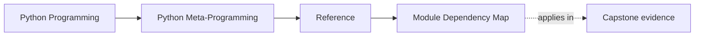
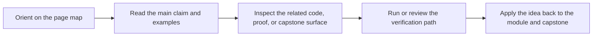
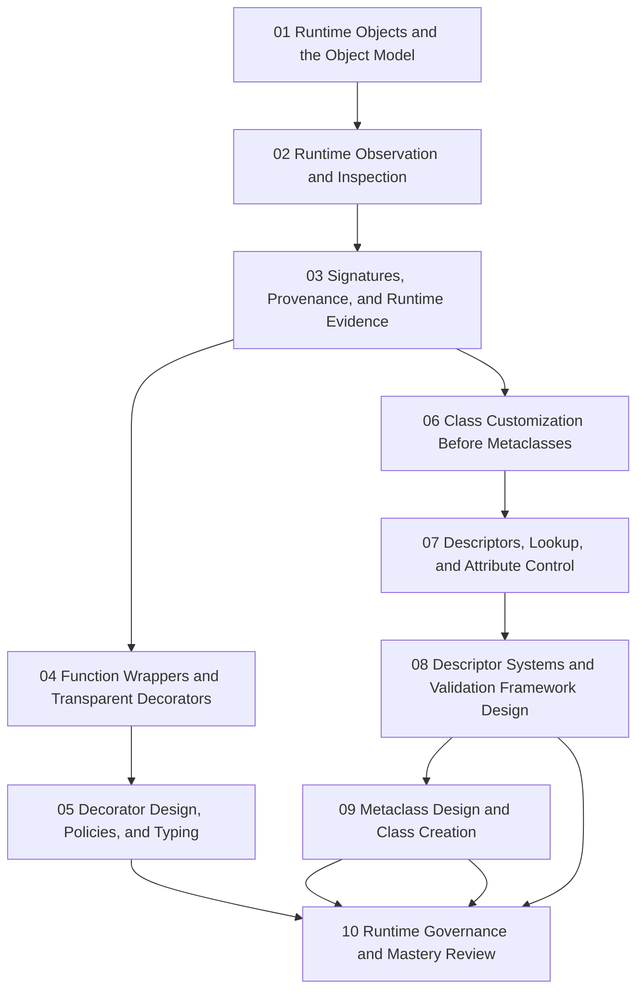

# Module Dependency Map

<!-- page-maps:start -->
## Page Maps

<!-- page-maps:end -->

Use this page when you remember a metaprogramming mechanism but not where it sits in the
course's escalation order. The goal is to keep higher-power tools attached to the lower
power tools they are supposed to replace only when necessary.

## Main sequence

## Why the sequence looks like this

| Module | Depends most on | Reason |
| --- | --- | --- |
| 01 | none | the object model is the floor beneath every later runtime technique |
| 02 | 01 | observation should come before mutation or transformation |
| 03 | 01-02 | provenance and signature discipline depend on knowing what can be inspected honestly |
| 04 | 02-03 | wrappers only deserve trust if runtime evidence survives them |
| 05 | 04 | decorator policy is a design problem after transparent wrapping is already clear |
| 06 | 01-05 | lower-power class customization should be exhausted before metaclass pressure appears |
| 07 | 01-06 | descriptor behavior relies on the earlier object and lookup model |
| 08 | 06-07 | descriptor systems are safer after single-descriptor behavior is already legible |
| 09 | 06-08 | metaclasses belong late because class-creation invariants are the strongest escalation |
| 10 | all earlier modules | governance review requires the whole power ladder in view |

## Fastest safe paths

- new to metaprogramming: read Modules 01 through 10 in order
- working maintainer: start with Modules 03, 04, 07, and 09, then backfill when the lower-power alternative is unclear
- runtime steward: start with Modules 05, 08, 09, and 10, then revisit earlier modules when transparency or blast radius questions appear
