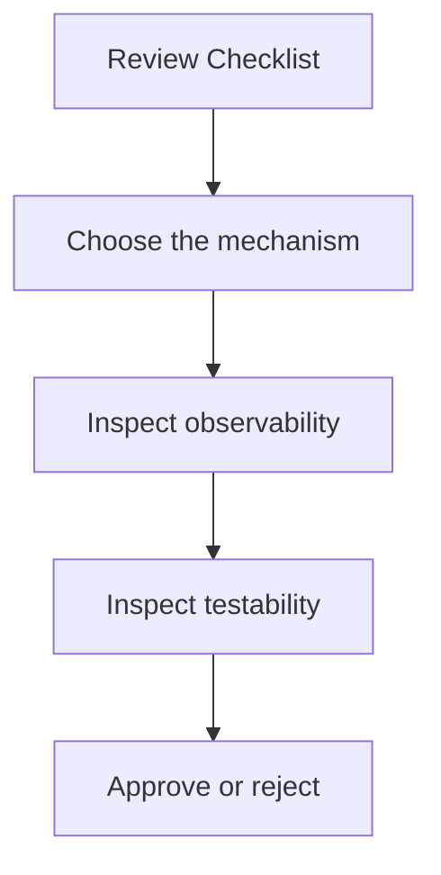
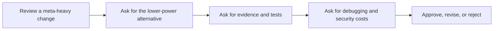

# Review Checklist

<!-- page-maps:start -->
## Page Maps

<!-- page-maps:end -->

Use this checklist when reviewing decorators, descriptors, metaclasses, dynamic execution,
or plugin registration code. The goal is not to punish dynamic design. The goal is to
force it to justify itself.

## Mechanism choice

- What lower-power tool was considered first?
- Which invariant actually requires this mechanism?
- Is the behavior local enough to explain without a live walkthrough?

## Observability

- Does signature, docstring, name, and traceback visibility survive wrapping?
- Can a reviewer inspect the runtime shape without executing business actions?
- Are import-time side effects explicit and deterministic?

## Testability

- Is the registry, cache, or global hook resettable in tests?
- Are failure cases tested, not only happy paths?
- Can the proof route demonstrate the claim from the public surface?

## Security and governance

- Is dynamic execution excluded from untrusted input paths?
- Are plugin names, field contracts, and public hooks stable and documented?
- Is there a kill switch or rollback path if the mechanism causes trouble in production?

## Rejection signals

Reject or rewrite if:

- the mechanism is chosen because it feels advanced
- the design hides work at import time without explicit contracts
- the code becomes harder to debug than an ordinary explicit alternative
