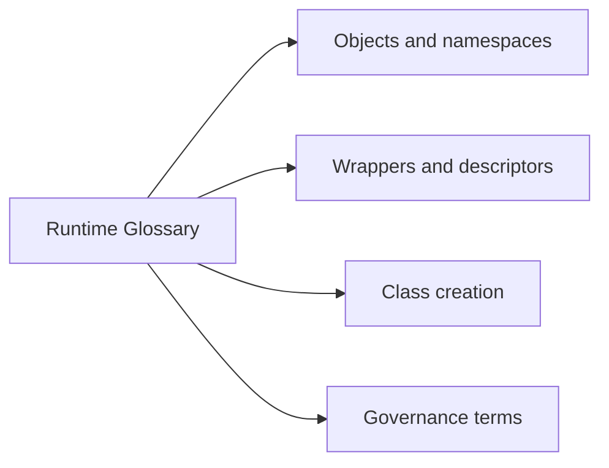

# Runtime Glossary

<!-- page-maps:start -->
## Page Maps

<!-- page-maps:end -->

Use this glossary to keep the course vocabulary stable. In metaprogramming, unclear
terms quickly become unclear boundaries.

## Objects and namespaces

**binding**
: associating a name with an object in a scope or namespace

**namespace**
: the mapping where a scope stores its names during runtime or class creation

**introspection**
: observing runtime shape, metadata, or signatures without changing the target

## Wrappers and descriptors

**wrapper**
: a callable that intercepts another callable while ideally preserving visible metadata

**descriptor**
: an object implementing `__get__`, `__set__`, or `__delete__` to control attribute access

**data descriptor**
: a descriptor implementing `__set__` or `__delete__`, which takes precedence over instance dictionaries

**non-data descriptor**
: a descriptor that only implements `__get__`, often used for methods and computed access

## Class creation

**class decorator**
: a post-creation transformation applied to the finished class object

**metaclass**
: the object responsible for creating a class and enforcing class-definition-time behavior

**`__prepare__`**
: an optional metaclass hook that provides the mapping used while executing the class body

## Governance

**definition time**
: the moment a class statement executes and the class object is created, usually during import

**runtime honesty**
: the discipline of making dynamic behavior observable, explainable, and reviewable

**lowest-power mechanism**
: the least invasive runtime tool that solves the problem clearly enough
