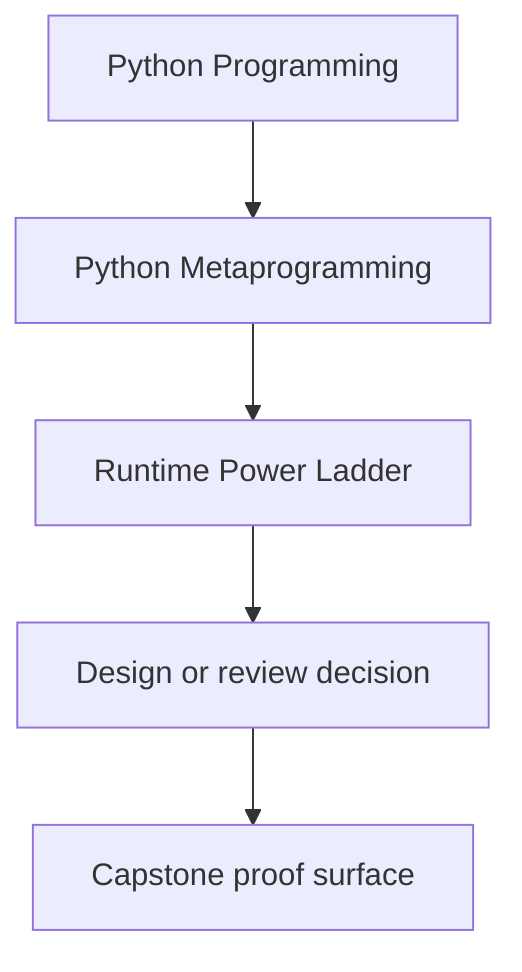
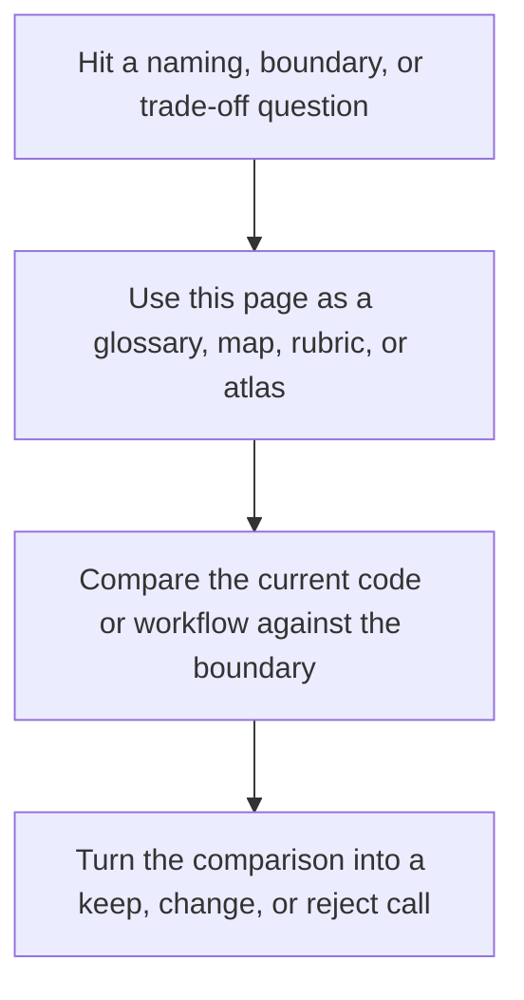

# Runtime Power Ladder

<!-- page-maps:start -->
## Reference Position

<!-- page-maps:end -->

Read the first diagram as a lookup map: this page is part of the review shelf, not a first-read narrative. Read the second diagram as the reference rhythm: arrive with a concrete ambiguity, compare the current work against the boundary on the page, then turn that comparison into a decision.

This page is the central decision rule for the course. Higher-power runtime hooks are
not "more advanced" in a way that makes them better. They are more invasive, harder to
debug, and easier to misuse.

## The ladder

### Plain code

Use functions, explicit classes, and direct composition when the behavior can stay local
and visible.

### Introspection

Use `type`, `isinstance`, `vars`, and `inspect` when you need to observe runtime shape
without changing it.

### Decorators

Use decorators when you need controlled callable transformation and preserved metadata.

### Descriptors

Use descriptors when an invariant belongs to attribute access itself and should be shared
across a class boundary.

### Metaclasses

Use metaclasses only when the invariant belongs to class creation and lower-power tools
cannot own it cleanly.

### Global hooks and dynamic execution

Treat import hooks, `exec`, `eval`, and monkey-patching as exceptional tools with strict
security, observability, and governance boundaries.

## Review prompts

- What lower rung almost solved this problem?
- What new failure mode did the higher rung introduce?
- Can the resulting behavior still be explained by reading one file at a time?
- Would a reviewer approve this without a live walkthrough?

## Decision matrix

| Need | Lowest honest tool | Do not escalate when | Prefer instead |
| --- | --- | --- | --- |
| Better names, extracted helpers, or explicit branching | Plain code | the behavior is still local and readable | plain functions, small classes, explicit composition |
| Runtime observation or evidence gathering | Introspection | you are only trying to inspect shape, signature, or provenance | `inspect`, `type`, `isinstance`, `vars`, `getattr_static` |
| Per-call instrumentation or callable policy | Decorators | the invariant belongs to attribute storage or class creation | `functools.wraps`, thin wrappers, explicit wrapper factories |
| Shared attribute validation or computed access | Descriptors | a property or class decorator already solves the problem locally | `property`, descriptors with `__set_name__`, class decorators for post-creation wiring |
| Hierarchy-wide class-creation invariants | Metaclasses | the problem can be solved after class creation or on one attribute at a time | class decorators, descriptors, explicit registration |
| Process-wide import behavior or runtime-generated code | Global hooks and dynamic execution | the same result can be achieved with explicit imports, entry points, or data-driven configuration | explicit imports, plugin registries, AST-free configuration |

## Escalation rule

When you think you need a higher rung, write down four sentences before you implement it:

1. What lower-power tool almost works?
2. What exact invariant does it fail to own?
3. What new blast radius does the higher tool introduce?
4. How will tests and review bundles prove the higher tool stayed worth it?
