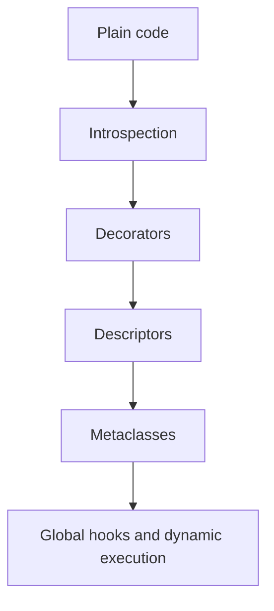
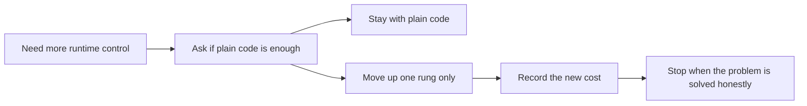

# Runtime Power Ladder

<!-- page-maps:start -->
## Page Maps

<!-- page-maps:end -->

This page is the central decision rule for the course. Higher-power runtime hooks are
not "more advanced" in a way that makes them better. They are more invasive, harder to
debug, and easier to misuse.

## The ladder

### Plain code

Use functions, explicit classes, and direct composition when the behavior can stay local
and visible.

### Introspection

Use `type`, `isinstance`, `vars`, and `inspect` when you need to observe runtime shape
without changing it.

### Decorators

Use decorators when you need controlled callable transformation and preserved metadata.

### Descriptors

Use descriptors when an invariant belongs to attribute access itself and should be shared
across a class boundary.

### Metaclasses

Use metaclasses only when the invariant belongs to class creation and lower-power tools
cannot own it cleanly.

### Global hooks and dynamic execution

Treat import hooks, `exec`, `eval`, and monkey-patching as exceptional tools with strict
security, observability, and governance boundaries.

## Review prompts

- What lower rung almost solved this problem?
- What new failure mode did the higher rung introduce?
- Can the resulting behavior still be explained by reading one file at a time?
- Would a reviewer approve this without a live walkthrough?
