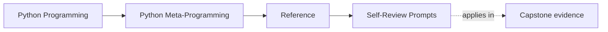
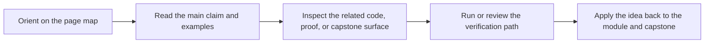

# Self-Review Prompts

<!-- page-maps:start -->
## Page Maps

<!-- page-maps:end -->

Read the first diagram as a lookup map: this page is part of the review shelf, not a
first-read narrative. Read the second diagram as the reference rhythm: arrive with a
concrete ambiguity, compare the current work against the boundary on the page, then turn
that comparison into a decision.

Use these prompts after each module to check whether the course ideas are becoming
operational rather than just familiar.

## Modules 01 to 03

- Can I explain what exists at runtime before any decorator or descriptor changes behavior?
- Can I distinguish safe observation from value resolution that may execute user code?
- Can I say which callable facts are strong evidence and which provenance details are only best-effort?

## Modules 04 to 06

- Can I explain what a wrapper changed at definition time and at call time?
- Can I say why a class decorator or property might be enough before reaching for stronger hooks?
- Can I point to one example where moving behavior to a lower-power boundary would make the design clearer?

## Modules 07 to 09

- Can I trace one descriptor-backed attribute from declaration to per-instance storage?
- Can I explain why a descriptor or metaclass owns the rule better than a plainer alternative?
- Can I name the exact moment when class-creation control becomes necessary?

## Module 10 and mastery review

- Can I explain which runtime powers I would still reject even if they technically work?
- Can I point to one capstone surface that proves the runtime stayed observable?
- Can I describe how this design would be debugged by someone who did not write it?
