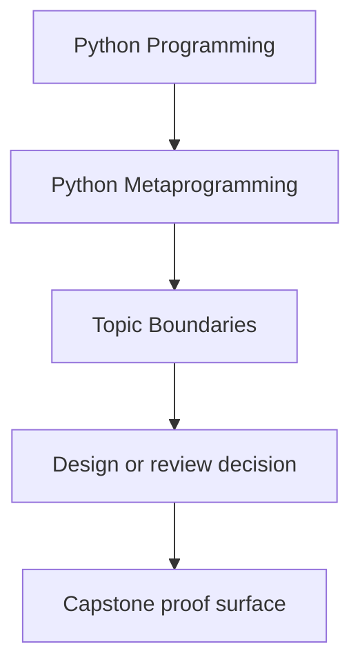
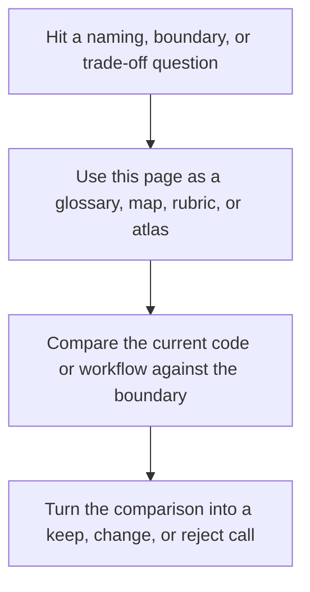

# Topic Boundaries

<!-- page-maps:start -->
## Reference Position

<!-- page-maps:end -->

Read the first diagram as a lookup map: this page is part of the review shelf, not a
first-read narrative. Read the second diagram as the reference rhythm: arrive with a
concrete ambiguity, compare the current work against the boundary on the page, then turn
that comparison into a decision.

Use this page when you need to decide whether a topic belongs inside the center of this
course, on its edge, or outside it. That boundary matters because metaprogramming becomes
sloppy fast when every dynamic trick is treated as equally central.

## What this course is centrally about

These topics are the spine of the course:

- Python's runtime object model for functions, classes, modules, methods, and instances
- safe observation with builtins and `inspect`
- signatures, provenance, and the difference between evidence and folklore
- wrapper discipline, decorator transparency, and policy boundaries
- class decorators, properties, and descriptors as ownership tools
- metaclasses only where class-creation control is truly the real requirement
- governance around dynamic execution, monkey-patching, import hooks, and review red lines

If a question changes where runtime behavior lives, how observable it remains, or how a
higher-power hook is justified, it belongs in the center of this course.

## Topics that are adjacent, not central

These matter, but they are supporting material rather than the main runtime-design target:

- static typing details beyond what is needed to discuss annotations and reviewability
- framework APIs beyond the runtime pressure they introduce
- packaging, distribution, and deployment mechanics
- performance tuning after the mechanism choice is already honest
- language-implementation internals beyond the point where they clarify the PLR-versus-CPython boundary

The course should mention these when they affect runtime judgment, but it should not turn
into a framework catalog or interpreter-internals survey.

## Topics that are outside the course center

These are not the main subject here:

- beginner syntax for functions, classes, decorators, or properties
- a full security curriculum beyond the dynamic-execution and observability boundaries taught here
- broad framework tutorials for Django, FastAPI, SQLAlchemy, or Pydantic
- compiler construction, bytecode hacking, or deep import machinery beyond the review boundary
- general software architecture that does not depend on metaprogramming choices

Those topics can matter, but they are not where this course should spend most of its
depth budget.

## Common boundary confusions

| Confusion | Better boundary |
| --- | --- |
| "Metaprogramming means every dynamic trick Python allows." | Metaprogramming here means runtime behavior that must stay observable, reviewable, and justified against lower-power alternatives. |
| "If a framework uses decorators or descriptors, the framework API is the curriculum." | Frameworks are examples of pressure, not the subject of the course. |
| "Using `inspect` is enough to make a design transparent." | Observation is only one layer; transparency also depends on what executes, what stays visible, and who owns the behavior. |
| "Metaclasses are the advanced destination of the course." | The course treats metaclasses as the narrowest justified tool, not the most prestigious one. |
| "Governance belongs outside a mechanics course." | Governance belongs here because runtime power becomes dangerous exactly when teams stop applying review boundaries to it. |

## How to use this boundary in practice

- Stay in this course when the question is "what runtime boundary should own this behavior?"
- Stay in this course when the question is "what lower-power tool should win here?"
- Use an adjacent source when the question is mostly framework commands or vendor-specific APIs.
- Leave the course center when the question is beginner syntax or deep implementation hacking for its own sake.

The course becomes clearer when its topic boundary is explicit. That clarity is what keeps
the module sequence coherent instead of turning into a bag of advanced Python tricks.
