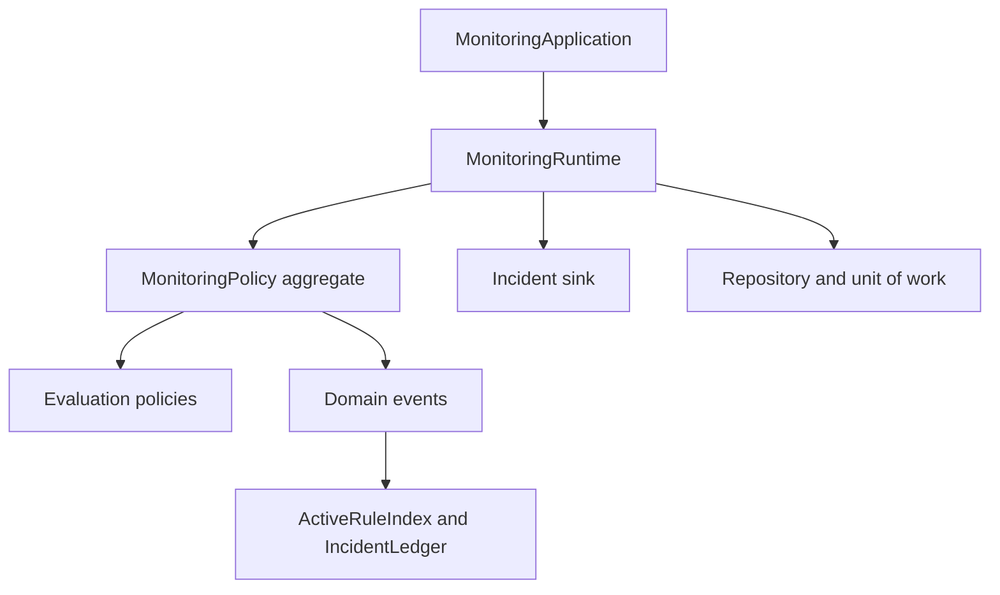
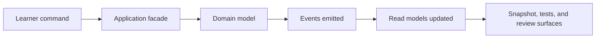

# Architecture Guide

<!-- page-maps:start -->
## Guide Maps

<!-- page-maps:end -->

This capstone is intentionally small, but its shape is strict. The domain is not buried
inside infrastructure, and the runtime does not quietly absorb domain rules. The goal is
to show an object-oriented design where ownership stays legible under change.

## Ownership boundaries

- `application.py` is the learner-facing use-case surface.
- `model.py` is the authoritative home of rule lifecycle and evaluation ownership.
- `policies.py` isolates replaceable evaluation behavior.
- `runtime.py` coordinates sources, sinks, projections, and units of work.
- `repository.py` expresses persistence intent and rollback semantics.
- `read_models.py` and `projections.py` remain downstream of events.

## Why this shape matters

The aggregate should stay authoritative for domain change. The runtime should stay thin
enough that replacing a source or sink does not change the rules of the domain. The
projections should stay derived so read concerns do not mutate authoritative state.

## Dependency direction

| Surface | May depend on | Should not depend on |
| --- | --- | --- |
| `application.py` | use-case inputs, runtime coordination, aggregate-facing operations | projection internals as a source of truth |
| `model.py` | domain values, events, policy abstractions | runtime adapters, sinks, or learner-facing command flow |
| `policies.py` | rule-evaluation inputs and domain values | repository or projection mechanics |
| `runtime.py` | aggregate operations, repositories, projections, sinks, and sources | projection state as an authority for domain decisions |
| `read_models.py` and `projections.py` | emitted events and display needs | aggregate mutation paths |
| `repository.py` | storage semantics and rollback coordination | hidden lifecycle or evaluation rules |

## Review routes for architecture questions

- Use `make inspect` when you want the derived state bundle before opening code.
- Use `make tour` when you want the learner-facing scenario route through the architecture.
- Use `make verify-report` when you need executable evidence alongside that review.
- Use `EXTENSION_GUIDE.md` when the architecture question is really a change-placement question.
- Use `EVENT_FLOW_GUIDE.md` when the main question is how aggregate decisions become read-model state.
- Use `CHANGE_RECIPES.md` when the architecture question has already become an edit plan.
- Use `RUNTIME_GUIDE.md` when the main confusion is which orchestration belongs in the runtime at all.

## Architecture questions for review

- What would break if rule activation lived in the runtime instead of the aggregate?
- What would become harder to trust if the read models were updated directly?
- Which extension should modify `policies.py` without forcing a rewrite of `model.py`?

## Change placement

| If the change is... | Start in | Why |
| --- | --- | --- |
| a new rule lifecycle constraint | `model.py` | lifecycle authority belongs to the aggregate |
| a new evaluation mode | `policies.py` | variation should stay replaceable instead of widening the aggregate |
| a new sink or source integration | `runtime.py` | orchestration and adapters stay outside domain ownership |
| a new read model | `projections.py` or `read_models.py` | derived views should stay downstream of events |
| a persistence or rollback detail | `repository.py` | storage mechanics should adapt to the domain, not redefine it |

## Anti-patterns this architecture rejects

- runtime code deciding domain lifecycle transitions
- projections mutating authoritative state
- persistence concerns leaking into the aggregate's core rules
- evaluation variability implemented as condition ladders spread across multiple files

## Boundary drift review

Ask these during review before changing the code:

- does this proposal make the runtime smarter than the aggregate about rule truth
- does this proposal force a read model to become authoritative
- does this proposal hide a domain rule inside persistence or adapter code
- does this proposal widen several files because ownership was not settled first
