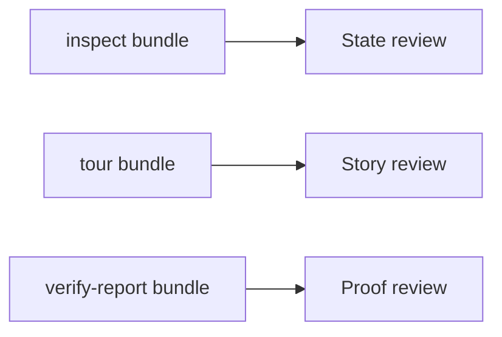
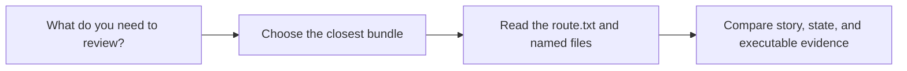

# Bundle Guide

<!-- page-maps:start -->
## Guide Maps

<!-- page-maps:end -->

Use this guide when the capstone writes useful artifacts but the relationship between the
bundle directories is still fuzzy. The goal is to make the saved review outputs feel like
one coherent proof system rather than three unrelated folders.

## Bundles at a glance

| Bundle | Built by | Best use |
| --- | --- | --- |
| inspect bundle | `make inspect` | review current state, lifecycle surfaces, and ordered scenario flow |
| tour bundle | `make tour` | follow the learner-facing story without opening internals first |
| verify-report bundle | `make verify-report` | compare executable confirmation with saved learner-facing artifacts |

## Best reading order

1. Start with `route.txt` in the bundle directory.
2. Read the highest-level artifact first: `summary.txt`, `walkthrough.txt`, or `pytest.txt`.
3. Read the matching local guide copied into the same directory.
4. Compare the bundle with the source guide only after you can name the claim or boundary you are reviewing.

## What to compare across bundles

| Compare... | To answer... |
| --- | --- |
| inspect bundle with tour bundle | does the saved state match the learner-facing story |
| inspect bundle with verify-report bundle | do the saved state surfaces agree with the executable checks |
| tour bundle with verify-report bundle | does the narrated scenario still match the strongest review route |

## Best companion guides

- read [PROOF_GUIDE.md](PROOF_GUIDE.md) when you need claim-to-route matching
- read [INSPECTION_GUIDE.md](INSPECTION_GUIDE.md) when one artifact inside the inspect bundle is still unclear
- read [TARGET_GUIDE.md](TARGET_GUIDE.md) when you need the smallest honest command before building another bundle
