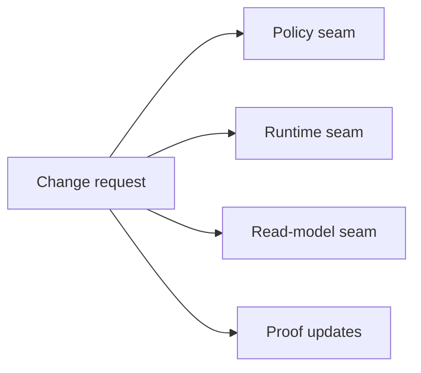
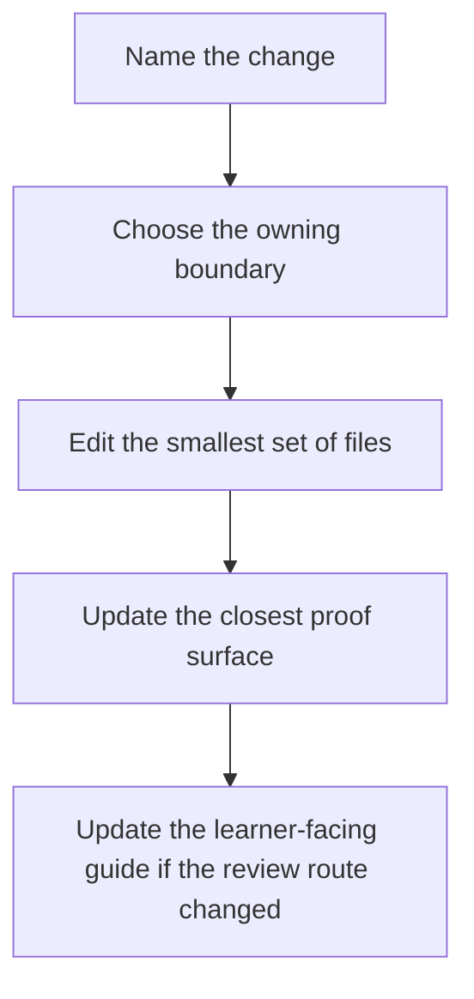

# Change Recipes

<!-- page-maps:start -->
## Guide Maps

<!-- page-maps:end -->

Use this guide when you know the capstone needs to change but you want the edit route to
stay disciplined. These recipes are not generic framework advice. They are local examples
for preserving the capstone's ownership model under change.

## Recipe: add a new evaluation mode

| Start in | Then update | Prove with |
| --- | --- | --- |
| `src/service_monitoring/policies.py` | targeted tests, then `PACKAGE_GUIDE.md` or `TEST_GUIDE.md` if the reading route changes | evaluation tests and `make verify-report` |

Why: evaluation variation belongs in the policy seam, not in the aggregate or runtime.

## Recipe: add a new metric source or incident sink

| Start in | Then update | Prove with |
| --- | --- | --- |
| `src/service_monitoring/runtime.py` | runtime tests, then `ARCHITECTURE.md` or `TOUR.md` if the story changes | runtime tests and `make tour` or `make verify-report` |

Why: orchestration and adapters should stay outside domain ownership.

## Recipe: add a new read-model view

| Start in | Then update | Prove with |
| --- | --- | --- |
| `src/service_monitoring/read_models.py` or `src/service_monitoring/projections.py` | inspection routes and `INSPECTION_GUIDE.md` if the learner-facing outputs change | runtime tests and `make inspect` |

Why: read concerns should remain downstream of events instead of becoming authoritative.

## Recipe: tighten a lifecycle rule

| Start in | Then update | Prove with |
| --- | --- | --- |
| `src/service_monitoring/model.py` | lifecycle tests, `RULE_LIFECYCLE_GUIDE.md`, and possibly `DOMAIN_GUIDE.md` | lifecycle tests and `make inspect` |

Why: transition authority belongs to the aggregate.

## Best companion guides

- read [EXTENSION_GUIDE.md](EXTENSION_GUIDE.md) when the change type is clear but the close-out bar is not
- read [ARCHITECTURE.md](ARCHITECTURE.md) when the recipe still leaves ownership blurry
- read [PROOF_GUIDE.md](PROOF_GUIDE.md) when you need the strongest honest route after the edit
