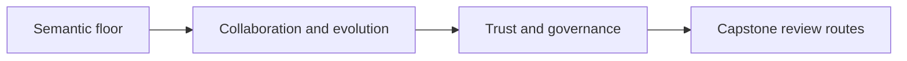
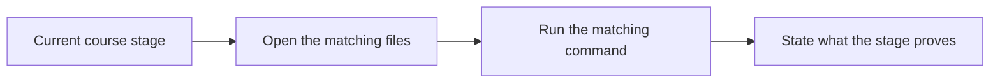

# Course Stage Map

<!-- page-maps:start -->
## Guide Maps

<!-- page-maps:end -->

Use this page when you already know where you are in the course and want the smallest
honest capstone route for that stage.

## Stage map

| Course stage | Start here | Then inspect | Best command |
| --- | --- | --- | --- |
| Semantic floor | `src/service_monitoring/model.py` | `tests/test_policy_lifecycle.py` and `PACKAGE_GUIDE.md` | `make inspect` |
| Collaboration and evolution | `ARCHITECTURE.md` | `runtime.py`, `repository.py`, `read_models.py` | `make verify-report` |
| Trust and governance | `PROOF_GUIDE.md` | saved bundles, `TEST_GUIDE.md`, and `EXTENSION_GUIDE.md` | `make confirm` or `make proof` |

## Stage questions

- Semantic floor: which object owns identity, value, and lifecycle meaning?
- Collaboration and evolution: which boundaries coordinate, persist, or derive state without stealing authority?
- Trust and governance: which proof route or review bundle would convince another person that the design still holds?
