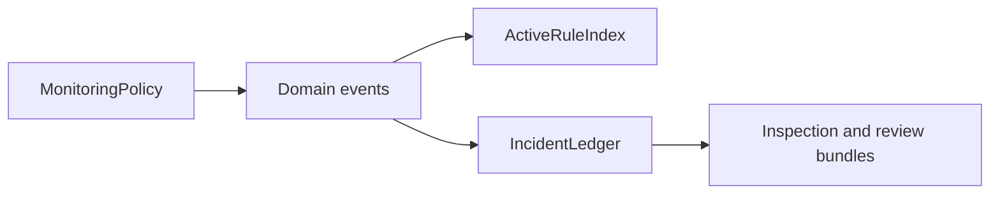
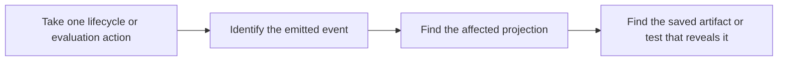

# Event Flow Guide

<!-- page-maps:start -->
## Guide Maps

<!-- page-maps:end -->

Use this guide when the capstone makes sense file by file but the event-driven flow is
still too implicit. The goal is to make the handoff from aggregate to projections and
inspection surfaces easy to trace.

## Event route

| Event | Emitted from | Projection effect | Best inspection surface |
| --- | --- | --- | --- |
| `RuleRegistered` | `MonitoringPolicy.add_rule` | no derived state changes today | lifecycle-oriented code review |
| `RuleActivated` | `MonitoringPolicy.activate_rule` | updates the active rule index | `summary.txt`, `rules.txt`, and runtime tests |
| `RuleRetired` | `MonitoringPolicy.retire_rule` | removes active index entries and clears open incidents for that rule | `rules.txt`, `history.txt`, and runtime tests |
| `AlertTriggered` | `MonitoringPolicy.evaluate` | appends incident history and updates open incidents | `history.txt`, `summary.txt`, and walkthrough output |

## Why this flow matters

- the aggregate remains authoritative because it decides when events exist
- the projections remain derived because they only react to emitted events
- the learner-facing bundles stay honest because they inspect derived state after the event path has run

## Best proof surfaces

- read `tests/test_runtime.py` when you want the event path tied to runtime coordination
- read `tests/test_policy_lifecycle.py` when you want the aggregate transition before the projection update
- run `make inspect` or `make tour` when you want the saved state or narrative after the event path completes

## Best companion guides

- read [ARCHITECTURE.md](ARCHITECTURE.md) for the wider boundary story
- read [RULE_LIFECYCLE_GUIDE.md](RULE_LIFECYCLE_GUIDE.md) for the transition rules that emit the events
- read [PROJECTION_GUIDE.md](PROJECTION_GUIDE.md) for the downstream state surfaces after those events land
- read [PROOF_GUIDE.md](PROOF_GUIDE.md) when you want the route from event flow to stronger evidence
