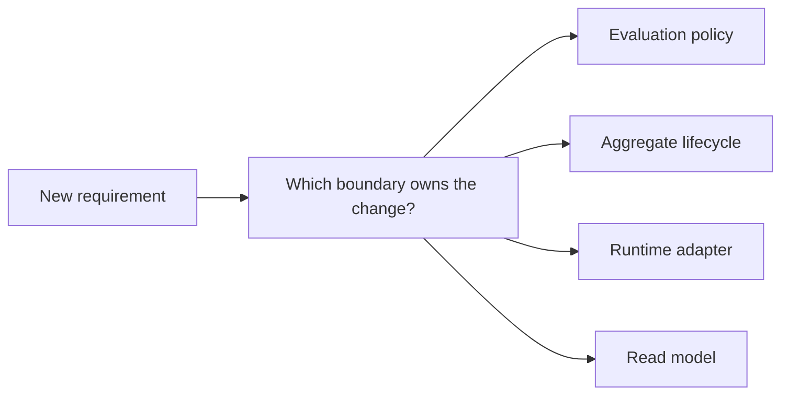
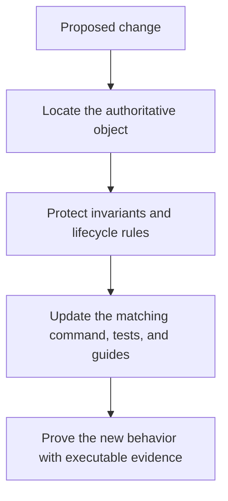

# Extension Guide

<!-- page-maps:start -->
## Guide Maps

<!-- page-maps:end -->

This guide exists so learners do not treat every change as a reason to edit the
aggregate. Object-oriented design stays clear when each change request lands in the
boundary that actually owns it.

## Best extension questions

- Is this new behavior a different way to evaluate a rule?
- Is this a new lifecycle rule for draft, active, or retired rules?
- Is this a new source, sink, repository, or unit-of-work concern?
- Is this a new read concern that should stay downstream of domain events?

## Where each change belongs

- Add a new evaluation mode in `src/service_monitoring/policies.py` when the rule keeps the same lifecycle but needs different evaluation semantics.
- Change `src/service_monitoring/model.py` when the aggregate must protect a new invariant or lifecycle boundary.
- Change `src/service_monitoring/runtime.py` when orchestration, adapters, or integration flow changes without altering domain ownership.
- Change `src/service_monitoring/repository.py` when persistence semantics or rollback behavior changes.
- Change `src/service_monitoring/read_models.py` or `src/service_monitoring/projections.py` when a new downstream view is needed.

## Honest warning

If an extension starts by editing the runtime before naming the authoritative domain
object, the design is already getting blurry. The runtime should compose behavior, not
quietly absorb domain rules that belong to the aggregate or evaluation policies.

## Recommended proof route after a change

1. Add or update tests in `tests/` for the new behavior.
2. Run `make confirm` to prove the contract still holds.
3. Run `make demo` or `make inspect` if the learner-facing narrative or review surface changed.
4. Update `PROOF_GUIDE.md`, `PACKAGE_GUIDE.md`, `TEST_GUIDE.md`, or `TARGET_GUIDE.md` when the review route changed.
