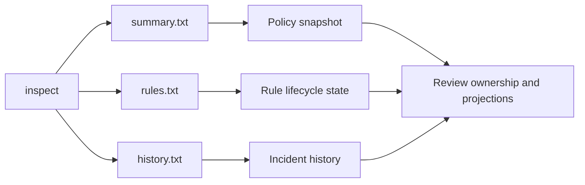
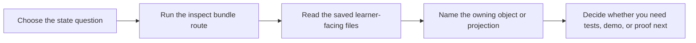

# Inspection Guide

<!-- page-maps:start -->
## Guide Maps

<!-- page-maps:end -->

Use this guide when you want to inspect the capstone state without opening implementation
files first. The goal is to make each inspection command answer one kind of question well.

## Which command to use

| Command | Best question |
| --- | --- |
| `make inspect` | I want the whole learner-facing inspection bundle |
| `make inspect-summary` | what policy state and open incidents exist right now |
| `make inspect-rules` | which rules are draft, active, or retired |
| `make inspect-history` | how incidents accumulated for each metric |

## Recommended reading order

1. `make inspect`
2. `summary.txt`
3. `rules.txt`
4. `history.txt`

That order moves from the current high-level snapshot into lifecycle detail and then into
incident history.

## What each route should teach

- `inspect-summary` should show the learner that the capstone still has one readable aggregate-centered story.
- `inspect-rules` should show that lifecycle state is explicit and reviewable.
- `inspect-history` should show that downstream incident views are derived from the scenario instead of controlling it.

## Best follow-up choices

- Go to `PACKAGE_GUIDE.md` when the question becomes "which package owns this state?"
- Go to `TEST_GUIDE.md` when the question becomes "which test proves this state change?"
- Go to `PROOF_GUIDE.md` when the question becomes "which route is strongest for this claim?"

## What this guide prevents

- using one summary output to justify every design claim
- confusing rule lifecycle state with incident history
- treating learner-facing inspection output as a substitute for tests
- forgetting that projections are derived artifacts rather than authoritative domain state
