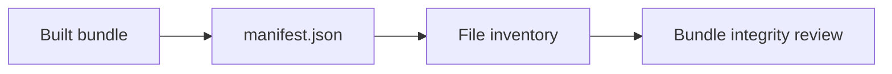
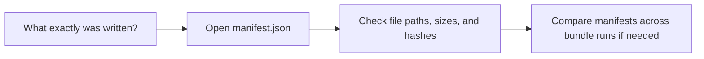

# Manifest Guide

<!-- page-maps:start -->
## Guide Maps

<!-- page-maps:end -->

Use this guide when a bundle exists and you need a stable inventory of what was written.
The goal is to make `manifest.json` part of the review story instead of a hidden helper.

## What the manifest contains

- bundle directory path
- file count
- one record per file with relative path, byte size, and SHA-256 hash

## When it is useful

- when you want to confirm which guides and outputs were copied into a bundle
- when you want to compare two bundle runs without diffing every file manually
- when you want a durable record of what the review route actually produced

## Best companion guides

- read [BUNDLE_GUIDE.md](BUNDLE_GUIDE.md) for the higher-level bundle relationship
- read [PROOF_GUIDE.md](PROOF_GUIDE.md) when the manifest is supporting an evidence review
- read `scripts/write_bundle_manifest.py` when you want the local implementation
