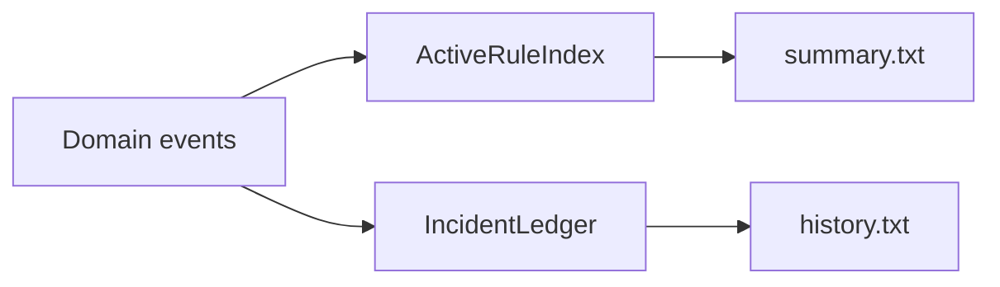
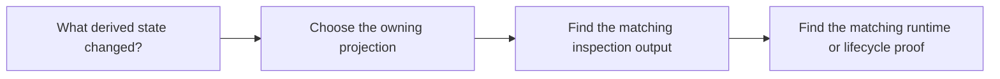

# Projection Guide

<!-- page-maps:start -->
## Guide Maps

<!-- page-maps:end -->

Use this guide when you need the read-model side of the capstone explained without
confusing it with the aggregate. The goal is to keep derived state legible and honestly
downstream.

## Projection responsibilities

| Surface | What it derives | Best inspection output |
| --- | --- | --- |
| `ActiveRuleIndex` in `projections.py` | active rule ids grouped by metric | `summary.txt`, `rules.txt` |
| `IncidentLedger` in `read_models.py` | open incidents and incident history | `history.txt`, `retirement.txt`, `rate_of_change.txt` |

## What projections must not do

- reject or approve lifecycle changes
- decide whether a rule should emit an alert
- become the source of truth for aggregate ownership
- hide the event path that produced their current state

## Best code route

1. `events.py`
2. `projections.py`
3. `read_models.py`
4. `runtime.py`
5. `INSPECTION_GUIDE.md`

## Best proof surfaces

- `tests/test_policy_lifecycle.py` for projection updates after lifecycle changes
- `tests/test_runtime.py` for projection updates during orchestration
- `EVENT_FLOW_GUIDE.md` for the event-to-projection handoff
