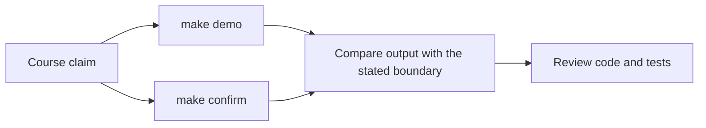
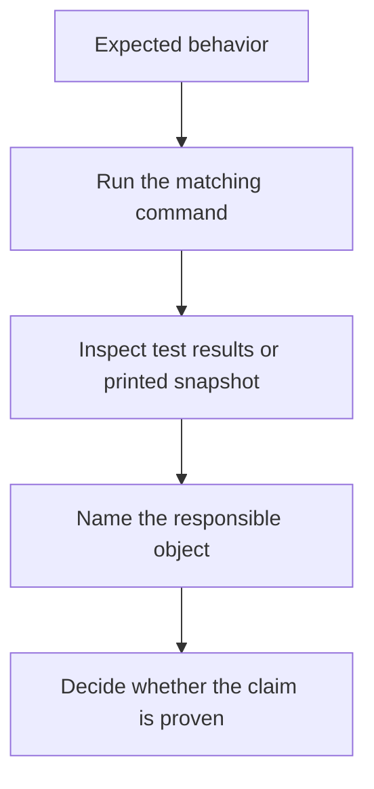

# Proof Guide

<!-- page-maps:start -->
## Guide Maps

<!-- page-maps:end -->

This capstone should not be trusted because the prose sounds tidy. It should be trusted
because the learner can inspect behavior directly.

## Current proof routes

- `make inspect` writes the learner-facing inspection bundle.
- `make tour` writes the learner-facing walkthrough bundle.
- `make verify-report` writes test output together with captured learner-facing state.
- `make confirm` runs the strongest local confirmation route.
- `make proof` runs the sanctioned end-to-end route.

## What each route proves

- `make inspect` proves that the scenario state can be reviewed without spelunking into internals first.
- `make tour` proves that a human can follow the story from policy creation to incident publication.
- `make verify-report` proves that executable checks and learner-facing state agree in one saved review bundle.
- `make confirm` proves that the current object boundaries and lifecycle behavior survive the strongest local confirmation route.
- `make proof` proves that the published learner-facing review route is still coherent end to end.

## Honest limitation

These routes prove different things. Bundles make review easier, but they do not replace
judgment. Tests prove behavioral contracts precisely. Walkthrough and inspection routes
prove that the system remains understandable as a story and as a state surface. You need
both.

## Best review pattern

1. State the claim you want to check.
2. Choose the smallest route that produces the closest evidence, or use `make proof` for the full route.
3. Read the saved bundle files before opening implementation internals.
4. Inspect the relevant code file.
5. Decide whether the evidence matches the design claim or only hints at it.

## Claim matrix

| If the claim is about... | Inspect first | Best route |
| --- | --- | --- |
| lifecycle and invariant ownership | `tests/test_policy_lifecycle.py` | `make inspect` |
| replaceable evaluation behavior | `tests/test_policy_evaluation.py` | `make verify-report` |
| runtime orchestration and adapter boundaries | `tests/test_runtime.py` and `TOUR.md` | `make tour` or `make verify-report` |
| learner-facing use cases | `tests/test_application.py` and `tests/test_demo.py` | `make demo` or `make tour` |
| whole-capstone trust and saved evidence | the generated verification bundle | `make confirm` or `make proof` |

## Review question after each route

- Which object or boundary owned the proven behavior?
- Which saved artifact or test was strongest?
- Which route would fail first if the design drifted?

## Route by course stage

- Semantic floor: start with `make inspect` and the lifecycle-oriented tests.
- Collaboration and evolution: use `make verify-report` when the claim crosses aggregates, policies, repositories, or runtime boundaries.
- Trust and governance: use `make confirm` or `make proof` when you need the strongest end-to-end review surface.
